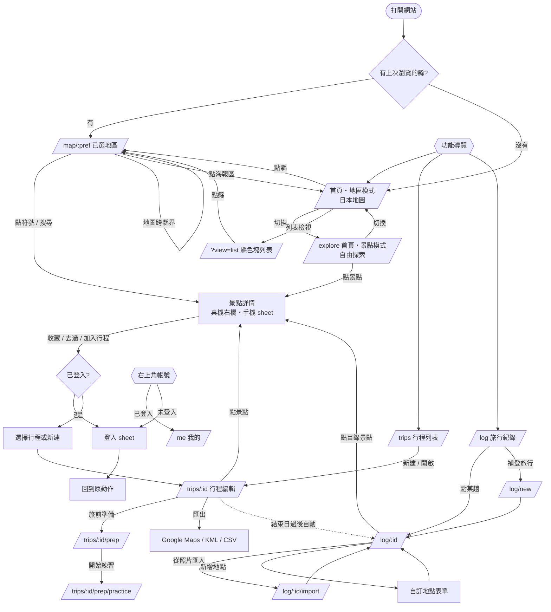
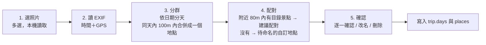
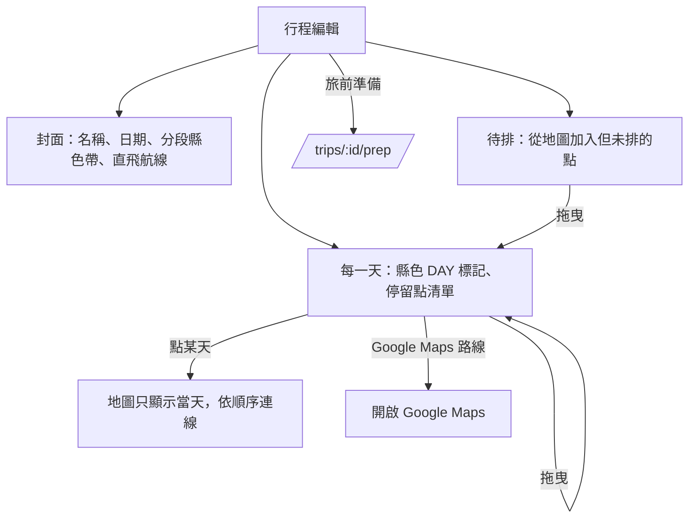

# ひとめぐり — 資訊架構、User Stories 與 UI Flow

> 搭配 `PLAN.md` 使用。本文件定義「功能放在哪裡、畫面怎麼走、地區色怎麼決定」，是前端實作的依據。
> 視覺參考：https://claude.ai/artifact/L6mTRQ4a9c44uNik145pS5 的「v7 定稿」頁；其他頁面為早期版本，僅供參考。

---

## 1. 資訊架構

### 1.1 兩種導覽，分開處理
v4 mockup 的問題：header 同時放了「名古屋 / 関西」（地理）與「旅行紀錄」（功能），左側又有大大的「京都」（另一層地理），三者層級混在一起。

改成：
- **功能導覽（header / 手機底部 tab）**：只放功能，永遠不放地名。「探索／行程／紀錄」三個分頁；「我的」不在分頁裡，放在右上角的帳號位置（未登入顯示「登入」按鈕，登入後顯示 Google 大頭貼，點開進 `/me`）。
- **地理導覽（地圖內）**：由「地區海報區」負責，地圖移動時自動更新。

| 功能導覽 | 路由 | 內容 |
|---|---|---|
| 探索 | `/map/:pref` | 地圖、主題、期間限定、景點詳情 |
| 行程 | `/trips` | 規劃中 / 進行中的行程、旅前準備 |
| 紀錄 | `/log` | 已完成的旅行、全部去過的地圖 |
| 我的（右上角） | `/me` | 收藏、清單、出發機場、帳號、登出 |

### 1.2 地理的三層與各自用途

| 層級 | 例 | 在程式中的角色 |
|---|---|---|
| 地方 area | 近畿、東海 | 分組、**直飛航線**以此為單位（機場服務的是整個地方） |
| 都道府縣 prefecture | 京都府、愛知県 | **資料分割鍵**（bundle）、**地區色的單位**、URL 的 `:pref` |
| 市區町村 / エリア | 京都市、宇治、名古屋市 | 顯示用文字、搜尋、行程每天的地點摘要 |

- 地區色只綁在**都道府縣**這一層（47 筆，定義在 `data/regions.json`）。「名古屋」「京都」在 UI 上的文字可以是城市名，但色與資料都走所屬的縣。
- 海報區顯示**目前焦點的都道府縣**（大字）＋所屬地方（小字）＋該地方的直飛航線。

### 1.3「目前焦點縣」怎麼決定（`activePref`）
依序取第一個有值的：
1. 已選取的景點所在縣
2. 地圖中心點落在哪個縣（前端 point-in-polygon，縣界用 国土数値情報 N03 行政區域資料，簡化後做成靜態 GeoJSON）
3. URL 的 `:pref`
4. 上次瀏覽的縣（localStorage）
5. 都沒有 → 進首頁 `/`（地區模式的日本地圖），介面使用「全國色」

平移地圖跨過縣界時：`activePref` 改變 → 海報區、地區色、URL（`history.replaceState`，不新增歷史紀錄）一起更新，並載入該縣 bundle。
判斷方式：已選定地區時有遲滯——只要這個縣還在畫面裡，拉遠看它在日本哪裡也保留，縮放 5 以下（接近整個日本）或縣完全移出畫面才回到全國；首頁（尚未選定）縮放 7 以下不指定地區；否則取可見範圍（扣掉左上浮動面板）中心所在的縣；畫面涵蓋超過 3 個縣、且中心縣佔可見陸地不到 4 成時，不指定地區（回到 `/`，用全國色）。只有使用者拖曳、縮放才觸發，程式定位（進入地區頁、點清單）不觸發。
景點卡片開著時，使用者拉遠到縮放 10 以下即關閉卡片。

---

## 2. 地區色規則

### 2.1 資料（47 縣事先定義）
`data/regions.json` 已事先定義全部 47 都道府縣，不需 fallback。每縣一個代表色（`source`，取自該縣印象：愛媛柑橘、岡山白桃、德島藍染…），其餘 token 由程式計算：

| token | 算法 | 用途 |
|---|---|---|
| `base` | source 去飽和 20%，再以約 55% 濃度疊在白底 | 海報區、名稱色帶、行程每天的 DAY 標記、封面色帶 |
| `on_base` | 墨色 / 白色中對比較高者 | base 上的文字（目前 47 縣全部為墨色 `#1E2124`） |
| `accent` | 去飽和後約 40% 濃度 | 海報區幾何裝飾（比 base 淡） |
| `tint` | 約 10% 濃度 | 選取背景、照片佔位 |
| `strong` | 與墨色混合，確保白字對比 ≥ 4.5:1 | 主按鈕、選取外框、tab 底線 |

```ts
{
  prefecture: "kyoto",
  name: { ja: "京都", kana: "きょうと", romaji: "KYOTO", zh_tw: "京都" },
  area: "kinki", area_name: "近畿", motif_zh: "京紫",
  color: { source: "#5B3A8C", base: "#A597BB", on_base: "#1E2124",
           accent: "#BEB3CD", tint: "#EFECF3", strong: "#4B3968" }
}
```
- 除了上表的強調色，每縣也有一組由同一個代表色算出的**中性色**（背景、header、線條、文字），整個介面會跟著縣色變化；公式與數值見 `DESIGN.md` §3.1。沒有地區語境時使用 `regions.json` 的 `national`（全國色）。
- **不在執行時用 CSS opacity 做透明感**：透明度會讓疊在地圖或照片上的顏色不可預期、對比也無法保證，所以「透明感」在產生 token 時就算成實色。
- 調整整體濃淡時，只改產生腳本的兩個參數（去飽和比例、疊白濃度）重新產生，不手改色碼。

### 2.2 前端實作
- 地區色一律用 CSS 變數：強調色 `--region-base`、`--region-on`、`--region-strong`、`--region-tint`、`--region-accent`；中性色 `--region-paper`、`--region-header`、`--region-line`、`--region-ink`、`--region-sub` 等（完整清單見 `DESIGN.md` §3.1）。
- 在「擁有地區語境」的容器上設定變數（探索頁根元素、景點卡片、行程的每一天），子元件只讀變數，不自己判斷是哪個縣。
- **主題色（茶、香、拉麵…）永不隨地區改變**；地區色只用在外框性質的地方：海報區、名稱色帶、主按鈕、選取外框、地圖底色。

### 2.3 各畫面的顏色來源

| 畫面 | 顏色來源 |
|---|---|
| 探索地圖、海報區 | `activePref` |
| 景點卡片 / 詳情 | **景點自己所在的縣**（在大阪地圖上點到京都的景點，卡片是京紫） |
| 行程、旅行紀錄的**某一天** | 當天的主要縣＝當天停留點最多的縣；同數取當天第一個點的縣 |
| 行程、旅行紀錄的**封面** | 見 §2.4 |
| 旅前準備、練習 | 行程封面縣的色調；每個地名旁標出所屬縣的色點 |
| 行程列表、紀錄列表的卡片 | 各自的封面色 |
| 首頁、景點模式、行程列表、紀錄總覽、我的 | **全國色**（日本藍為基底，用同一套公式產生的中性色） |

### 2.4 跨縣行程
- 行程封面頂部是一條**分段色帶**：依天數比例排列各縣顏色（例：名古屋 2 天金＋京都 2 天紫＋宇治（京都）1 天紫 → 金 2 : 紫 3）。
- 封面大字：只跨 1 縣 → 縣名；跨 2 縣 → 「名古屋・京都」；3 縣以上 → 所屬地方名（例：「近畿・東海」）或使用者自己取的行程名。
- 封面主色（按鈕、海報區底色）＝天數最多的縣；使用者可在行程設定手動指定。
- 時間軸上每一天的 DAY 標記用該天的縣色，跨縣的地方自然出現換色，一眼看出「第 3 天進京都」。

---

## 3. 資料模型調整（取代 PLAN.md §4.3 的 visited / trips）

**行程與旅行紀錄是同一個 entity**，差別只在狀態：規劃中的行程出發後變進行中，結束後就是一筆旅行紀錄；補登過去的旅行也是直接建立 `done` 狀態的 trip。

```
users/{uid}/trips/{tripId}
users/{uid}/trips/{tripId}/progress/{phraseId}   // 旅前準備學習進度
users/{uid}/places/{placeId}                     // 自訂地點（在地小店等，不在公開目錄）
users/{uid}/marks/{spotId}                       // 收藏、未歸入任何行程的「去過」
users/{uid}/lists/{listId}
```

```ts
// Trip
{
  name?: string,
  status: "planning" | "ongoing" | "done",   // 依日期自動推算，可手動覆寫
  start_date?: string, end_date?: string,
  cover_pref?: string,                        // 手動指定封面縣；空值則自動計算
  days: [{
    date?: string,
    stops: ({ type: "catalog", spot_id: string } | { type: "custom", place_id: string })[],
    note?: string
  }],
  unscheduled: (同 stops 元素)[],             // 想去但還沒排進某天
  source?: "manual" | "photo_import" | "kml_import",
  created_at, updated_at
}

// Place（自訂地點）
{
  name: string, name_ja?: string,
  location: { lat, lng },
  prefecture: string,                         // 由座標在前端算出
  category?: string,                          // 自由分類：拉麵、咖啡、居酒屋…
  theme?: string,                             // 若屬於既有主題，套用主題符號
  note?: string,
  linked_spot_id?: string,                    // 之後目錄收錄了同一家店，可以連過去
  created_at
}

// Mark
{ favorite?: boolean, visited_at?: string, note?: string }
```

- **「去過」是推導出來的**：`status: done` 的 trip 裡所有 stops ∪ marks 裡有 `visited_at` 的景點。
- 景點卡片按「去過」時：如果日期落在某個 trip 期間，詢問是否加入那趟；否則只寫 mark。
- 自訂地點**永遠不進公開目錄**，pipeline 不讀取 users 資料。

---

## 4. User Stories

格式：作為使用者，我想要…，以便…（✅ = 驗收條件）

### A. 探索
- **A1** 第一次打開時，我想先選要看哪裡，以便直接進到該地區。
  ✅ 無上次紀錄時進首頁：按縣塗色的日本地圖（MVP 範圍的縣正常顯示可點，其餘淡化不可點），可切換成列表。
- **A1b** 我想不選地區，直接在地圖上逛全部景點。
  ✅ 首頁切換到「景點」模式（`/explore`）：地圖顯示各縣景點符號，左欄主題篩選＋依地圖範圍的精選卡片；卡片與選取景點用景點所在縣的顏色，其餘介面維持全國色。
- **A2** 我想在地圖上自由移動到隔壁縣，不用回選單切換。
  ✅ 地圖中心跨縣界時，海報區、地區色、URL、bundle 自動切換；切換不打斷正在看的景點卡片。
- **A3** 我想先只看必去的大點，排好骨架。
  ✅ 「大點」預設開啟，其他主題預設關閉；不標示精選（PLAN.md §6），縣內顯示全部大點。
- **A4** 我想打開我在意的主題（茶、香、拉麵…），在骨架附近找小點。
  ✅ 主題改稱「擴充包」（`web/src/data/packs.ts`），放在地圖上方的浮動列（DESIGN.md §7.4），一次開一個：開啟後左側景點清單換成擴充包清單、地圖上景點變淡當底圖；狀態寫進 URL query（`?pack=pokemon`）。按鈕顯示目前地區（首頁為全國）的件數，沒有資料的變灰。右側圖示打開設定，勾選要顯示的擴充包（存在這台瀏覽器；登入後同步待 Phase 5）。設定中啟用的擴充包，景點卡片會列出 2 km 內的點。只放已有資料的擴充包（目前：寶可夢＝人孔蓋、寶可夢中心、寶可夢商店）。
- **A5** 我想用名稱、假名或羅馬拼音搜尋。
  ✅ 輸入「いっぽど」「ippodo」「一保堂」都能找到；結果跨縣時，選取後地圖飛到該縣。
  實作：header 右側的搜尋框（DESIGN.md §7.3），第一次聚焦時才下載全國索引 `bundles/search.json`；片假名／平假名、全形／半形、大小寫、長音符號視為相同；結果先列縣名，再列景點（完全相同 > 開頭相同 > 包含，同級依分數）。
- **A6** 我想看到這週有什麼期間限定。
  ✅ 探索頁側欄列出 `activePref` 的地區限定＋全國限定，依結束日期排序；點地區限定項目會在地圖標示。
- **A7** 我想知道從台灣哪個機場能直飛這一帶。
  ✅ 海報區顯示所屬地方的已驗證直飛航線；「我的」設定了出發機場時，該機場的航線排第一並強調。

### B. 景點
- **A8** 我想深入了解一個地方：有什麼特色吃的、祭典、幾月去最好、有什麼限定。
  ✅ 地區頁地圖上方的「深度探索」按鈕進入 `/region/:pref`（整頁，海報區＋段落），頁首「‹ 地圖」回地圖。段落順序：季節（花期月曆）→ 祭典 → 地區特色 → 期間限定；沒有資料的段落不顯示。目前已有：
  - 季節：氣象廳生物季節観測的平年值（梅、櫻花開花～滿開、紫藤、繡球花、銀杏黃葉、楓葉紅葉），畫在 12 個月的時間軸，本月加底色；一縣有多個觀測站時（北海道、沖繩等）可切換，第一個是縣廳所在地的氣象台。
  - 祭典：日文維基「{縣}の祭り」分類的條目，依舉行月份分組，從本月開始往後排；月份列可篩選，每月先顯示 6 項；沒有月份的放最後「月份未載」。有座標的附 Google Maps 連結。
  - 地區特色：依料理・小吃／拉麵／甜點／茶・酒／農產／工藝分組，有照片與簡介的排前面，每組先顯示 9 項。地區特色不再放在地圖左側清單。
- **B1** 我想點一個景點看它是什麼、怎麼念、離哪個車站近。
  ✅ 桌機：右欄；手機：底部 sheet，可上拉成全頁。內容：照片（credit）、假名 / 漢字 / 羅馬拼音、主題符號、最寄駅、簡介、來源。
- **B2** 我想聽景點名稱的日文發音。
  ✅ 名稱旁有播放鈕（Web Speech API ja-JP）。
- **B3** 我想直接用 Google Maps 導航過去。
  ✅ 一鍵開啟 Google Maps（place_id 或座標）。
- **B4** 我想收藏景點，之後排行程時用。
  ✅ 未登入時按收藏 → 登入提示 → 登入後自動完成原本的動作。

### C. 行程
- **C1** 我想建立一個行程，設定日期。
  ✅ `/trips/new`：名稱可空、日期可空（可先排再定日期）。
- **C2** 我想從地圖把景點加入行程。
  ✅ 景點卡片「加入行程」→ 選行程（或新建）→ 放入「待排」或指定某天。
- **C3** 我想把景點拖到每一天，調整順序。
  ✅ 行程頁：左側每天的清單（可拖曳），右側地圖只顯示該行程的點；點某天 → 地圖只顯示當天並依順序連線。
- **C4** 我想一眼看出每天在哪個縣。
  ✅ 每天的標頭與 DAY 標記使用當天的縣色；封面顯示分段色帶（§2.4）。
- **C5** 我想把某一天丟到 Google Maps 導航。
  ✅ 每天有「Google Maps 路線」按鈕（Maps URLs，超過 waypoint 上限時拆段）；整趟可匯出 KML / CSV。
- **C6** 我想看通趟行程的直飛航線。
  ✅ 行程頁顯示第一天所在地方與最後一天所在地方的直飛航線（去程、回程可能不同機場）。

### D. 旅前準備
- **D1** 出發前，我想知道這趟會遇到哪些日文。
  ✅ `/trips/:id/prep` 依行程內容組裝：地名、聽、說、讀四類；每個地名旁有縣色點。
- **D2** 我想只看一定會遇到的。
  ✅ 「只看必備」篩選（priority 1）。
- **D3** 我想用 flashcard 練習並記住進度。
  ✅ `/trips/:id/prep/practice`：Leitner box，進度存 Firestore。
- **D4** 在日本當天，我想快速找到今天會用到的詞。
  ✅ 行程 `ongoing` 時，旅前準備頁頂部自動切到「今天」的地名與會話；PWA 離線可用。

### E. 旅行紀錄
- **E1** 我想補登以前去過的日本旅行。
  ✅ `/log/new`：建立 `done` 狀態的 trip，可手動加天、加點。
- **E2** 我想用照片快速重建某一趟旅行。
  ✅ 照片匯入流程（§5.4）；照片不上傳、不儲存，只讀 EXIF。
- **E3** 我想記下不在目錄裡的在地小店。
  ✅ 「新增地點」：地圖點選位置 → 填名稱、分類、筆記；以虛線外框＋「自訂」標籤顯示。
- **E4** 我想看我全部去過哪裡。
  ✅ `/log` 頂部是「全部去過」地圖（印章樣式標記），下方是各趟旅行卡片（封面色、日期、地點數）。
- **E5** 行程結束後，我想它自動變成紀錄。
  ✅ `end_date` 過後狀態自動變 `done`，出現在 `/log`；可補上自訂地點與筆記。

### F. 帳號與設定
- **F0** 我想隨時知道自己有沒有登入、一鍵進到帳號設定。
  ✅ 右上角固定一個帳號位置：未登入是「登入」按鈕（開啟登入 sheet）；登入後是 Google 大頭貼，點開進 `/me`，目前在 `/me` 時頭像加外框。
- **F1** 我想不登入也能瀏覽。
  ✅ 探索、景點、搜尋、期間限定都不需登入；收藏 / 行程 / 紀錄需要。
- **F2** 我想設定常用的出發機場。
  ✅ `/me` 選擇 TPE / TSA / RMQ / KHH / TNN，影響直飛航線的排序。

---

## 5. UI Flow

### 5.1 全站
mockup「v7 定稿」頁最上方的「全站流程」畫板是同一張圖的視覺版（每個畫面左側色條＝使用的色調）。


### 5.2 畫面清單

| 路由 | 畫面 | 桌機版面 | 手機版面 | 需登入 |
|---|---|---|---|---|
| `/` | 首頁・地區模式 | 左：標語＋可探索縣清單／右：按縣塗色的日本地圖（沖繩在小框） | 日本地圖＋底部縣清單 sheet | 否 |
| `/?view=list` | 首頁・列表 | 47 縣色塊依地方分組，未收錄的縣淡化不可點 | 同左，單欄 | 否 |
| `/explore` | 首頁・景點模式 | 左：主題篩選＋精選卡片（依地圖範圍）／右：地圖上的景點符號 | 地圖＋主題 chips＋底部卡片 sheet | 否 |
| `/map/:pref` | 探索 | 左：海報區＋主題＋期間限定／中：地圖／右：景點詳情 | 全螢幕地圖＋頂部海報條（縮小版）＋主題 chips 橫捲＋底部 sheet | 否 |
| `/map/:pref?spot=:id` | 景點詳情 | 右欄展開 | sheet 半開，可上拉全頁 | 否 |
| `/trips` | 行程列表 | 卡片格線（封面色帶） | 單欄卡片 | 是 |
| `/trips/:id` | 行程編輯 | 左：天數清單（拖曳）／右：行程地圖 | 上：天數 tab／下：當天清單；地圖以切換按鈕顯示 | 是 |
| `/trips/:id/prep` | 旅前準備 | 置中單欄 | 單欄 | 是 |
| `/trips/:id/prep/practice` | Flashcard | 置中卡片 | 全螢幕卡片 | 是 |
| `/log` | 旅行紀錄 | 上：全部去過地圖／下：旅行卡片 | 同左，地圖較矮 | 是 |
| `/log/:id` | 單趟紀錄 | 左：時間軸／右：當趟地圖 | 時間軸 / 地圖 tab | 是 |
| `/log/:id/import` | 照片匯入 | 精靈式四步 | 同左 | 是 |
| `/me` | 我的 | 收藏、清單、出發機場、登出 | 同左 | 是 |

手機底部 tab：探索／行程／紀錄；「我的」在各頁頂部右側的頭像（對應 §1.1）。

**Mockup 對照**（「v7 定稿」頁的畫板名稱）
| 畫面 | 桌機 | 手機 |
|---|---|---|
| 首頁・地區 / 列表 / 景點 | 「① 首頁・日本地圖」「①' 首頁・列表模式」「①b 首頁・景點模式」 | — |
| 已選地區、景點詳情 | 「② 已選地區・未選景點」「③ 已選景點」 | 「手機・探索」 |
| 行程 | 「行程列表」「行程編輯」 | 「手機・行程單日」 |
| 旅前準備、練習 | 「旅前準備」「練習」 | — |
| 紀錄 | 「旅行紀錄」「單趟紀錄」「照片匯入」 | — |
| 我的、登入 | 「我的」 | 「手機・登入」 |

### 5.3 探索頁的狀態
```ts
// Pinia store: explore
{
  activePref: string,            // §1.3
  loadedPrefs: Set<string>,      // 已載入的 bundle（鄰縣預先載入）
  themes: string[],              // 與 URL query 同步
  featuredOnly: boolean,
  selectedSpotId?: string,       // 與 URL query 同步
  viewport: { center, zoom }
}
```
- `activePref` 變更 → 更新 CSS 變數、`replaceState`、載入 bundle、預載相鄰縣。
- `selectedSpotId` 變更 → 景點卡片的地區色取該景點的縣，不改 `activePref`（避免選到邊界景點時整個頁面換色）；若地圖因此飛過去，則由地圖中心自然更新 `activePref`。

### 5.4 照片匯入流程（`/log/:id/import`）

- 無 GPS 的照片略過並顯示數量；日期範圍外的照片提示是否擴充行程日期。
- 照片檔案本身不上傳、不保存（Spark 方案沒有 Storage，也避免隱私問題）。

### 5.5 行程編輯頁

