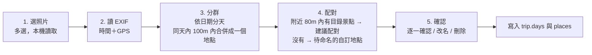
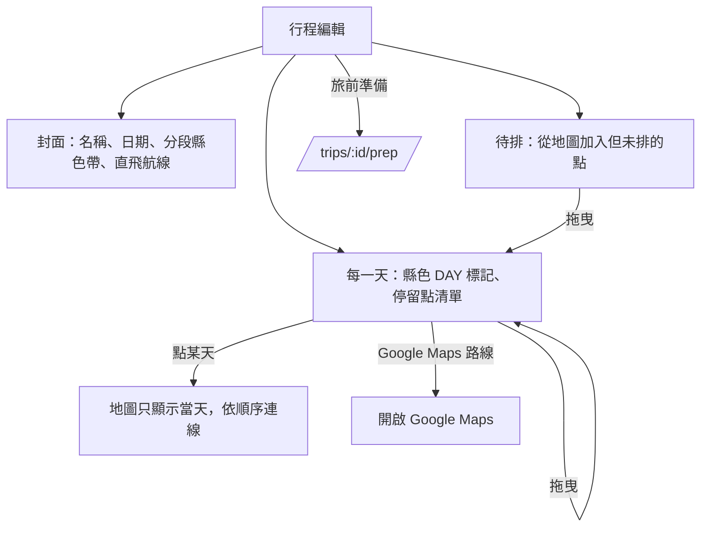

# ひとめぐり — 資訊架構、User Stories 與 UI Flow

> 搭配 `PLAN.md` 使用。本文件定義「功能放在哪裡、畫面怎麼走、地區色怎麼決定」，是前端實作的依據。
> 視覺參考：https://claude.ai/artifact/L6mTRQ4a9c44uNik145pS5 的「v7 定稿」頁；其他頁面為早期版本，僅供參考。

---

## 1. 資訊架構

### 1.1 兩種導覽，分開處理
v4 mockup 的問題：header 同時放了「名古屋 / 関西」（地理）與「旅行紀錄」（功能），左側又有大大的「京都」（另一層地理），三者層級混在一起。

改成：
- **功能導覽（header / 手機底部 tab）**：只放功能，永遠不放地名。「探索／行程／紀錄」三個分頁；「我的」不在分頁裡，放在右上角的帳號位置（未登入顯示「登入」按鈕，登入後顯示 Google 大頭貼，點開進 `/me`）。
- **地理導覽（地圖內）**：由「地區海報區」負責，地圖移動時自動更新。

| 功能導覽 | 路由 | 內容 |
|---|---|---|
| 探索 | `/map/:pref` | 地圖、主題、期間限定、景點詳情 |
| 行程 | `/trips` | 規劃中 / 進行中的行程、旅前準備 |
| 紀錄 | `/log` | 已完成的旅行、全部去過的地圖 |
| 我的（右上角） | `/me` | 收藏、清單、出發機場、帳號、登出 |

### 1.2 地理的三層與各自用途

| 層級 | 例 | 在程式中的角色 |
|---|---|---|
| 地方 area | 近畿、東海 | 分組、**直飛航線**以此為單位（機場服務的是整個地方） |
| 都道府縣 prefecture | 京都府、愛知県 | **資料分割鍵**（bundle）、**地區色的單位**、URL 的 `:pref` |
| 市區町村 / エリア | 京都市、宇治、名古屋市 | 顯示用文字、搜尋、行程每天的地點摘要 |

- 地區色只綁在**都道府縣**這一層（47 筆，定義在 `data/regions.json`）。「名古屋」「京都」在 UI 上的文字可以是城市名，但色與資料都走所屬的縣。
- 海報區顯示**目前焦點的都道府縣**（大字）＋所屬地方（小字）＋該地方的直飛航線。

### 1.3「目前焦點縣」怎麼決定（`activePref`）
依序取第一個有值的：
1. 已選取的景點所在縣
2. 地圖中心點落在哪個縣（前端 point-in-polygon，縣界用 国土数値情報 N03 行政區域資料，簡化後做成靜態 GeoJSON）
3. URL 的 `:pref`
4. 上次瀏覽的縣（localStorage）
5. 都沒有 → 進首頁 `/`（地區模式的日本地圖），介面使用「全國色」

平移地圖跨過縣界時：`activePref` 改變 → 海報區、地區色、URL（`history.replaceState`，不新增歷史紀錄）一起更新，並載入該縣 bundle。
判斷方式：已選定地區時有遲滯——只要這個縣還在畫面裡，拉遠看它在日本哪裡也保留，縮放 5 以下（接近整個日本）或縣完全移出畫面才回到全國；首頁（尚未選定）縮放 7 以下不指定地區；否則取可見範圍（扣掉左上浮動面板）中心所在的縣；畫面涵蓋超過 3 個縣、且中心縣佔可見陸地不到 4 成時，不指定地區（回到 `/`，用全國色）。只有使用者拖曳、縮放才觸發，程式定位（進入地區頁、點清單）不觸發。
景點卡片開著時，使用者拉遠到縮放 10 以下即關閉卡片。

---

## 2. 地區色規則

### 2.1 資料（47 縣事先定義）
`data/regions.json` 已事先定義全部 47 都道府縣，不需 fallback。每縣一個代表色（`source`，取自該縣印象：愛媛柑橘、岡山白桃、德島藍染…），其餘 token 由程式計算：

| token | 算法 | 用途 |
|---|---|---|
| `base` | source 去飽和 20%，再以約 55% 濃度疊在白底 | 海報區、名稱色帶、行程每天的 DAY 標記、封面色帶 |
| `on_base` | 墨色 / 白色中對比較高者 | base 上的文字（目前 47 縣全部為墨色 `#1E2124`） |
| `accent` | 去飽和後約 40% 濃度 | 海報區幾何裝飾（比 base 淡） |
| `tint` | 約 10% 濃度 | 選取背景、照片佔位 |
| `strong` | 與墨色混合，確保白字對比 ≥ 4.5:1 | 主按鈕、選取外框、tab 底線 |

```ts
{
  prefecture: "kyoto",
  name: { ja: "京都", kana: "きょうと", romaji: "KYOTO", zh_tw: "京都" },
  area: "kinki", area_name: "近畿", motif_zh: "京紫",
  color: { source: "#5B3A8C", base: "#A597BB", on_base: "#1E2124",
           accent: "#BEB3CD", tint: "#EFECF3", strong: "#4B3968" }
}
```
- 除了上表的強調色，每縣也有一組由同一個代表色算出的**中性色**（背景、header、線條、文字），整個介面會跟著縣色變化；公式與數值見 `DESIGN.md` §3.1。沒有地區語境時使用 `regions.json` 的 `national`（全國色）。
- **不在執行時用 CSS opacity 做透明感**：透明度會讓疊在地圖或照片上的顏色不可預期、對比也無法保證，所以「透明感」在產生 token 時就算成實色。
- 調整整體濃淡時，只改產生腳本的兩個參數（去飽和比例、疊白濃度）重新產生，不手改色碼。

### 2.2 前端實作
- 地區色一律用 CSS 變數：強調色 `--region-base`、`--region-on`、`--region-strong`、`--region-tint`、`--region-accent`；中性色 `--region-paper`、`--region-header`、`--region-line`、`--region-ink`、`--region-sub` 等（完整清單見 `DESIGN.md` §3.1）。
- 在「擁有地區語境」的容器上設定變數（探索頁根元素、景點卡片、行程的每一天），子元件只讀變數，不自己判斷是哪個縣。
- **主題色（茶、香、拉麵…）永不隨地區改變**；地區色只用在外框性質的地方：海報區、名稱色帶、主按鈕、選取外框、地圖底色。

### 2.3 各畫面的顏色來源

| 畫面 | 顏色來源 |
|---|---|
| 探索地圖、海報區 | `activePref` |
| 景點卡片 / 詳情 | **景點自己所在的縣**（在大阪地圖上點到京都的景點，卡片是京紫） |
| 行程、旅行紀錄的**某一天** | 當天的主要縣＝當天停留點最多的縣；同數取當天第一個點的縣 |
| 行程、旅行紀錄的**封面** | 見 §2.4 |
| 旅前準備、練習 | 行程封面縣的色調；每個地名旁標出所屬縣的色點 |
| 行程列表、紀錄列表的卡片 | 各自的封面色 |
| 首頁、景點模式、行程列表、紀錄總覽、我的 | **全國色**（日本藍為基底，用同一套公式產生的中性色） |

### 2.4 跨縣行程
- 行程封面頂部是一條**分段色帶**：依天數比例排列各縣顏色（例：名古屋 2 天金＋京都 2 天紫＋宇治（京都）1 天紫 → 金 2 : 紫 3）。
- 封面大字：只跨 1 縣 → 縣名；跨 2 縣 → 「名古屋・京都」；3 縣以上 → 所屬地方名（例：「近畿・東海」）或使用者自己取的行程名。
- 封面主色（按鈕、海報區底色）＝天數最多的縣；使用者可在行程設定手動指定。
- 時間軸上每一天的 DAY 標記用該天的縣色，跨縣的地方自然出現換色，一眼看出「第 3 天進京都」。

---

## 3. 資料模型調整（取代 PLAN.md §4.3 的 visited / trips）

**行程與旅行紀錄是同一個 entity**，差別只在狀態：規劃中的行程出發後變進行中，結束後就是一筆旅行紀錄；補登過去的旅行也是直接建立 `done` 狀態的 trip。

```
trips/{tripId}                                   // 行程（共編：members 裡的人都能讀寫，C7）
invites/{code}                                   // 共編邀請連結（知道邀請碼才能讀）
users/{uid}/trips/{tripId}/progress/{phraseId}   // 旅前準備學習進度（每個成員各自一份）
users/{uid}/places/{placeId}                     // 自訂地點（在地小店等，不在公開目錄）
users/{uid}/marks/{spotId}                       // 收藏、未歸入任何行程的「去過」
users/{uid}/lists/{listId}
users/{uid}/finds/{findId}                       // 截圖收藏：品牌、品項、說明、縮圖
users/{uid}/find_images/{findId}                 // 截圖原圖（同 id，打開大圖時才讀）
```

```ts
// Trip（Phase 7 實作：web/src/stores/trips.ts、services/trip.ts。
//   實作差異：每天的日期由 start_date 推算不另存；停留點另存 pref、name；cover_pref、source 尚未使用；
//   status 每次儲存時依日期重算，畫面上一律依日期推算）
{
  name?: string,
  status: "planning" | "ongoing" | "done",   // 依日期自動推算，可手動覆寫
  start_date?: string, end_date?: string,
  cover_pref?: string,                        // 手動指定封面縣；空值則自動計算
  days: [{
    date?: string,
    stops: ({ type: "catalog", spot_id: string, pref: string, name: string } | { type: "custom", place_id: string })[],
    note?: string
  }],
  unscheduled: (同 stops 元素)[],             // 想去但還沒排進某天
  source?: "manual" | "photo_import" | "kml_import",
  owner: string,                              // 建立者：可以移除成員、刪除行程
  members: string[],                          // 共編成員 uid（含建立者，上限 20）；成員都能編輯
  member_info: { [uid]: { name, photo?, via? } },  // 顯示用的名稱與大頭貼；via 是加入時用的邀請碼
  invite?: string,                            // 目前有效的邀請碼；重新產生時舊的失效
  created_at, updated_at
}
// 以前放在 users/{uid}/trips 的行程，登入時搬到 trips/（同一個 id）。

// Invite：{ trip_id, trip_name, inviter, created_by, created_at }  // 加入前顯示行程名稱與邀請人

// Place（自訂地點）
{
  name: string, name_ja?: string,
  location: { lat, lng },
  prefecture: string,                         // 由座標在前端算出
  category?: string,                          // 自由分類：拉麵、咖啡、居酒屋…
  theme?: string,                             // 若屬於既有主題，套用主題符號
  note?: string,
  linked_spot_id?: string,                    // 之後目錄收錄了同一家店，可以連過去
  created_at
}

// Mark（Phase 5 實作：web/src/stores/marks.ts）
{
  pref: string, name: string,                 // 景點所在縣、日文名：列表與匯出只載入相關縣的 bundle；景點從目錄移除時仍認得出來
  favorite?: true,
  visited?: true, visited_on?: "YYYY-MM-DD",  // 去過；日期可以留空
  lists?: string[],                           // 所屬清單 id（上限 50）
  updated_at
}
// 收藏、去過、清單三者都沒有時刪掉文件。

// List
{ name: string, created_at, updated_at }       // 景點歸屬記在 Mark.lists；刪除清單時一併移除

// Find（截圖收藏，web/src/stores/finds.ts）：不用 Cloud Storage（需要 Blaze），圖片在瀏覽器壓縮後存成 data URL
{
  brand: string, item: string, note: string,  // 上限 40 / 80 / 500 字
  thumb: string,                              // 縮圖 data URL（寬 ≤ 480，≤ 150 KB）
  w: number, h: number,                       // 原圖尺寸（gallery 依比例排版）
  trip_id?: string,                           // 掛在哪一趟（旅前準備、旅前小書會列出）
  created_at, updated_at
}
// FindImage：{ data: string, created_at }     // 原圖 data URL（寬 ≤ 1280、高 ≤ 4000，≤ 900 KB；Firestore 單一文件上限 1 MiB）
```

- **「去過」是推導出來的**：`status: done` 的 trip 裡所有 stops ∪ marks 裡 `visited` 的景點。
- 景點卡片按「去過」時：如果日期落在某個 trip 期間，詢問是否加入那趟；否則只寫 mark。
- 自訂地點**永遠不進公開目錄**，pipeline 不讀取 users 資料。

---

## 4. User Stories

格式：作為使用者，我想要…，以便…（✅ = 驗收條件）

### A. 探索
- **A1** 第一次打開時，我想先選要看哪裡，以便直接進到該地區。
  ✅ 無上次紀錄時進首頁：按縣塗色的日本地圖（47 縣都可點），可切換成列表。
- **A1b** 我想不選地區，直接在地圖上逛全部景點。
  ✅ 首頁切換到「景點」模式（`/explore`）：地圖顯示各縣景點符號，左欄主題篩選＋依地圖範圍的精選卡片；卡片與選取景點用景點所在縣的顏色，其餘介面維持全國色。
- **A2** 我想在地圖上自由移動到隔壁縣，不用回選單切換。
  ✅ 地圖中心跨縣界時，海報區、地區色、URL、bundle 自動切換；切換不打斷正在看的景點卡片。
- **A3** 我想先只看必去的大點，排好骨架。
  ✅ 「大點」預設開啟，其他主題預設關閉；不標示精選（PLAN.md §6），縣內顯示全部大點。
- **A4** 我想打開我在意的主題（茶、香、拉麵…），在骨架附近找小點。
  ✅ 主題改稱「擴充包」（`web/src/data/packs.ts`），放在地圖上方的浮動列、靠左排（DESIGN.md §7.4），一次開一個：開啟後左側景點清單換成擴充包清單、地圖上景點變淡當底圖；狀態寫進 URL query（`?pack=pokemon`）。按鈕顯示目前地區（首頁為全國）的件數，沒有資料的變灰。右側圖示打開設定，勾選要顯示的擴充包（存在這台瀏覽器；登入後同步待 Phase 5）。設定中啟用的擴充包，景點卡片會列出 2 km 內的點。只放已有資料的擴充包：寶可夢（人孔蓋、寶可夢中心、寶可夢商店）、城（日本100名城・続日本100名城，名城番號與スタンプ設置場所）、老舖・茶屋（香舖、和菓子、茶舖、茶屋・甘味處）、角色商店（任天堂、吉卜力、三麗鷗…依品牌分組）。設定存「關掉的擴充包」，之後新增的擴充包預設開啟。
  ✅ 擴充包清單每列右側有「去過」快捷鈕，清單標題顯示這個範圍去過幾個（例：城集滿幾座）。已經是景點的城，點了直接打開景點卡片（卡片上有名城番號與スタンプ設置場所），去過也記在景點上。
- **A5** 我想用名稱、假名或羅馬拼音搜尋。
  ✅ 輸入「いっぽど」「ippodo」「一保堂」都能找到；結果跨縣時，選取後地圖飛到該縣。
  實作：header 右側的搜尋框（DESIGN.md §7.3），第一次聚焦時才下載全國索引 `bundles/search.json`；片假名／平假名、全形／半形、大小寫、長音符號視為相同；結果先列縣名，再列景點（完全相同 > 開頭相同 > 包含，同級依分數）。
- **A6** 我想看到這週有什麼期間限定。
  ✅ Phase 4 v1：地區地圖左側面板「期間限定」（前三筆，依結束日）、深度探索「期間限定」段落（含摘要與出典）；目前資料只有氣象廳本季的櫻花、銀杏、楓葉觀測。
  ✅ 連鎖店的商品不抓（使用條款不允許，使用者決定不抓）：改成「連鎖店」快捷搜尋，直接開 Google 近一個月的結果（超商、連鎖餐飲、7-11、全家、LAWSON、麥當勞）；自己看到的可以存成截圖（D5）。`/limited` 期間限定頁：連鎖店搜尋、截圖 gallery、全國目前的季節觀測；深度探索、旅前準備的「期間限定」段落也有連鎖店搜尋。
  ✅ 探索頁側欄列出 `activePref` 的地區限定＋全國限定，依結束日期排序；點地區限定項目會在地圖標示。
- **A7** 我想知道從台灣哪個機場能直飛這一帶。
  ✅ 海報區顯示所屬地方的已驗證直飛航線（桌機在地圖頁的地區標籤，手機在深度探索頁的海報）；「我的」設定了出發機場時，該機場的航線排第一並強調。

### B. 景點
- **A8** 我想深入了解一個地方：有什麼特色吃的、祭典、幾月去最好、有什麼限定。
  ✅ 地圖頁左欄最下方的「深度探索」卡進入 `/region/:pref`（整頁，海報區＋段落），左欄「‹ 地圖」回地圖。段落順序：季節（花期月曆）→ 祭典 → 地區特色 → 期間限定；沒有資料的段落不顯示。目前已有：
  - 季節：氣象廳生物季節観測的平年值（梅、櫻花開花～滿開、紫藤、繡球花、銀杏黃葉、楓葉紅葉），畫在 12 個月的時間軸，本月加底色；一縣有多個觀測站時（北海道、沖繩等）可切換，第一個是縣廳所在地的氣象台。
  - 祭典：日文維基「{縣}の祭り」分類的條目，依舉行月份分組，1 月到 12 月；月份列可篩選，每月先顯示 6 項；沒有月份的放最後「月份未載」。有座標的附「在地圖上看」：回到縣的地圖頁，在該位置放一個有名稱的標記（網址 `?at=緯度,經度&label=名稱`，可關閉）。沒有中文名時顯示英文名。
  - 地區特色：依料理・小吃／拉麵／甜點／茶・酒／農產／工藝分組，有照片與簡介的排前面，每組先顯示 9 項。地區特色不再放在地圖左側清單。
  ✅ 入口：地圖頁左欄最下方的「深度探索」卡（手機是海報條右端的「深度探索 ›」）。深度探索頁左欄是「‹ 地圖」返回與段落目錄（點了捲到該段，捲動時標出目前段落，地區特色展開各組；手機為頂部橫列，海報捲走後換成地區色條，左邊「‹ 縣名」回縣地圖，在祭典、地區特色時多一列月份、組別）。祭典的「在地圖上看」去地圖再返回，回到同一張卡、同樣的月份篩選與展開。
- **B1** 我想點一個景點看它是什麼、怎麼念、離哪個車站近。
  ✅ 桌機：右欄；手機：底部 sheet，可上拉成全頁。內容：照片（credit）、假名 / 漢字 / 羅馬拼音、主題符號、最寄駅、簡介、來源。
- **B2** 我想聽景點名稱的日文發音。
  ✅ 名稱旁有播放鈕（Web Speech API ja-JP）。
- **B3** 我想直接用 Google Maps 導航過去。
  ✅ 一鍵開啟 Google Maps（place_id 或座標）。
- **B4** 我想收藏景點，之後排行程時用。
  ✅ 未登入時按收藏 → 登入提示 → 登入後自動完成原本的動作。
  ✅ 景點卡片的「去過」標了之後，按鈕右半邊是日期（自製月曆，DESIGN.md §7.16），不另佔一行。

### C. 行程
- **C1** 我想建立一個行程，設定日期。
  ✅ `/trips/new`：名稱可空、日期可空（可先排再定日期）。
- **C2** 我想從地圖把景點加入行程。
  ✅ 景點卡片「加入行程」→ 選行程（或新建）→ 放入「待排」或指定某天。
- **C3** 我想把景點拖到每一天，調整順序。
  ✅ 行程頁：左側每天的清單（可拖曳），右側地圖只顯示該行程的點；點某天 → 地圖只顯示當天並依順序連線。
- **C4** 我想一眼看出每天在哪個縣。
  ✅ 每天的標頭與 DAY 標記使用當天的縣色；封面顯示分段色帶（§2.4）。
- **C5** 我想把某一天丟到 Google Maps 導航。
  ✅ 每天有「Google Maps 路線」按鈕（Maps URLs，超過 waypoint 上限時拆段：手機瀏覽器 3 個、其他 9 個）；每天第一站上面有「從目前位置」（裝置位置到第一站的大眾運輸路線）；相鄰停留點之間有「轉乘路線」；整趟可匯出 KML / CSV。
- **C7** 我想和旅伴一起排行程。
  ✅ 行程頁「共編」→ 複製邀請連結傳給對方（手機有系統分享時是「傳送」；手機的共編面板是下方對話框）；對方打開 `/join/:code`、登入、按「加入」後（邀請連結帶 LINE 的 `openExternalBrowser=1`；在 App 內建的瀏覽器裡沒辦法登入，加入頁改成「用瀏覽器開啟」與「複製連結」），這個行程就在他帳號的「我的行程」（結束後在紀錄），成員都能編輯、即時同步。
  ✅ 同時編輯不互蓋：每個修改在交易裡讀最新的一份再套用；移動、刪除停留點以景點 id 找現在的位置。
  ✅ 離線時行程只能看：修改的按鈕停用，標題下一行「離線中・行程不能修改」；儲存失敗的訊息也在這一行（DESIGN.md §7.20）。
  ✅ 建立者可以移除成員、重新產生連結（舊連結失效）、刪除行程；其他成員可以離開。練習進度、截圖、收藏仍是個人的。
- **C6** 我想看通趟行程的直飛航線。
  ✅ 行程頁顯示第一天所在地方與最後一天所在地方的直飛航線（去程、回程可能不同機場）。

### D. 旅前準備
- **D1** 出發前，我想知道這趟會遇到哪些日文。
  ✅ `/trips/:id/prep` 依行程內容組裝：地名、聽、說、讀四類；每個地名旁有縣色點。
  ✅ 一頁式；桌機左側是段落目錄（聽／說／讀展開到情境），手機在頂部橫列；捲到哪段目錄就標哪段，每段都有錨點（`#say`、`#say-restaurant`…）。
- **D2** 我想只看一定會遇到的。
  ✅ 「只看必備」篩選（priority 1）。
- **D3** 我想用 flashcard 練習並記住進度。
  ✅ `/trips/:id/prep/practice`：Leitner box，進度存 Firestore。手機打橫時卡片在左、計數與按鈕在右，一屏放得下。
- **D4** 在日本當天，我想快速找到今天會用到的詞。
  ✅ 行程 `ongoing` 時，旅前準備頁頂部自動切到「今天」的地名與會話；PWA 離線可用。
- **D5** 我在網路上看到想買的限定商品，想存下來帶去日本找。
  ✅ 上傳截圖（可一次多張、拖曳或貼上），填品牌、品項、說明，可以掛在某一趟行程；`/limited` 的 gallery 依原圖比例排成瀑布流、可依品牌篩選，點開看原圖（長截圖可捲動）、編輯、刪除。旅前準備的「期間限定」只列掛在這趟的截圖。
- **D6** 出發前，我想把行程與旅前準備印成一本小冊子帶著走。
  ✅ `/trips/:id/book` 旅前小書：封面（縣色帶、名稱、日期、縣）→ 行程（每天的停留點、念法、最近車站）→ 會話 → 地區特色 → 期間限定（季節觀測、這趟的截圖）→ 筆記頁；A5／A4、各段可取捨、只放必備會話。用瀏覽器列印存成 PDF，每段從新的一頁開始。

### E. 旅行紀錄
- **E1** 我想補登以前去過的日本旅行。
  ✅ `/log/new`：建立 `done` 狀態的 trip，可手動加天、加點。
- **E2** 我想用照片快速重建某一趟旅行。
  ✅ 照片匯入流程（§5.4）；照片不上傳、不儲存，只讀 EXIF。
- **E3** 我想記下不在目錄裡的在地小店。
  ✅ 「新增地點」：地圖點選位置 → 填名稱、分類、筆記；以虛線外框＋「自訂」標籤顯示。
- **E4** 我想看我全部去過哪裡。
  ✅ `/log` 頂部是「全部去過」地圖（印章樣式標記），下方是各趟旅行卡片（封面色、日期、地點數）。手機第一屏：收集冊一張，經縣值、旅人、成就三格一列，「收藏 n ・ 清單 n ›」連到 `/me`，再下面是 sticky 的「旅行・去過」段落列（DESIGN.md §7.27）。
- **E5** 行程結束後，我想它自動變成紀錄。
  ✅ `end_date` 過後狀態自動變 `done`，出現在 `/log`；可補上自訂地點與筆記。
- **E6** 我想在清單上快速標「去過」，日期之後一次補。
  ✅ 地區地圖的景點清單、收藏、清單頁的每一列右側有「去過」快捷鈕（像按愛心），只切換去過、不填日期；`/log`「補日期」勾選景點（預設勾好沒有日期的；補日期時點整列就是勾選，不會回到地圖，選中的列底色 `bg-region-tint`）→ 選日期 → 套用，一次寫入。手機的工具列貼在分頁列上方一行（已選 n・日期・套用・完成），「沒有日期的」「全選」在「去過」標題旁。
- **E7** 我想把去過的景點收集起來，看得到自己集了多少。
  `/log/cards` 收集冊：去過的景點做成收集卡（DESIGN.md §7.19），依縣排列；上方是去過的縣塗色的日本地圖與名城進度；可依世界遺產／名城／國寶・特別史跡・特別名勝篩選；點卡片放大、翻面看簡介，左右切換，「地圖」回到那個景點。點地圖上的縣捲到那一縣的卡片；手機上地圖只是裝飾，改用 sticky 縣條（縣名＋張數，跟著目前的段落）跳到那一縣。手機打橫時放大的卡、卡包、新卡亮相整張放得下，按鈕排在卡片右邊一欄；規則捲到下面也按得到「關閉」。入口在 `/log` 上方（最近三張卡疊成扇形）與景點卡片名稱帶的卡片鈕。
- **E8** 我想看自己的旅行累積了什麼。
  ✅ `/log/achievements` 成就（DESIGN.md §7.25）：一本紀念章帳。第一頁是 47 縣的初訪章，後面是地方、旅行、時節、足跡、文化指定、名城、擴充包 40 個成就；達成的蓋章並寫旅行時的那天，還沒達成的是虛線框＋進度。點章看條件、日期與有關的地方或旅行；沒有日期的「補日期」回到 `/log` 的批次補日期。在景點按「去過」剛好達成時，新卡入手的卡片右上多蓋一個成就章；行程結束的卡包與行程頁列出「這趟的成就」。地方、旅行、時節的成就每個送 5 張抽獎券。入口在 `/log` 三張卡下面一整列（最近的章、NEW）。

### F. 帳號與設定
- **F0** 我想隨時知道自己有沒有登入、一鍵進到帳號設定。
  ✅ 右上角固定一個帳號位置：未登入是「登入」按鈕；登入後是 Google 大頭貼，點開向下展開帳號選單（名稱與 email、我的行程、旅行紀錄、收藏與清單、期間限定、登出；寬度 < 1024 有底部 tab，不重複放我的行程、旅行紀錄），在這幾頁時頭像加外框。
  ✅ Phase 7：景點卡片「加入行程」（選行程與待排／某天、新增行程）；`/trips` 行程列表與新增；`/trips/:id` 編輯（名稱、日期→天數、DAY 標記縣色、拖曳或「移到」選單排序換天、待排、點某天地圖只顯示當天並連線、相鄰停留點的 Google Maps 大眾運輸連結、每天一個 folder 的 KML／CSV）；`/log` 已結束的旅行卡片、補登旅行、去過含已結束行程的停留點；`/trips/:id/prep` 旅前準備（今天、地名與車站、聽／說／讀、地區特色、只看必備、發音）；`/trips/:id/prep/practice` Leitner 練習。
  ✅ Phase 5：景點卡片「收藏」「去過」（可填日期）「清單」（勾選加入、新增清單）；地圖上收藏畫外圈、去過右上印章色小圓點，上方「收藏」開關只顯示收藏；`/me` 收藏與清單（匯出 KML / CSV）、`/me/lists/:id` 清單（改名、刪除、移除景點、匯出）；`/log` 全部去過地圖＋去過列表（依日期）。
- **F1** 我想不登入也能瀏覽。
  ✅ 探索、景點、搜尋、期間限定都不需登入；收藏 / 行程 / 紀錄需要。
- **F2** 我想設定常用的出發機場。
  ✅ `/me` 選擇 TPE / TSA / RMQ / KHH / TNN，影響直飛航線的排序。

---

## 5. UI Flow

### 5.1 全站
mockup「v7 定稿」頁最上方的「全站流程」畫板是同一張圖的視覺版（每個畫面左側色條＝使用的色調）。


### 5.2 畫面清單

| 路由 | 畫面 | 桌機版面 | 手機版面 | 需登入 |
|---|---|---|---|---|
| `/` | 首頁・地區模式 | 左：標語＋可探索縣清單／右：按縣塗色的日本地圖（沖繩在小框） | 日本地圖＋chip 軌道＋上方縣清單卡（最高 50dvh）：一行標語，依地方分組的 3 欄站名板格，只放縣名 | 否 |
| `/?view=list` | 首頁・列表 | 47 縣色塊依地方分組，未收錄的縣淡化不可點 | 同左，單欄 | 否 |
| `/explore` | 首頁・景點模式 | 左：主題篩選＋精選卡片（依地圖範圍）／右：地圖上的景點符號 | 地圖＋主題 chips＋底部卡片 sheet | 否 |
| `/map/:pref` | 探索 | 左：海報區＋主題＋期間限定／中：地圖／右：景點詳情 | 全螢幕地圖＋頂部海報條（‹ 全國／縣名／深度探索 ›）＋chip 軌道（收藏、各擴充包、設定，橫向捲動）＋期間限定一行（有資料時）＋上方清單 40dvh（不放「景點」標題，類型索引一行橫向捲動；擴充包開著時是擴充包清單）＋底部 sheet。打橫時清單與卡片是左側 300px 一欄 | 否 |
| `/map/:pref?spot=:id` | 景點詳情 | 右欄展開 | sheet 三段：收合（名稱帶＋去過）／半開 55vh（打開時）／全開；拖把手或名稱帶換段，往下拉到底關閉（上方清單收起，選到的點在剩下的地圖中間；收藏・去過・清單・行程固定在 sheet 底部） | 否 |
| `/map/:pref?at=…&label=…` | 祭典位置 | 地圖上的位置標記 | 清單收起，底部小卡：‹ 祭典／祭典名／關閉 | 否 |
| `/trips` | 行程列表 | 新增表單在上，下面卡片格線（封面色帶） | 單欄卡片在前；新增表單收成一顆 Primary「新增行程」，按了在原處展開（名稱整行，日期與送出排下一行） | 是 |
| `/trips/:id` | 行程編輯 | 左：天數清單（拖曳）／右：行程地圖；旅途中的今天在 DAY 標記下標「今日」 | 整頁一起捲，沒有內層捲動。按鈕一列：旅前準備・旅前小書・離線用・更多 ▾（匯出 KML、CSV、回顧圖、刪除行程）。下面是 sticky 天數條（DAY 1…／待排，右邊「地圖」），一次只顯示選中的那天；地圖預設收起，打開是天數條下面 40dvh、只顯示那天。旅途中進頁就選今天、打開地圖、捲到天數條。觸控時沒有拖曳把手與「移到」下拉，排序、換天、移除在每列的「⋯」 | 是 |
| `/trips/:id/prep` | 旅前準備 | 左：段落目錄（sticky）／右：內容 | 頂部段落橫列（sticky）＋單欄 | 是 |
| `/join/:code` | 加入共編 | 行程名稱、邀請人、「加入」 | 同左 | 是 |
| `/trips/:id/book` | 旅前小書 | 工具列＋紙面預覽（A5／A4），列印存 PDF | 工具列一列：‹ 旅前準備・內容 ▾（紙張、各段勾選、只放必備會話）・列印／存成 PDF | 是 |
| `/trips/:id/prep/practice` | Flashcard | 置中卡片 | 全螢幕卡片 | 是 |
| `/log` | 旅行紀錄 | 上：全部去過地圖／下：旅行卡片 | 同左，地圖較矮 | 是 |
| `/log/cards` | 收集冊 | 海報區（進度）＋依縣分段的卡片 4 欄 | 海報縮成一條帶、篩選一行橫捲、sticky 縣條（站名小牌＋張數）、卡片 2 欄 | 是 |
| `/log/achievements` | 成就 | 海報區（n / N、進度、最近的章）＋初訪 47 格＋7 組成就章 6 欄 | 頂部段落橫列（sticky）＋章 3 欄 | 是 |
| `/log/:id` | 單趟紀錄 | 左：時間軸／右：當趟地圖 | 時間軸 / 地圖 tab | 是 |
| `/log/:id/import` | 照片匯入 | 精靈式四步 | 同左 | 是 |
| `/me` | 我的 | 收藏、清單、出發機場、登出 | 同左 | 是 |
| `/limited` | 期間限定 | 連鎖店搜尋、截圖 gallery（瀑布流）、季節觀測 | 同左，兩欄 | 截圖需要 |

手機底部 tab：探索／行程／紀錄；「我的」在各頁頂部右側的頭像（對應 §1.1）。寬度 < 1024（含平板）都用手機版面：底部 tab、header 只放搜尋鈕與頭像（DESIGN.md §5.1）。

外框（全站）：
- 換頁時捲到頂端；返回、往前時回到離開時的位置。
- 未登入時，行程、紀錄頁在「收藏、行程與紀錄需要登入。」下面放「登入」鈕。
- 離線時點到還沒下載的頁：底部一行「離線中，無法開啟這一頁」；在線上載入失敗（部署後的舊分頁）就重新載入一次。
- 觸控裝置打字時底部 tab 收起。
- 底部 tab 記住各分頁上次的位置（含 query 與 #hash，只存在記憶體，登出或換帳號時清掉）：從行程切到探索再切回行程，回到剛才的行程或旅前準備。點目前所在的分頁：頁面（或深度探索、行程清單、景點卡片等內層捲動區）捲過了就先捲回頂端，已經在頂端就回到分頁的根（`/`、`/trips`、`/log`）。桌機 header 的分頁照舊回到根（`services/tabNav.ts`）。
- 手機打橫（高 ≤500px，決定事項 N2）：沒有底部 tab，分頁放進 44px 高的 header（和桌機同一個位置），行為和底部 tab 相同、共用同一份記住的位置（`composables/tabNav.ts`）。地圖頁的清單與景點卡片改成地圖左側 300px 的一欄（卡片不能拖、沒有三段高度）；經縣值、紀錄頁的小地圖依畫面高度縮到一屏放得下；練習的卡片在左、計數與按鈕在右。其他頁照直向的手機版面捲動。
- 取消收藏、取消去過、從清單或行程移除之後，底部一行提示附「復原」，約 6 秒收起；刪除行程、清單、截圖，移出成員、離開共編、重新產生邀請連結先用站內確認框問一次（DESIGN.md §7.26）。
- 返回手勢先關浮層：景點 sheet、header 搜尋列、帳號選單打開時各新增一筆歷史，返回先關它們，不會直接離開這一頁（原生 dialog 由瀏覽器處理）。

**Mockup 對照**（「v7 定稿」頁的畫板名稱）
| 畫面 | 桌機 | 手機 |
|---|---|---|
| 首頁・地區 / 列表 / 景點 | 「① 首頁・日本地圖」「①' 首頁・列表模式」「①b 首頁・景點模式」 | — |
| 已選地區、景點詳情 | 「② 已選地區・未選景點」「③ 已選景點」 | 「手機・探索」 |
| 行程 | 「行程列表」「行程編輯」 | 「手機・行程單日」 |
| 旅前準備、練習 | 「旅前準備」「練習」 | — |
| 紀錄 | 「旅行紀錄」「單趟紀錄」「照片匯入」 | — |
| 我的、登入 | 「我的」 | 「手機・登入」 |

### 5.3 探索頁的狀態
```ts
// Pinia store: explore
{
  activePref: string,            // §1.3
  loadedPrefs: Set<string>,      // 已載入的 bundle（鄰縣預先載入）
  themes: string[],              // 與 URL query 同步
  featuredOnly: boolean,
  selectedSpotId?: string,       // 與 URL query 同步
  viewport: { center, zoom }
}
```
- `activePref` 變更 → 更新 CSS 變數、`replaceState`、載入 bundle、預載相鄰縣。
- `selectedSpotId` 變更 → 景點卡片的地區色取該景點的縣，不改 `activePref`（避免選到邊界景點時整個頁面換色）；若地圖因此飛過去，則由地圖中心自然更新 `activePref`。

### 5.4 照片匯入流程（`/log/:id/import`）

- 無 GPS 的照片略過並顯示數量；日期範圍外的照片提示是否擴充行程日期。
- 照片檔案本身不上傳、不保存（Spark 方案沒有 Storage，也避免隱私問題）。

### 5.5 行程編輯頁

