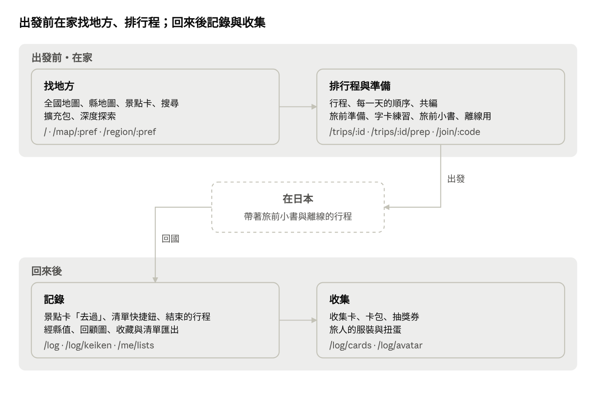

# ひとめぐり 使用流程與優化盤點

2026-10-02 起。線上版（可留言）：https://claude.ai/code/artifact/c995b879-2cea-4a2c-ab9d-d2cd5adc6f74 ，這裡是匯出的副本。

使用分成兩段：出發前在家找地方、排行程、做準備；回來後記錄去過的地方、收集卡片與旅人的服裝。下面依旅程順序寫成 user story，最後一節列出目前流程可以改善的地方。

網站在出發前與回來後使用；在日本的時候，靠的是事先印好的旅前小書和存成離線的行程。

## 出發前・找地方

在桌機上，從全國地圖挑縣、看大點、找順路的小點都走得通。卡住的地方在搜尋與擴充包。

1. **身為準備出國的人，我想從日本全圖挑一個縣，以便看那裡有哪些大點。**
   - 打開 `/`，開場畫面結束後是全國地圖。左側卡片依地方分組，列出 47 縣。
   - 點「京都」進 `/map/kyoto`。地圖定位到縣界，整頁換成縣色，並畫出鐵路與車站。
   - 左上的地區標籤有假名、縣名、羅馬拼音與地方。按「‹ 全國」回 `/`。
   - 把地圖拖過縣界，縣色、標籤與網址會自動換成鄰縣。拉遠到縮放 5 以下就回到全國。
   - 放大後，角落出現位置小框，例「京都 ×7.1」。
2. **身為規劃行程的人，我想在一個縣裡依類型看大點，再點開看念法與最近的車站，以便決定要不要去。**
   - 左側「景點」清單上方有類型列（「不限」「寺社」「城・史跡」…）。清單與地圖一起篩選。
   - 滑過一列，地圖會標出該點。點一列，網址加上 `?spot=`，右欄打開景點卡，地圖飛過去。
   - 景點卡內容：照片、假名／漢字／羅馬拼音、發音鈕、卡片鈕、「最寄駅」、維基百科簡介、附近的擴充包、「來源」。
   - 卡片最下方是「收藏」「去過」「清單」「加入行程」「在 Google Maps 開啟」。附近的點一多，這一列就被推到第一屏外。
   - 按「×」關閉。拉遠到縮放 10 以下也會自動關閉。
3. **身為已經知道要去哪裡的人，我想輸入名稱直接跳到景點，以便不用先找縣。**
   - 桌機 header 有「搜尋景點、地區」。第一次點進搜尋框時才下載全國索引。
   - 「fushimi」「伏見稲荷」「姫路城」都找得到。結果列有縣色小方塊、假名、日文名與繁中名。
   - 選了結果就進該縣並打開景點卡，例 `/map/hyogo?spot=wd-Q188754`。
   - 通稱「金閣寺」「銀閣寺」找不到，擴充包的點（例「一保堂」）也找不到。開著擴充包時，選結果沒有反應。
   - 手機沒有搜尋框。
4. **身為排行程的人，我想把看中的景點收藏起來或放進某一趟，以便之後在行程頁排順序。**
   - 按「收藏」。未登入時先跳 Google 登入，登入後自動完成收藏。
   - 地圖上方出現「收藏 N」，按下後地圖只顯示收藏，但左側清單仍列出全部景點。
   - 「清單」可以勾選既有的清單，或輸入「新清單名稱」後按「新增」。
   - 「加入行程」列出每一趟未結束的行程，選「待排」或某一天後按「加入」。目前選某一天時選單會關掉，景點只能進待排。
   - 沒有行程時，輸入「新行程名稱」按「新增」，就會建好行程並把景點放進去。
   - 加入後只顯示「已加入」，沒有連到那一趟的路。
5. **身為有特定興趣的人，我想在地圖上打開寶可夢人孔蓋、百名城、老舖這類主題，以便在大點附近找順路的小點。**
   - 地圖上方有「寶可夢」「城」「老舖・茶屋」「角色商店」膠囊鈕，件數跟著目前的縣變。滑桿圖示可以選要顯示哪些。
   - 點一顆會進 `?pack=castle`。左側換成擴充包清單，地圖上的景點變淡，當作底圖。
   - 點名城會打開景點卡，多出「名城 No.53」「スタンプ」兩列。點其他的點會打開擴充包卡，有創業年、地址、官方網站。
   - 擴充包卡只有去過鈕，不能收藏、加清單，也不能加入行程。
   - 全國首頁也能開擴充包，清單依縣分段，點一列就進該縣。
   - 景點卡的「附近的老舖・茶屋」列出 2 km 內的點。如果那個擴充包還沒開，第一次點不會選到。
6. **身為還在決定季節的人，我想看一個縣的花期、祭典與地區特色，以便挑出發的月份。**
   - 地區頁左欄最下方的「深度探索」進 `/region/:pref`，左欄是段落目錄。
   - 季節：12 個月的時間軸，本月有底色，可以切換觀測站。
   - 祭典：可依月份篩選。「在地圖上看」會回到地圖並放上名稱標記，上一頁會回到原段落。祭典不能加入行程。
   - 地區特色：每組先列 9 項，按「全部 N 項」展開。
   - 期間限定：連鎖店的 Google 近一個月搜尋，和「截圖」連結。
   - 「‹ 地圖」回到的是整縣地圖，原本開著的景點卡與擴充包都不見了。
7. **身為想買限定商品的人，我想查超商新品並存下截圖，以便到日本照著找。**
   - 從帳號選單的「期間限定」，或深度探索的「截圖」進 `/limited`。
   - 「連鎖店」是一排 Google 搜尋鈕，搜近一個月，介面是繁中。
   - 在「截圖」按「新增」上傳。未登入時顯示要先登入。

## 出發前・排行程與準備

建行程、排每一天、共編、旅前準備都能用。最大的斷點有兩個：景點放不進指定的那一天，行程頁本身也不能加景點。

1. **身為出發前的使用者，我想建一趟有名稱與日期的行程，以便把景點排進每一天。**
   - 按 header 的「行程」進 `/trips`。未登入時只有一行「收藏、行程與紀錄需要登入。」，沒有按鈕。
   - 輸入「名稱」（可以空著），在「日期」月曆依序點出發日與回程日。
   - 按「新增行程」進 `/trips/:id`，系統依日期建好 DAY 1 到 DAY N。
   - 空的那幾天只寫「這天還沒有地點」，頁面上沒有加景點的入口。
   - `/trips` 列表的行程卡有封面色帶、日期、地點數與倒數翻牌。
2. **身為出發前的使用者，我想在地圖上看到想去的景點就加進行程，以便邊逛邊收集。**
   - 回到「探索」，用搜尋，或在地圖、清單上找到景點，打開景點卡。
   - 按「加入行程」，選單列出未結束的行程，每一列有「待排」下拉與「加入」。
   - 選「DAY 1」時，整個選單直接關掉，選擇沒有生效，景點只能放進待排。
   - 加入後那一列顯示「已加入」，按鈕變成「加入行程 1」。選單裡沒有連到這一趟的連結。
   - 擴充包的點和祭典沒有「加入行程」。
3. **身為出發前的使用者，我想把待排的景點分到每一天並調整順序，以便看出每天的路線。**
   - 在 `/trips/:id`，每個停留點都有「移到」下拉，選某一天就移過去。
   - 用「⌃」「⌄」調整順序。桌機也能拖曳把手，手機上拖不動。
   - 點 DAY 標記，右側地圖只顯示那一天，並依順序畫線。按「全部」回到整趟。
   - 相鄰兩點之間有「轉乘路線」，會開 Google Maps 的大眾運輸路線。
   - 縮短日期時，被拿掉那幾天的點會移到待排，畫面沒有提示。
   - 點停留點的名稱只會加底色，不會打開景點卡。
   - 「匯出 KML」「匯出 CSV」的檔案裡，每天是一個 folder。
4. **身為和旅伴一起出發的使用者，我想讓對方也能編輯同一趟，以便一起排。**
   - 在行程頁按「共編」。第一次按會產生邀請連結，按「複製」後傳給旅伴。
   - 旅伴打開 `/join/:code` 並登入，會看到邀請人與行程名稱，按「加入」就進到行程。
   - 建立者的按鈕即時變成「共編 2」。成員可以「離開」，建立者可以移除成員。
   - 產生連結之後改了行程名稱，邀請頁還是顯示舊名稱。
5. **身為出發前的使用者，我想先看到這趟會遇到的日文，以便熟悉地名與會話。**
   - 在行程頁按「旅前準備」進 `/trips/:id/prep`，標頭用封面縣的地區色。
   - 「地名與車站」列出每個停留點與最近的車站，附假名、羅馬拼音與發音鈕。
   - 「聽」「說」「讀」依情境分組。勾「只看必備」就只留下必備的句子。
   - 「期間限定」只放氣象廳近期的觀測。提早幾週排的行程，這一段通常是空的。
   - 這一段也有截圖與連鎖店搜尋。
6. **身為出發前的使用者，我想用字卡練習地名與會話，以便記得更牢。**
   - 在旅前準備按「開始練習」，進 `/trips/:id/prep/practice`。
   - 一輪 20 張。翻面看假名與中文，再按「記得」或「再練一次」。
   - 勾「聽音」時，正面只播發音。
   - 頂部寫「熟練 0 ／ 115」，旁邊的進度條卻從一開始就看起來快滿了。
7. **身為出發前的使用者，我想把行程與會話印成小冊子，以便出發時帶在身上。**
   - 按「旅前小書」進 `/trips/:id/book`。
   - 選 A5 或 A4，勾選要放的段落，也可以勾「只放必備會話」。
   - 下方照紙寬預覽。按「列印／存成 PDF」會用瀏覽器列印。
8. **身為出發前的使用者，我想把網路上看到的限定商品截圖掛在這趟行程，以便到日本照著找。**
   - 在旅前準備的「截圖」按「新增」，行程已經預先選好。也可以到 `/limited` 按「新增」。
   - 選圖（可以多張，也能拖曳或貼上），填品牌、品項與說明後按「儲存」。
   - 從 `/limited` 新增時，「行程」下拉被對話框蓋住，選不到行程。
   - 存好的截圖會出現在旅前準備，以及旅前小書的期間限定頁。
9. **身為出發前的使用者，我想把這趟的資料與地圖存到手機，以便網路不穩時也能看。**
   - 在行程頁按「離線用」，按鈕底色會變成進度條。
   - 存完後顯示「已存離線」。之後再加景點，按鈕也不會變回來。

## 回來後・記錄

回國後有三條路可以標去過：景點卡、清單快捷鈕、已結束的行程。三條路記下的結果，在各頁看起來不一樣。

1. **身為剛從日本回來的使用者，我想在景點卡上標「去過」並補上日期，以便收集冊、經縣值和旅人都記到這個地方。**
   - 在 `/map/:pref` 打開景點卡，按「去過」。
   - 按鈕蓋章，收集卡轉著飛到畫面中央。如果是這個縣第一次去過，會再蓋一個縣的紀念章。
   - 卡片停一下後縮進「紀錄」分頁，點任何地方都可以跳過。
   - 亮相的季節卡用的是今天的季節，不是去的那一天，收集冊裡其實沒有那張季節卡。紀念章原本也寫今天的日期，已隨成就系統修正：沒有日期就不寫。
   - 「去過」的右半邊變成「日期」，點開月曆就能補日期。
   - 再點一次左半邊會取消去過，日期也一起刪掉。
   - 手機上的動作列在 sheet 最下方，要先捲過簡介與附近清單才按得到。
2. **身為一次去了很多地方的使用者，我想在清單上連續按「去過」，之後再一次補日期，以便不用一個個打開景點卡。**
   - 桌機地區頁左欄、`/me` 的收藏、`/me/lists/:id` 的清單，每一列右側都有勾勾圓圈，可以切換去過。
   - 用快捷鈕標的去過不會播亮相，也不送第一次的免費抽，代表服裝也不會標 NEW。
   - 到 `/log` 的「去過 N」按「補日期」，沒有日期的列已經預先勾好。
   - 按「選擇日期」，月曆從本月開始。選好日期按「套用」，再按「完成」。
   - 補日期時如果點到景點名稱，會直接離開頁面，勾選全部不見。
3. **身為出發前就排好行程的使用者，我想讓行程結束後自動變成紀錄，以便不用再一個個標去過。**
   - 過了回程日，`/trips` 上方改成「已結束的旅行 N」，`/log` 的「旅行」也會出現這一趟。
   - 每一天的停留點自動算去過，日期就是那一天。待排的點不算。
   - `/log` 的地圖、去過清單、收集冊、經縣值和旅人服裝都會跟著更新。
   - 但景點卡、地區清單與探索地圖仍顯示「沒去過」。原本之後再標同一縣的景點會重蓋「初訪」，這一點已隨成就系統修正。
4. **身為剛結束一趟旅行的使用者，我想打開這趟的卡包，以便有收卡的儀式感。**
   - 在 `/log` 的「旅行」點這一趟，進 `/trips/:id`。返回連結寫「紀錄」，頂部分頁亮的卻是「行程」。
   - 「開卡包」排在按鈕列第一個，還沒開過時右上有紅點。`/log` 的旅行卡片上沒有這個紅點。
   - 按鈕列還留著「旅前準備」「旅前小書」「離線用」，畫面上有兩個 Primary。
   - 撕開卡包後一張張翻，最稀有的留到最後。按「全部翻開」可以直接看一覽。
   - 一覽下方有「收集冊」，連到 `/log/cards`。
5. **身為想跟朋友分享的使用者，我想把這趟做成一張回顧圖，以便貼到社群。**
   - 在行程頁按「回顧圖」，預覽 1080×1350 的圖：縣色帶、行程名稱、日期、地圖與每天的路線。
   - 手機按「分享」，桌機按「下載」。
   - 回顧圖寫「N 個地方」，不含待排。行程卡片寫「N 個地點」，含待排。
6. **身為以前去過、但沒在網站上排行程的使用者，我想補登那一趟，以便紀錄頁也有這趟旅行。**
   - 在 `/log` 按「補登旅行」，輸入名稱、選過去的日期，按「新增」後進 `/trips/:id`。
   - 每一天都寫「這天還沒有地點」，頁面上沒有加景點的入口。
   - 景點卡的「加入行程」只列未結束的行程，補登的這一趟不在裡面。
   - 只能繞路：先建沒有日期的行程、逐一加點、把日期改成過去，再一個個「移到」每一天。三個景點約要 20 個操作。
7. **身為喜歡「経県値」的使用者，我想替 47 縣標上住過、玩過等級數，以便看出自己去過多少地方。**
   - 按 `/log` 上方的「經縣值」卡進 `/log/keiken`，可以看到總分 / 235 與各級的縣數。
   - 點地圖上的縣，會在點的位置打開級數選單。也可以在下方的列上直接按六個按鈕之一。
   - 沒有選級數的縣，只要有去過的景點，就自動算「玩過」。但手動選過之後，就回不到自動。
   - 在手機上點南邊的縣，選單會被底部分頁蓋住。點選單外面也不會關掉。
   - 「存成圖片」→ 預覽 →「分享」或「下載」。
8. **身為整理旅行資料的使用者，我想管理收藏與清單並匯出，以便帶到 Google My Maps 或試算表。**
   - 從頭像選單的「收藏與清單」進 `/me`。點一列會回到地圖並打開景點卡。
   - 在「新清單名稱」輸入後按「新增清單」，直接進 `/me/lists/:id`。清單可以改名、刪除、移除項目。
   - 收藏、清單與 `/log` 的去過都有「匯出 KML」「匯出 CSV」。

## 回來後・收集

收集冊、抽獎券、卡包和旅人都做得很完整。問題是拿到新東西之後，使用者常常沒看到，也找不到。

1. **身為剛回國的旅人，我想在標「去過」時當場拿到收集卡，以便把旅行變成收藏。**
   - 在景點卡按「去過」，收集卡轉兩圈飛到畫面中央。第一次到這個縣時，會另外蓋一個縣章。
   - 每個景點第一次去過，會送一次免費抽，抽到的樣式直接拿來亮相。
   - 第一次去一個縣會送代表服裝，但亮相畫面上看不到。
   - 卡片停一下後飛進「紀錄」分頁。分頁和 `/log` 都不會留下記號。
   - 系統開了「減少動態」時，整段亮相都不會出現。
2. **身為使用者，我想看自己集了多少卡、去過幾個縣，以便感受自己去了多少地方。**
   - `/log` 最上方的「收集冊」入口卡，有最近三張卡排成的扇形、張數與「都道府縣 n / 47」。
   - `/log/cards` 的海報區有張數、縣數與名城進度條。右側地圖會替去過的縣上色。
   - 點地圖上的縣，頁面會捲到那一縣的段落。
   - 篩選膠囊有「全部」「世界遺產」「名城」「國寶・特別史跡・特別名勝」「全景・金箔」，各帶張數。沒有「新拿到」。
   - 每張卡下方寫「n / 種數」，有新樣式的卡左上角會標 NEW。
3. **身為使用者，我想放大看一張卡、翻到背面、切換樣式並選封面。**
   - 在 `/log/cards` 點卡片，打開放大檢視。
   - 點卡片、按 Space 或 Enter，或按「背面」都能翻面。用 ‹ ›，或左右滑動換卡。
   - 下方的樣式膠囊可以切換樣式。打開時停在封面，不是剛拿到的那一種。
   - 按「設為收集冊的封面」，格子裡的卡立刻換成那一種。
   - 按「地圖」回到景點。從景點卡打開的檢視沒有「收集冊」。
   - 收集冊不讀網址參數，沒辦法直接連到某一張卡。
4. **身為使用者，我想用抽獎券補齊同一個景點的其他樣式，以便不用為了收集重複去同一個地方。**
   - `/log/cards` 上方一列有「抽獎券 n」（可展開來源明細）、「樣式 已有 / 全部」、「規則」、「十連抽」。
   - 「十連抽」把十張卡背朝上排成 5×2，再依序自動翻開。按「全部翻開」可以一次翻完。
   - 放大檢視裡的「抽一張 券 n」只抽這一個景點。
   - 只會抽到還沒有的樣式。測試期不限張數；正式上線後，券不到 10 張時「十連抽」會不能按。
5. **身為剛結束一趟旅行的人，我想一次打開這趟的卡，以便把整趟收進收集冊。**
   - 行程結束後，在 `/trips/:id` 按「開卡包」。
   - 撕開卡包，一張張翻，最稀有的留到最後。
   - 一覽下方的「收集冊」直接連到 `/log/cards`。這是唯一一條直達收集冊的路。
6. **身為使用者，我想調整旅人的樣子，穿上去過的縣的服裝，以便有一個代表自己旅行的角色。**
   - 從 `/log` 第三張入口卡「旅人」進 `/log/avatar`。桌機也能從頭像的旅人小卡進去。
   - 左邊是展示窗，可以拖拉旋轉。右邊衣櫃分成「外觀」「衣服」「頭上」「臉上」「手上」「夥伴」。
   - 頁面一律開在「衣服」，分頁上也沒有 NEW。47 件代表服裝只有 1 件在「衣服」。
   - 點貼紙就穿上，蓋上朱色「穿」。還沒有的顯示剪影與縣名小牌。
   - 手機上衣櫃在展示窗下方，捲下去換衣服時就看不到旅人。
7. **身為使用者，我想用抽獎券抽服裝，以便拿到更多服裝。**
   - 展示窗下方有「抽服裝」，右邊寫「抽獎券 n」。
   - 扭蛋轉出來後，顯示名稱與 NEW。可以按「穿上」「再抽一次」或「關閉」。
   - 關閉後衣櫃停在原本的分頁，看不出抽到的東西在哪一頁。
   - 去過的縣都抽齊時，按鈕會改寫成「去過的縣都抽齊了」。
8. **身為使用者，我想在其他頁也看到我的旅人，以便偶爾被提醒回來收集。**
   - 登入後，散步的旅人在畫面下緣走動（只在桌機），偶爾說一句話，例如下一趟的倒數、「抽獎券還有 n 張」、「收集冊有新的卡」。
   - 點旅人只會換一句話，不會帶你到收集冊或旅人頁。
   - 取消去過之後，旅人還是會說「收集冊有新的卡」。
   - 可以在帳號選單的「散步的旅人」把它關掉。

9) **身為使用者，我想看自己集到哪些紀念章，以便知道哪裡還沒去、下一趟往哪裡走。**
   - 從 `/log` 三張入口卡下面的「成就」一列進 `/log/achievements`。有新的成就時，這一列標 NEW。
   - 第一頁「初訪」是 47 縣的紀念章，依地方分行，還沒去的是虛線圓。後面 7 組共 40 個成就：地方、旅行、時節、足跡、文化指定、名城、擴充包。
   - 達成的章寫旅行時的那天。還沒達成的寫進度，地方差 3 縣以內寫「還沒去：秋田、山形」。
   - 點章看條件、日期與有關的地方，可以連到地圖或行程頁。
   - 在景點卡按「去過」剛好達成時，新卡入手的卡片右上多蓋一個成就章。卡包一覽下方與行程頁標頭下方有「這趟的成就」。
   - 地方、旅行、時節的成就每個送 5 張抽獎券。取消去過時，成就與抽獎券一起拿掉，標回去就回來。
   - 用清單快捷鈕、批次補日期達成的成就不播動畫，只標 NEW。
   - 有些地方沒有日期時，達成日寫不出來，頁面上方出現「沒有日期的地方 n 處」與「補日期」。

## 跨頁的部分

開場、登入、分頁、年代主題與離線都很穩定。跨頁時最常遇到的問題是狀態不見：回到探索要重找、捲動位置錯、按返回會跳過頁面。手機版面依 PLAN.md §5 暫緩，所以手機的項目大多列為 P3。

1. **身為打開網站的使用者，我想不管從哪一頁進來，都能很快看到自己的資料，以便接著準備。**
   - 先出現開場畫面，47 縣的圓點依實際載入進度亮起。最少 0.9 秒，最多 10 秒。
   - 開場期間就確認好登入狀態，不會先閃出「需要登入」。
   - header 右上角顯示頭像或「登入」。
2. **身為使用者，我想用 Google 登入，再從頭像進到帳號相關的頁面，以便在不同裝置同步。**
   - 按「登入」→ Google 彈出視窗 → 回到原頁，按鈕換成頭像。
   - 桌機滑過頭像，會出現旅人小卡，顯示服裝數與抽獎券數。
   - 點頭像打開帳號選單：「我的行程」「旅行紀錄」「收藏與清單」「期間限定」「年代」「散步的旅人」「登出」。
   - 鍵盤：按 ↓ 打開，↑↓ 移動，Esc 收起。
3. **身為還沒登入的人，我想先逛地圖、用搜尋，以便決定要不要登入。**
   - 探索、搜尋與景點卡都能用。按「收藏」或「去過」時會先登入，登入後自動完成。
   - 「行程」「紀錄」「收集冊」「經縣值」「旅人」都只有一行「收藏、行程與紀錄需要登入。」，沒有按鈕。
   - `/me` 有「用 Google 登入」，`/join/:code` 有「登入」。
   - `/limited` 不用登入。但未登入時，唯一的入口是深度探索裡的「截圖」小字。
4. **身為使用者，我想在探索、行程、紀錄之間來回切換，以便邊看地圖邊排行程。**
   - 桌機的分頁在 header，手機在底部 tab。子頁會標出所屬的分頁。
   - `/me` 與 `/limited` 只在頭像選單裡。在這兩頁時，三個分頁都不會亮。
   - 換頁時淡入淡出，過場中的點擊不會落空。
   - 在 `/map/kyoto?spot=…` 切到「行程」，再按「探索」，會回到 `/`。剛才的縣和景點卡都不見了。
   - 新頁會停在上一頁的捲動位置附近。按返回時，捲動位置不會還原。
5. **身為使用者，我想用返回手勢回到剛才的位置，也想把網址傳給旅伴，以便不用重新找。**
   - `/map/:pref?spot=`、`/trips/:id`、`/join/:code` 都能直接打開。不存在的路徑會導回 `/`。
   - 子頁左上角有「‹ 紀錄」「‹ 行程」「‹ 地圖」，可以回上一層。
   - 打開景點卡時用的是 replace。依序走 `/` → 京都 → 景點，再按返回，會直接回到 `/`。
   - 在收集冊放大卡片後按返回，會直接離開收集冊。
   - 從別頁搜尋會多一筆 `/` 的紀錄，按返回時會先看到全國地圖。
   - 不是成員的人打開行程網址，只會看到「找不到這個行程」，沒有任何連結。
   - 每個地區頁的分頁標題都是「探索｜ひとめぐり」，每個行程頁都是「行程｜ひとめぐり」。
6. **身為使用者，我想把介面換成江戶、昭和等年代的樣子，以便看紀錄時更有味道。**
   - 在帳號選單的「年代」時間軸拖曳，或點年代名稱。紙色、字型、印章色與地區色會立即換掉。
   - 選擇存在這台裝置，下次打開時在畫面出現前就套用。
   - 網址帶著 `?theme=` 時，這個參數會一直蓋掉選單的選擇。未登入的人沒有選單，換不回來。
7. **身為出發前的使用者，我想在網路不穩時仍看得到收藏與行程，以便不被打斷。**
   - 斷網時，wordmark 右側會出現「離線」。
   - 收藏、去過與行程由本機快取顯示，連線後會自動送出修改。
   - 有新版本時，底部出現一行「有新版本」，附「重新整理」與「稍後」，不會自動重新整理。
8. **身為用手機的使用者，我想在手機上做到和桌機一樣的事，以便通勤時也能規劃。**
   - 手機 header 只有 wordmark 與頭像，三個分頁在底部 tab。
   - 選縣後，頂部是縣色條，下面是全螢幕地圖。景點卡是高 60dvh 的底部 sheet。
   - 沒有搜尋、景點清單、類型篩選、擴充包和深度探索的入口。
   - 散步的旅人走在 tab 上方，會蓋住卡片與按鈕。
   - 手機版面依 PLAN.md §5 暫緩，目前的要求是能開、不壞版。

## 待優化的流程

共 55 項，其中 P1 有 13 項。最大的三個主題是：三條標去過的路記下的結果不一致、換頁後地圖與捲動狀態不見、景點放不進行程指定的那一天或那一趟。建議先做 P1，其中 6 項是小工作量。工作量：小＝半天內，中＝1–2 天。

| 優先 | 區塊 | 項目 | 現在的問題 | 建議 | 工作量 |
| --- | --- | --- | --- | --- | --- |
| P1 | 找地方 | 開著擴充包時，搜尋與附近小點失效 | 開著擴充包時，從搜尋選景點沒有反應。附近的小點要點兩次才選得到。 | 一次導覽就寫好 spot 與 pack，pack 的 watcher 不再用 replace 蓋掉導覽。 | 小 |
| P1 | 排行程 | 「加入行程」選不了某一天 | 選 DAY 1 時整個選單會關掉，景點全進待排，要到行程頁再移。 | 外部點擊的判斷略過浮動面板（data-floating），清單選單也一起修。 | 小 |
| P1 | 記錄・收集 | 新卡亮相用的是今天的季節與日期 | 亮相用今天抽季節卡、蓋今天的日期，但收集冊裡其實沒有那張卡。 | 季節依 visited\_on 算，沒有日期就不亮季節卡、不印日期。補了日期後，新的季節卡標 NEW。 | 小 |
| P1 | 跨頁 | 回到探索時要重找剛才的縣和景點 | 「探索」分頁、「‹ 地圖」與別頁搜尋，都會回到 / 或整縣地圖，景點卡與擴充包不見。 | 記住最後一個探索網址（含 spot、pack），分頁與返回都連到它。別頁搜尋直接進縣。 | 小 |
| P1 | 跨頁 | 換頁時捲動位置錯亂 | 新頁沿用上一頁的捲動位置，返回時又不還原。例：/log 捲到 250 後進經縣值，停在 246。 | router 依 history 位置存取 main.scrollTop：返回時還原，換新頁時捲到頂。 | 小 |
| P1 | 收集 | 拿到新卡、新服裝後，入口沒有記號 | 新卡飛進「紀錄」後，分頁與 /log 入口都沒有 NEW，扇形也不放新卡。 | 紀錄分頁加紅點。/log 的收集冊、旅人入口加 NewTag 與抽獎券數，扇形先放新卡。 | 小 |
| P1 | 找地方 | 搜尋找不到通稱與擴充包的點 | 「金閣寺」「銀閣寺」「一保堂」「ポケモンセンター」都找不到。 | 索引加入 name.en 與 Wikidata 別名。擴充包的點另外當一類，並延遲載入。 | 中 |
| P1 | 找地方 | 擴充包的點與祭典不能加入行程 | 擴充包卡與祭典沒有收藏、清單、加入行程，順路的小點放不進行程。 | 擴充包卡改用 SpotActions，以擴充包 id 寫入。祭典加「加入行程」，放進待排。 | 中 |
| P1 | 排行程 | 行程頁不能加景點 | 空的行程只寫「這天還沒有地點」，沒有入口。收藏與清單也放不進待排。 | 「待排」旁加 Secondary「加入景點」，打開對話框，可以搜尋，也列出收藏與清單。 | 中 |
| P1 | 記錄 | 補登的旅行加不進任何地點 | 補登的行程一建立就是已結束，「加入行程」不會列出它，行程頁也沒有入口。 | 「加入行程」選單加入已結束的行程。去過日期落在行程期間內時，預設選那一天。 | 中 |
| P1 | 記錄 | 行程算出的去過，在景點卡與地圖上看不到 | 已結束行程的點在 /log 算去過，景點卡、清單與地圖卻顯示沒去過。 | 加一個共用的 visitedById，景點卡、快捷鈕、地圖與初訪判斷都讀它。 | 中 |
| P1 | 記錄・收集 | 用快捷鈕或行程標的去過，沒有免費抽也沒有 NEW | 清單快捷鈕、行程結束、補登標的去過，都沒有免費抽，新卡與服裝也不標 NEW。 | NEW 改由資料推出來：新出現的縣與景點都標 NEW。進收集冊時補發還沒領的免費抽。 | 中 |
| P1 | 收集 | 拿到代表服裝卻看不到 | 縣的代表服裝不會出現在亮相裡。衣櫃一律開在「衣服」，分頁上沒有 NEW。 | 亮相時在縣章旁放服裝貼紙。有 NEW 的分頁加紅點，並預設打開那一頁。 | 中 |
| P2 | 找地方 | 景點卡的動作列在第一屏外 | 附近清單一長，收藏、去過、加入行程就被推出第一屏。手機要捲完整個 sheet。 | 桌機的動作列固定在卡片底部（sticky），附近清單先列 2 筆。手機把動作列移到名稱帶下方。 | 小 |
| P2 | 找地方 | 類型篩選會帶到全國地圖 | 在縣地圖選的類型，回到全國後還在。首頁沒有類型列，看不出來也取消不了。 | 類型篩選只在地區頁套用，或回到全國時清掉。 | 小 |
| P2 | 排行程 | 加入行程後沒有路到那一趟 | 加入後只顯示灰字「已加入」，看不出在哪一天，也不能點過去。 | 「已加入」改成連到 /trips/:id 的連結，並寫出「DAY 2」或「待排」。 | 小 |
| P2 | 排行程 | 行程頁點景點打不開景點卡 | 點停留點只會加底色，看不到簡介和最寄駅，也不能改收藏。 | 選取中的那一列加「地圖」連結，連到 /map/{pref}?spot={id}。 | 小 |
| P2 | 排行程 | 縮短日期時，景點悄悄移到待排 | 縮短日期後，被拿掉那幾天的點移到頁面最下方的待排，畫面沒有任何提示。 | 有點會被移走時先確認，例「DAY 3 的 1 個地點移到待排？」。 | 小 |
| P2 | 排行程 | 邀請頁顯示改名前的行程名稱 | 邀請連結存的是建立時的行程名稱，改名後旅伴看到的還是舊名稱。 | 改名時同步更新 invites/{code}。規則加上成員可改 trip\_name，改完要貼到 Console。 | 小 |
| P2 | 準備 | 截圖編輯器的「行程」下拉選不到 | 下拉面板跑到對話框後面，從 /limited 新增截圖時掛不上行程。 | Teleport 的目標改成觸發鈕最近的 dialog，找不到才用 body。 | 小 |
| P2 | 排行程 | 排序鈕太小，移除後不能復原 | 上下鈕只有 24×16px，緊貼移除鈕。按偏就會移除，無法復原，共編的人也會跟著少一個點。 | 觸控時把按鈕放大到 44×44。移除後留一行「已移除 清水寺　復原」幾秒。 | 小 |
| P2 | 記錄 | 已結束的行程看不出卡包，按鈕還是出發前那套 | 旅行卡片沒有卡包紅點。行程頁還留著旅前準備，畫面上有兩個 Primary。 | 結束後只留「開卡包」一個 Primary，隱藏旅前準備、小書與離線用。卡片加上紅點。 | 小 |
| P2 | 記錄 | 補日期時點到名稱就離開頁面 | 勾選模式下，每一列仍是連結。點到名稱就跳到地圖，勾選全部不見。 | 勾選模式下整列改成 label，點了只切換勾選。月曆預設翻到最近一趟的月份。 | 小 |
| P2 | 記錄 | 經縣值的級數選單超出畫面 | 選單開在點的位置下方，不會往上翻，手機上被分頁列蓋住。點外面也不會關。 | 改用 floating.ts，加上外部點擊與 Esc 關閉。手機改成捲到那一縣的列。 | 小 |
| P2 | 記錄 | 取消去過時，日期也一起刪掉 | 誤點「去過」的左半邊，整筆日期就被刪掉。再標回來時沒有日期，還會重播亮相。 | 在記憶體裡保留剛取消的日期，同一次瀏覽中再標去過時帶回來。 | 小 |
| P2 | 收集 | 收集冊的 NEW 要整頁捲著找 | 十連抽之後，NEW 散在各縣段落裡。打開卡片時停在封面，不是新的那一種。 | 篩選列前面加「新拿到 n」。打開卡片時，先顯示第一個 NEW 樣式。 | 小 |
| P2 | 收集 | 券不到 10 張時，十連抽不能按 | 張數只看還缺幾種，不看手上的券。上線後只有 7 張券時，按鈕是灰的。 | n 取缺的種類、券數與 10 三者中最小的。1 到 9 張時寫「抽 n 張」。 | 小 |
| P2 | 收集 | 開了減少動態，按去過沒有任何回饋 | 開了減少動態，亮相就完全不顯示。免費抽與縣章照樣發了，使用者卻看不到。 | 改成靜態顯示：遮罩加卡片淡入，縣章直接蓋好，點一下就收起。 | 小 |
| P2 | 跨頁 | 未登入的頁面沒有登入按鈕 | 行程、紀錄、收集冊等頁只有一行字，只有 /me 和 /join 有登入按鈕。 | 做一個共用的 SignInPrompt：一行字加 Secondary「登入」。/me 也改成 Secondary。 | 小 |
| P2 | 找地方 | 探索地圖看不出哪些點已排進行程 | 已加入行程的點和其他點長得一樣，也沒有「只看這趟」的開關。 | 「收藏」旁加一顆「行程」膠囊。選一趟後，地圖只亮那趟的停留點。 | 中 |
| P2 | 準備 | 旅前準備的季節資訊，未來的行程是空的 | 這一段只放氣象廳近期的觀測，提早排的行程幾乎都是空的。 | 加一小段「季節」，列出平年日落在行程前後 2 週內的現象，註明來源是氣象廳。 | 中 |
| P2 | 收集 | 收集冊不能直接打開某張卡 | 收集冊不讀網址。景點卡的卡片檢視沒有「收集冊」，按返回也不會關閉放大的卡片。 | CardsView 讀 ?card= 並用 push 打開。景點卡的卡片檢視加「收集冊」連結。 | 中 |
| P2 | 跨頁 | 返回手勢會跳過地區地圖 | 景點卡用 replace 打開，看完按返回，會直接回到上上頁。 | 從沒選景點到打開第一張卡時改用 push，切換景點時仍用 replace。 | 中 |
| P2 | 跨頁 | 在對話框按 Tab，焦點會跑到外面 | 規則、分享圖、卡包等對話框沒有限制 Tab。關閉後，焦點會掉到 body。 | 統一改用原生的 dialog.showModal()。關閉後，焦點回到觸發的按鈕。 | 中 |
| P2 | 跨頁 | 手機沒有搜尋 | header 的搜尋框在 768px 以下會隱藏，全站沒有其他搜尋入口。 | 手機 header 加一顆放大鏡 Icon 鈕，點開後展開整列 SearchBox，沿用現有元件。 | 中 |
| P3 | 找地方 | 只看收藏時，清單仍列出全部景點 | 地圖上只剩收藏的點，左側清單卻仍是全縣 393 列。 | 只看收藏時，清單也只列收藏，標題改成「收藏」。 | 小 |
| P3 | 找地方 | 直接打開深度探索時，目錄標錯段落 | 從連結進 /region/:pref，人在「季節」段落，目錄卻標在「期間限定」。 | 內容載入後呼叫 scrollSpy 的 refresh，「捲到底」的判斷加上高度條件。 | 小 |
| P3 | 準備 | 零熟練時，練習進度條看起來是滿的 | 1 到 5 箱都用地區色畫，剛開始整條是淡色，和「熟練 0」互相矛盾。 | 底色改用 bg-placeholder，只畫第 5 箱所占的比例，不用 opacity。 | 小 |
| P3 | 準備 | 「已存離線」不會跟著行程更新 | 存好之後再加景點，仍顯示「已存離線」。圖磚抓不到，也不算失敗。 | 一併存下停留點清單，和目前行程不同時退回「離線用」，並統計失敗數。 | 小 |
| P3 | 排行程 | 找不到行程時沒有路可走 | 不是成員或行程已刪除時，只顯示一行字。旅前準備、練習與小書整頁空白。 | 改寫「找不到這個行程，或還沒加入共編。」，並加一顆 Secondary「行程」。 | 小 |
| P3 | 記錄 | 已結束的行程，分頁卻亮在「行程」 | 從 /log 進已結束的行程，返回連結寫「紀錄」，分頁卻亮「行程」。 | 路由是 trip 且行程已結束時，改亮「紀錄」分頁。 | 小 |
| P3 | 記錄 | 經縣值選過級數，就回不到自動 | 手動選過級數的縣，回不到「有去過就算玩過」。 | 選單加「清除」。圖例的縣數加上單位，例「住過 5　0 縣」。 | 小 |
| P3 | 記錄 | 地點數的說法不一致 | 行程卡片寫「個地點」，含待排。回顧圖寫「個地方」，不含待排。 | 回顧圖改寫「N 個地點」，和行程卡片一致。 | 小 |
| P3 | 收集 | 卡包一覽在張數少時靠左 | 只有 1 到 4 張時卡片靠左，標題與按鈕卻是置中。 | 一覽改成 flex flex-wrap justify-center，每張卡固定寬度。 | 小 |
| P3 | 收集 | 點散步的旅人，到不了它說的地方 | 旅人說「收集冊有新的卡」，點它卻只會換一句話。 | 把提到地方的句子改成連結：新卡連到收集冊，新衣服與抽獎券連到旅人頁。 | 小 |
| P3 | 收集 | 取消去過後，旅人仍說有新卡 | 去過又取消後，NEW 記錄還留著，旅人一直說有新卡、新衣服。 | 旅人只算目前還擁有的東西的 NEW。 | 小 |
| P3 | 收集 | 國寶名城沒有特別全景 | 規則寫國寶與特別史跡有特別全景，松本城等 18 張名城卡卻沒有。 | 特別全景改看文化財指定，不看名城的箔片稀有度。 | 小 |
| P3 | 收集 | 手機收集冊的第一屏看不到卡 | 390px 寬時，海報、抽獎券列與三行篩選把第一張卡推到 712px。 | 篩選改成一行橫向捲動。十連抽縮小，留在同一行。 | 小 |
| P3 | 收集 | 手機十連抽的卡太小 | 直式手機仍排成 5×2，每張只有約 67px 寬，NEW 牌蓋住縣名與卡號。 | 小卡的 NEW 改成紅點，窄螢幕的 gap 縮到 4px。 | 小 |
| P3 | 跨頁 | 手機上散步的旅人蓋住內容 | 旅人走在內容區，蓋住卡片、按鈕與經縣值的選項。 | 手機上改走在 tab 上緣。sheet 或對話框開著時隱藏旅人。 | 小 |
| P3 | 跨頁 | 未登入時，期間限定頁不好找 | 未登入時唯一的入口是深度探索的「截圖」小字，字面和頁面內容對不上。 | 把段落裡的「截圖」連結改寫成「期間限定」。 | 小 |
| P3 | 跨頁 | 網址的 ?theme= 會蓋掉之後選的年代 | 網址帶 ?theme= 時，重新整理就會蓋回去。未登入的人沒有選單可以換回。 | 讀到參數並存好後，用 replaceState 把它從網址拿掉。 | 小 |
| P3 | 跨頁 | 地圖與行程的分頁標題都一樣 | 每個地區頁都是「探索｜ひとめぐり」，每個行程頁都是「行程｜ひとめぐり」。 | 改用實際的名稱，例「京都｜ひとめぐり」「{行程名}｜ひとめぐり」。 | 小 |
| P3 | 排行程 | 手機行程頁看不到停留點 | 手機上地圖固定占 36dvh，按鈕列有 7 顆，第一屏看不到停留點。 | 照 UX-FLOW 改成天數 tab 加地圖切換鈕，兩個匯出鈕合成一個。 | 中 |
| P3 | 收集 | 手機旅人頁換衣服時看不到旅人 | 衣櫃在展示窗下方，捲下去換衣服時，旅人已經在畫面外。 | 手機上的展示窗改成 sticky，高度約 38dvh。 | 中 |
