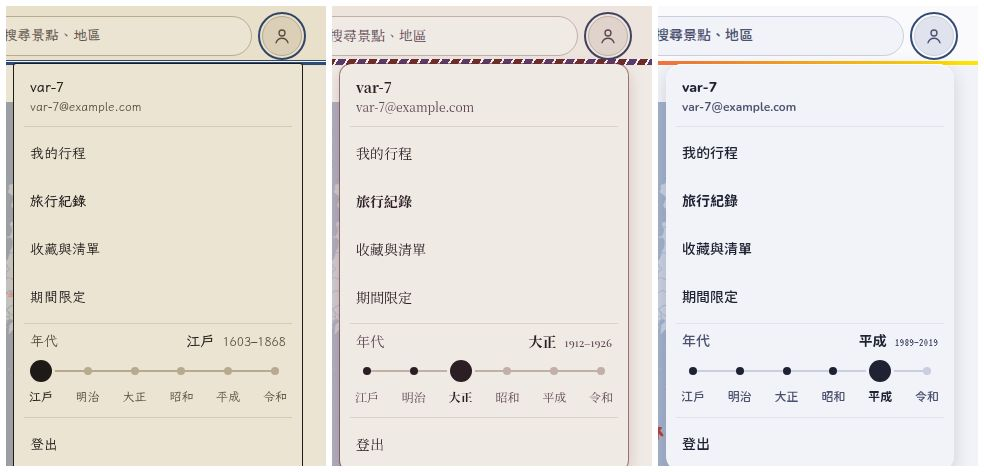
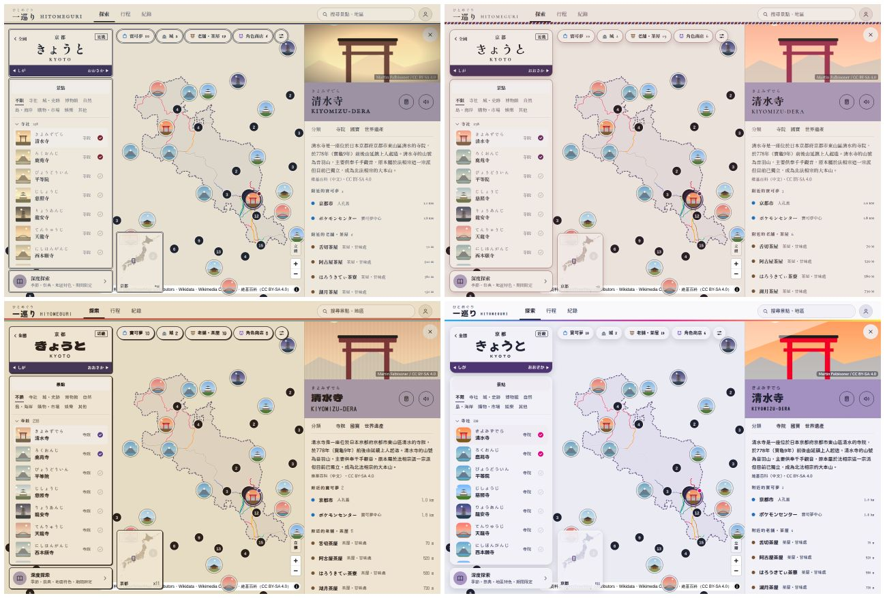
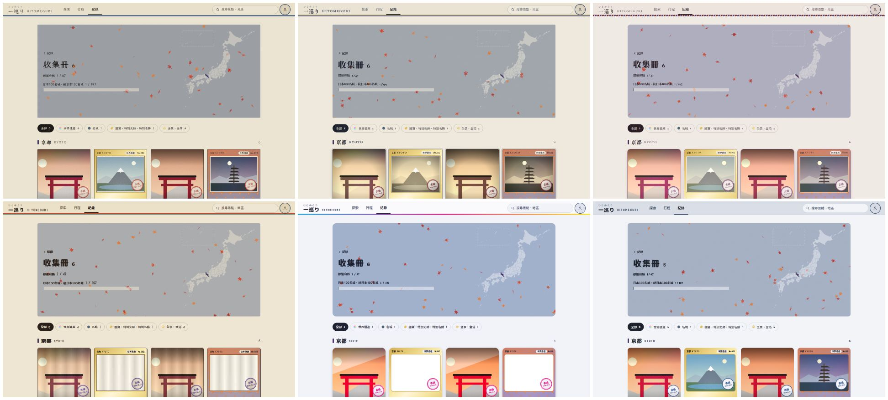
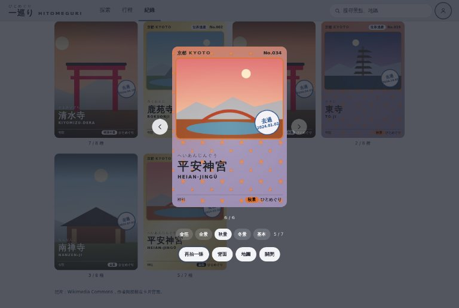
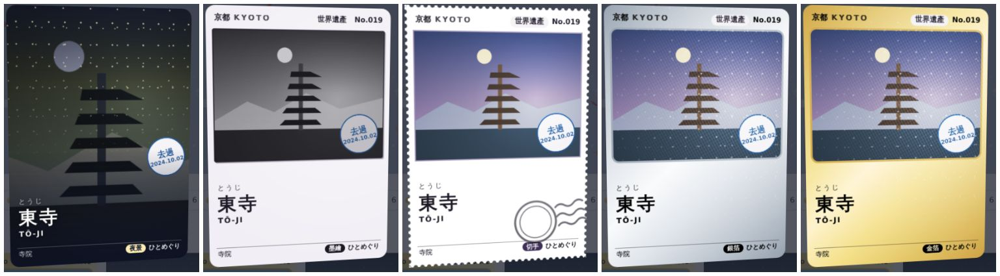
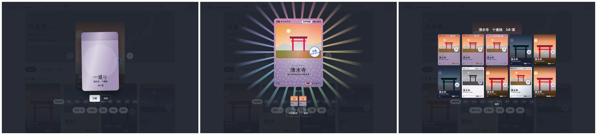
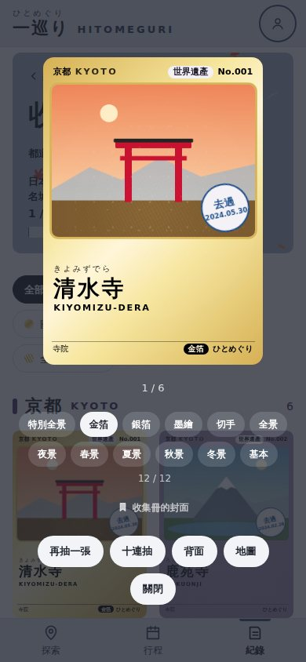
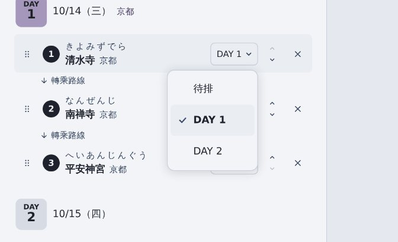

# 年代主題 驗收說明（2026-10-02）

規格見 DESIGN.md §13（各年代的顏色、字型、照片、形狀一覽表）；昭和的 mockup：https://claude.ai/artifact/ML2F8FTvJa9LDsKY263tXw

## 怎麼切換
- 登入後點右上頭像 →「年代」時間軸：拖曳把手或點年代名稱。江戶（1603–1868）、明治（1868–1912）、大正（1912–1926）、昭和（1926–1989）、平成（1989–2019）、令和（2019–，原本的樣子）。
- 選了就存在這台裝置；網址加 `?theme=showa`（edo、meiji、taisho、heisei、modern）也會切換並記住。
- 開場畫面、旅行回顧圖（分享圖）也跟著年代的顏色與字型。

## 收集卡：無限抽、季節照片
- 測試期每次按「去過」、每次打開卡包都重抽一次；放大檢視多了「再抽一張」。抽到的存在帳號裡（Firestore `users/{uid}/cards`，規則請貼到 Console；沒貼之前只存在這台裝置）。
- 全景、金箔、特別全景、季節卡改用抽到那個季節的照片（Commons 分類裡有的話），卡片背面的出處跟著換。季節照片由 Actions 的 `seed-pack` → `seed-season-photos` 找（分數 70 以上、有 Wikidata 的景點）。2026-10-02 跑完全部縣（run #50）：查了 3,125 筆，627 筆找到，其中夜景 236、春 221、冬 145、秋 137、夏 39；東京 110、北海道 76、京都 62 最多，高知 0。照片來自景點本身的 Commons 分類，少數是分類裡的周邊照片（例如萬松寺的夏景是大須夏祭）。

## 新卡種、十連抽
- 樣式從 7 種變 11 種（稀有景點 12 種）：多了夜景、墨繪、切手、銀箔。機率在 DESIGN.md §7.19a。
- 放大檢視：「再抽一張」（新卡入手動畫）、「十連抽」（十張一次排成 5×2，依序自動翻開，也可以「全部翻開」；翻開的點一下放大）。
- 收集冊的封面：放大檢視收集到兩種以上時可以「設為收集冊的封面」；沒選的顯示基本卡。
- 測試期的抽卡季節也隨機，才抽得到夏景、冬景（正式規則看去的日期）。
- 原生 `<select>` 都換成自己的下拉選單（行程的「移到 DAY n」、加入行程的天、收藏的行程）；品牌欄的建議改成膠囊。
- 景點照片的慢慢拉近拿掉；位置小框的擴散光圈拿掉。
- 地圖照片圓點對不準：改用資料的座標（原本用圖磚回傳的幾何）。

## 這次一起修的
- 切換時 header 高度不變（帶色畫在 header 裡面），不再抖一下。
- 大標的中文改用有繁體字的字型（日文字型缺字時，一句裡會混兩種字）。
- 地圖最大放大到 17 級（原本可以一直放大；放太大時立體地形上的照片與圓點會錯開）。
- 地圖上的照片圓點、收集卡的陰影減輕。
- 擴充包面板「在 Google Maps 開啟」放不下時換到下一行。
- 季節卡（春景…）在淡色的縣也看得出來：卡框上半染季節色，花樣加影子，傾斜時跟著光源飄。
- 選取景點時往外擴散淡出的光圈拿掉，只留一圈。
- 川越的「氷川神社」改成正式名稱「川越氷川神社」（埼玉有三間同名的氷川神社：川越、大宮、浦和）。

## 請確認
- 各年代的感覺、字型。
- 站名標「前後一個縣」要不要留。
