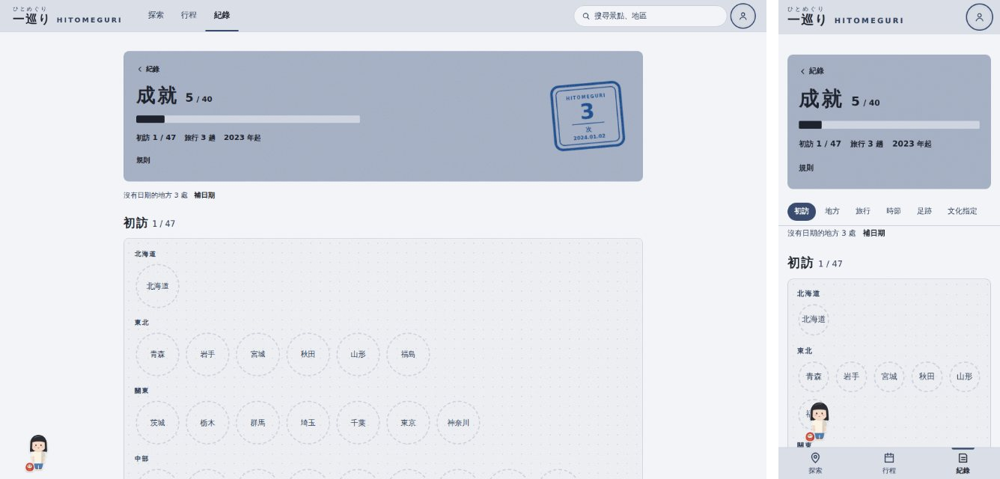
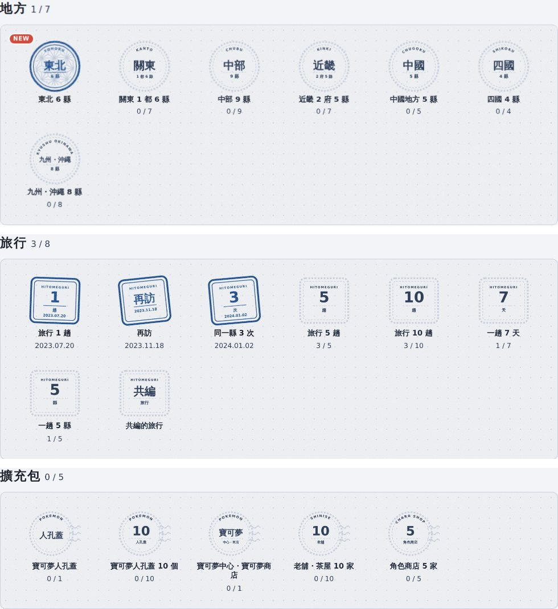
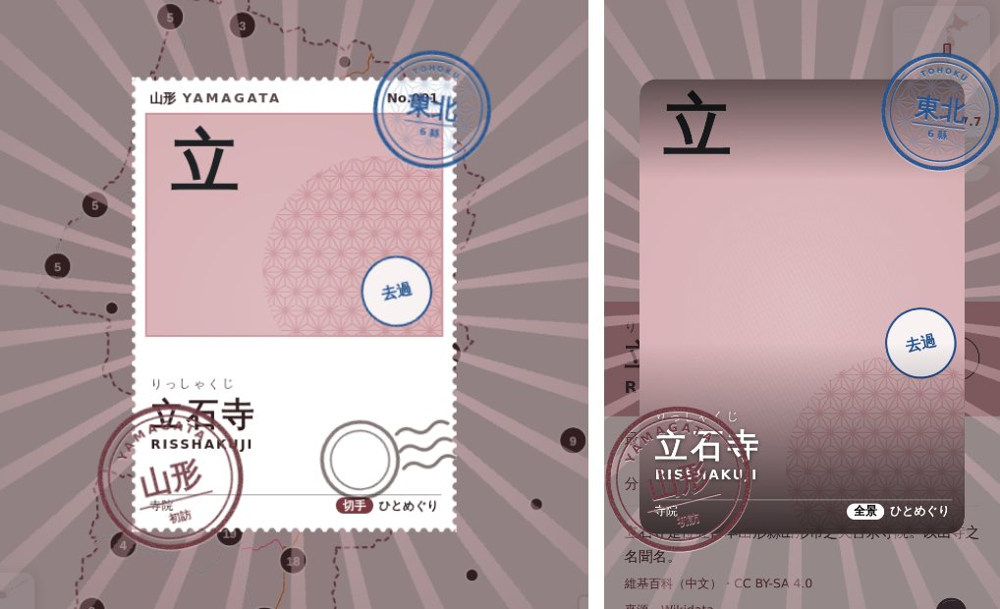
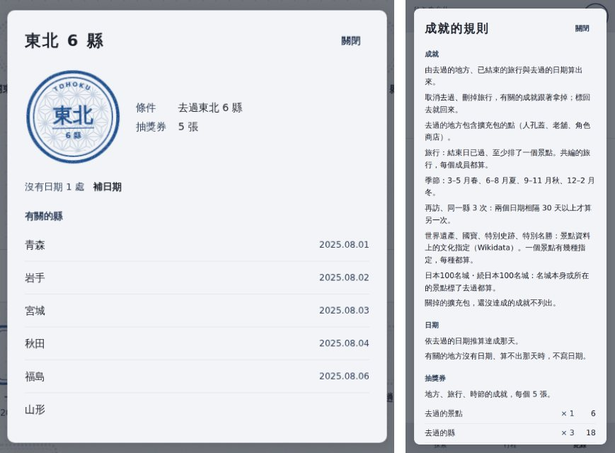
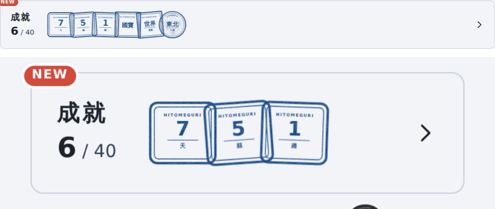
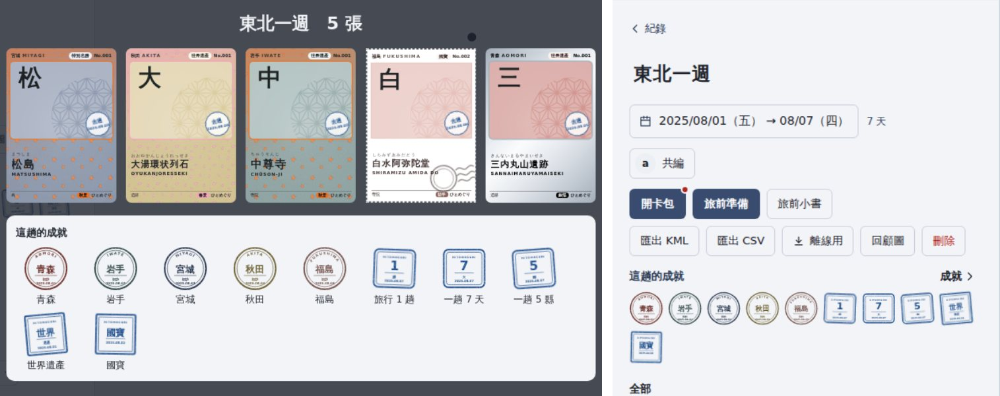
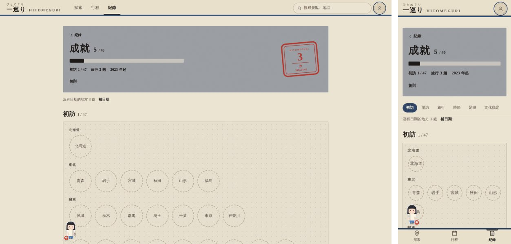

# 成就 驗收說明（2026-10-02）

規格見 DESIGN.md §7.25（成就）、§7.19b（抽獎券）、§9（動態）；UX-FLOW.md E8。入口在「紀錄」頁三張卡下面的「成就」一列，或直接開 `/log/achievements`。

## 做了什麼
- 成就頁是一本紀念章帳：
  - 第一頁「初訪」：47 格縣的紀念章（`PrefStamp`，原本只在新卡入手時出現一次），依地方分行；還沒去的是虛線圓＋縣名。
  - 後面 7 組 40 個成就：地方 7、旅行 8、時節 4、足跡 6、文化指定 5、名城 5、擴充包 5。條件只取真實的名單（日本100名城・続日本100名城、Wikidata 的文化指定、8 個地方）與自己的紀錄（去過的日期、已結束的旅行）。
  - 達成的用印泥蓋上、寫旅行時的那天；還沒達成的是虛線框，下面寫進度（地方差 3 縣以內寫「還沒去：秋田、山形」）。
  - 組別用形狀分：地方雙圈（內圈鋪地方的和風紋樣）、旅行角形駅スタンプ、時節小判、足跡點線雙圈、文化指定角印、名城八角、擴充包消印。
  - 點章看條件、日期或進度、抽獎券、有關的地方／旅行／縣（最多 12 筆，連到地圖或行程頁）。
  - 標頭的「規則」：自己點才打開，條列怎麼算、日期怎麼推、抽獎券、記號。
- 達成日：用去過的日期推算。有些地方沒有日期時，只要影響不到那一天，日期照樣寫；算不出來的就不寫，頁面上方一行「沒有日期的地方 n 處」＋「補日期」（回到紀錄頁、打開批次補日期）。
- 取消去過、刪掉旅行：有關的成就與抽獎券跟著拿掉；標回去就回來，不會再標 NEW。
- 抽獎券：地方、旅行、時節的成就每個 5 張（最多 95 張）。足跡、文化指定、名城、擴充包只記錄（錢包已依縣、依每 10 個景點給過）。收集冊的抽獎券明細、旅人與收集冊的規則表多一列「成就」。
- NEW：每台裝置記得看過哪些；第一次打開（新裝置、第一次部署）時把已達成的靜靜記下來，不會冒出一大片 NEW。登入後就載入文化指定與名城的資料，新帳號第一個去過的世界遺產、國寶也會標 NEW。打開那個成就就拿掉，離開成就頁拿掉全部。
- 解鎖時刻：
  - 在景點按「去過」剛好達成成就時，新卡入手的卡片右上多蓋一個成就章（rank 最高的那個；地方 > 足跡 > 名城 > 文化指定 > 旅行 > 時節 > 擴充包），卡片多停 0.7 秒。
  - 行程結束打開卡包，翻完的一覽下方「這趟的成就」：達成日落在這趟期間的初訪章與成就章。行程頁標頭下方也有同一列（小、不動），右邊「成就 ›」。
  - 清單快捷鈕、批次補日期、午夜行程結束、別台裝置的變化不播動畫，只有 NEW、紀錄頁入口的 NEW、散步的旅人說「有新的成就」或「東北還差秋田、山形」。
- 順手修的：
  - 新卡入手的縣章不再補上今天的日期（快捷去過沒有日期時就不寫）。
  - 景點卡片的「第一次到這個縣」改看去過的紀錄（含已結束的行程），行程裡去過的縣不會再蓋一次初訪章、再標一次服裝 NEW。
- Firestore 規則不用改。資料多一個小檔 `bundles/achievements.json`（約 3 KB gz，`build-bundles` 產生，部署的 workflow 本來就會跑）。

## 在 emulator 上驗收
先 `npx firebase emulators:start --project demo-hitomeguri --only auth,firestore`、`.venv/bin/python -m pipeline.cli build-bundles`、`cd web && npm run dev`，用新的測試帳號登入。

1. **東北 6 縣**：在青森、岩手、宮城、秋田、福島各找一個景點按「去過」並填日期；最後在山形的景點按「去過」。
   - 新卡入手的卡片右上蓋上「東北 6 縣」的章（山形是這縣第一個，左下同時有山形的初訪章）。
   - 紀錄頁的成就入口有 NEW；成就頁的「東北 6 縣」有 NEW，進頁面時蓋一次。
   - 收集冊的抽獎券明細「成就 1 × 5」，剩下的張數多 5。
2. **取消一縣**：把宮城的景點取消去過 → 「東北 6 縣」變回虛線（進度「還沒去：宮城」），抽獎券少 5。再標回去 → 章回來、抽獎券回來，不再標 NEW。（取消去過會清掉那個景點的日期，所以標回去後達成日不寫，頁面上方出現「補日期」。）
3. **補登一趟 7 天的旅行**：紀錄頁「補登旅行」選一週以前的日期，排 1 個以上的景點。
   - 成就頁「旅行 1 趟」「一趟 7 天」達成，日期是行程的結束日。
   - 行程頁「開卡包」翻完，下方「這趟的成就」列出這兩個（和這趟的初訪章）；行程頁標頭下方也有。
4. **名城**：在地圖上打開日本100名城的點（擴充包「城」）按去過，再到那座城對應的景點按去過 → 「日本100名城 10 城」的進度只加 1，詳細裡那座城的日期是比較早的那天。
5. **新帳號第一個去過是世界遺產**：用全新的測試帳號登入，在京都打開東寺按「去過」 → 新卡入手蓋「世界遺產」的章，讀屏是「…收進收集冊　成就　世界遺產　等 2 個」；成就頁的「世界遺產」「國寶」都有 NEW。
6. **第二台裝置**：用另一個瀏覽器（或私密視窗）登入同一個帳號 → 成就頁、紀錄頁入口都沒有 NEW，第一次打開時已達成的章依北到南蓋上一次。
7. **減少動態**：系統設定「減少動態」後按去過 → 新卡入手只淡入、淡出（不轉、不飛），這次達成的成就章一樣蓋在卡片右上（直接出現）；成就頁的蓋章直接出現（不一個一個等）。
8. **江戶主題**：`/log/achievements?theme=edo` → 達成的章是朱色，初訪章是江戶的縣色，字型換成江戶的字型。

## 自動測試
- `cd web && npm run test`（vitest，`src/services/achievements.test.ts`，46 項；CI 的前端 job 也會跑）：上下界與達成日、門檻邊界（9／10、47、名城不混続100名城）、地方名稱、季節（12–2 月冬）、30 天門檻、只有待排的行程不算、取消再勾結果一樣、NEW 的基準與比對（含 achievements.json 晚到）、去過的紀錄的指紋、旅行期間、目錄的 id（不用 `pref-` 開頭）與給券總數 95、文案不含驚嘆號・問號・emoji・「您」・「讓我們」。
- `.venv/bin/pytest -q`（`build_achievements` 3 項）。

## 需要你決定的
1. 取消去過時成就要不要永久保留？目前是跟著拿掉（和抽獎券、代表服裝一樣）。要保留的話得新增 `users/{uid}/meta/achievements` 並請你貼規則。
2. ~~服裝獎勵~~ 已做（2026-10-09）：6 個成就各送 1 件旅人的服裝，見下方「成就服裝」與 DESIGN.md §7.24。

## 成就服裝（決定事項 2，2026-10-09）
| 成就 | 服裝 | 位置 |
|---|---|---|
| 都道府縣 47 | 道中合羽 | 衣服 |
| 日本100名城 50 城 | 陣笠 | 頭上 |
| 四季 | 四季扇子 | 手上 |
| 一趟 7 天 | 唐草風呂敷 | 手上 |
| 足跡 300 處 | 金剛杖 | 手上 |
| 旅行 10 趟 | 無事蛙 | 夥伴 |

- 和代表單品一樣由紀錄算出來、不存：成就拿掉時服裝跟著拿掉；穿著的不畫（衣服換回白 T 恤），標回去就照樣穿上。不進扭蛋。
- 衣櫃：成就服裝排在不限縣的後面、各縣的前面，下面掛成就名小牌；還沒達成是剪影＋框線小牌。新達成時標 NEW。
- 成就的詳細多一列「服裝」（連到旅人頁）；成就與旅人的規則各多一條。
- 驗收：用測試帳號把 47 縣各標一個去過（日期分在 1、4、7、10 月）→ 衣櫃「衣服」「手上」出現道中合羽、四季扇子（NEW）；取消沖繩 → 道中合羽變回剪影，身上換回白 T 恤；標回去 → 又穿上，不再 NEW。
- 自動測試：`src/services/outfitOwn.test.ts`（目錄 5–8 件且成就都存在、色碼只用 token、規則列出每個成就、不進扭蛋、達成／拿掉／回來、穿在身上的）；`src/data/outfitGifts.test.ts` 產生並檢查 `outfitRewards.ts`。
