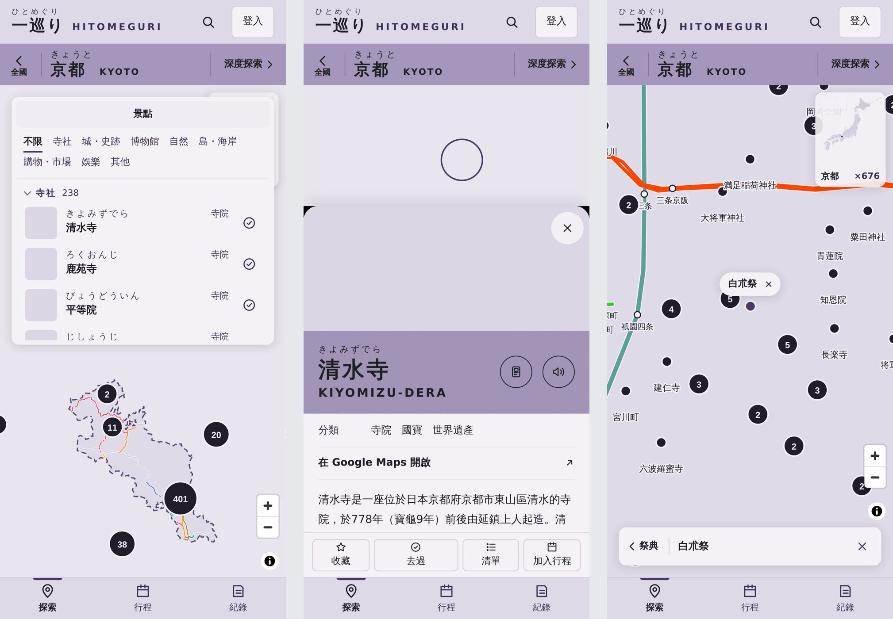
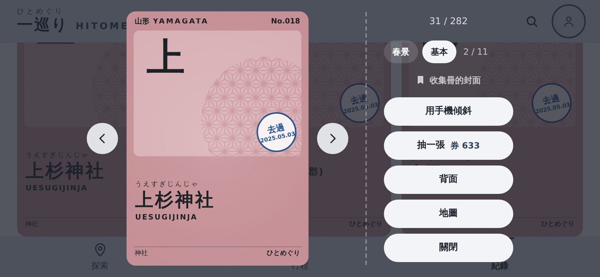

# 手機版面第一階段 驗收說明（2026-10-03）

計畫見 `docs/手機版計畫.md` §2。使用者同意的決定：A2（1024 以下都用手機版面）、G1（離線時行程不能修改）、S2（整頁不下拉重新整理）。

## 做了什麼
- **外框**：1024 以下用手機版面（平板也是）；換頁時捲到頂、返回時回到原位置；帳號選單打橫也點得到「年代」「登出」，點選單外面不會點到底下；打字時分頁列讓開；頁面程式載不到時有提示（離線時寫「離線中，無法開啟這一頁」）；沒登入的行程、紀錄頁有「登入」鈕；打橫時讓出瀏海；360 寬的「離線」標記不斷行；手機的搜尋在點放大鏡的同時聚焦。
- **探索**：
  - 縣頁海報條拆成「‹ 全國」、縣名、「深度探索 ›」；深度探索頁補上直飛航線。
  - 地圖鏡頭扣掉上方清單與景點卡片，選取的點落在看得到的地方；祭典「在地圖上看」改成底部小卡（‹ 祭典、名稱、關閉）。
  - 景點卡片底部固定「收藏・去過・清單・加入行程」；「在 Google Maps 開啟」移到資訊列。
  - 擴充包在手機看得到、關得掉；「附近的…」第一次點就打開那個點（桌機也修了）。
  - 返回手勢先關景點卡片、搜尋列、帳號選單。
  - 清單捲到頂再往下拉不會重新整理；地圖出處一開始收起。
- **深度探索、行程、紀錄**：段落列在頁頂時亮第一段；離線時行程鎖住，標題下寫「離線中・行程不能修改」；批次補日期點整列就是勾選；經縣值的等級選單不會被分頁列蓋住。
- **收集**：打橫時卡片檢視、開卡包、新卡亮相整張放得下，按鈕排在右邊；規則捲到下面也按得到「關閉」；點收集冊地圖上的縣會停在那一縣（桌機也修了）；翻到背面再抽一張，新卡回到正面。

## 要用真的手機確認
- iPhone：點放大鏡後鍵盤會不會跳出來；打字時分頁列有沒有讓開。
- Android：返回鍵是否先關景點卡片；鍵盤收起後分頁列有沒有回來。
- 打橫時瀏海的位置（沙箱只能模擬）。

## 下一步（第二階段，已同意照建議）
景點卡片把手與三段高度、擴充包 chip 軌道、首頁縣名格、行程頁「更多」、分頁記住位置、旅途中停在今天、觸控目標 44px、復原與站內確認框等，見 `docs/手機版計畫.md` §3。
