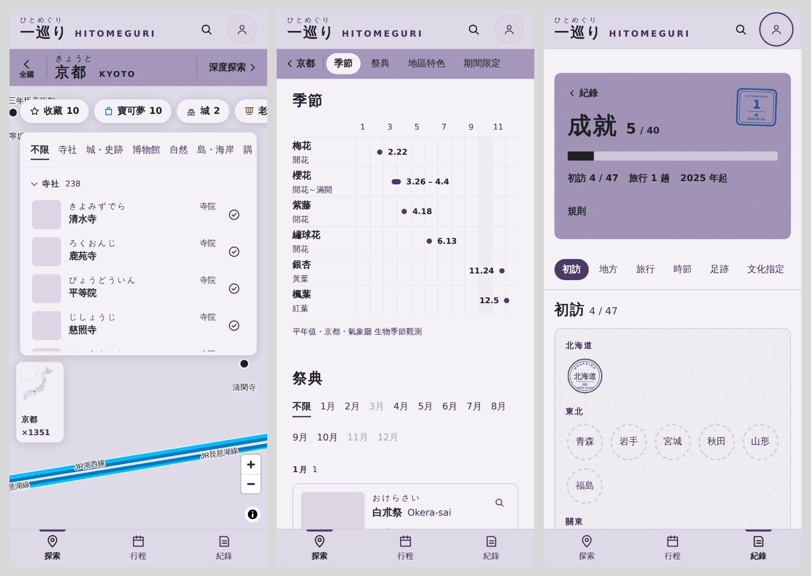
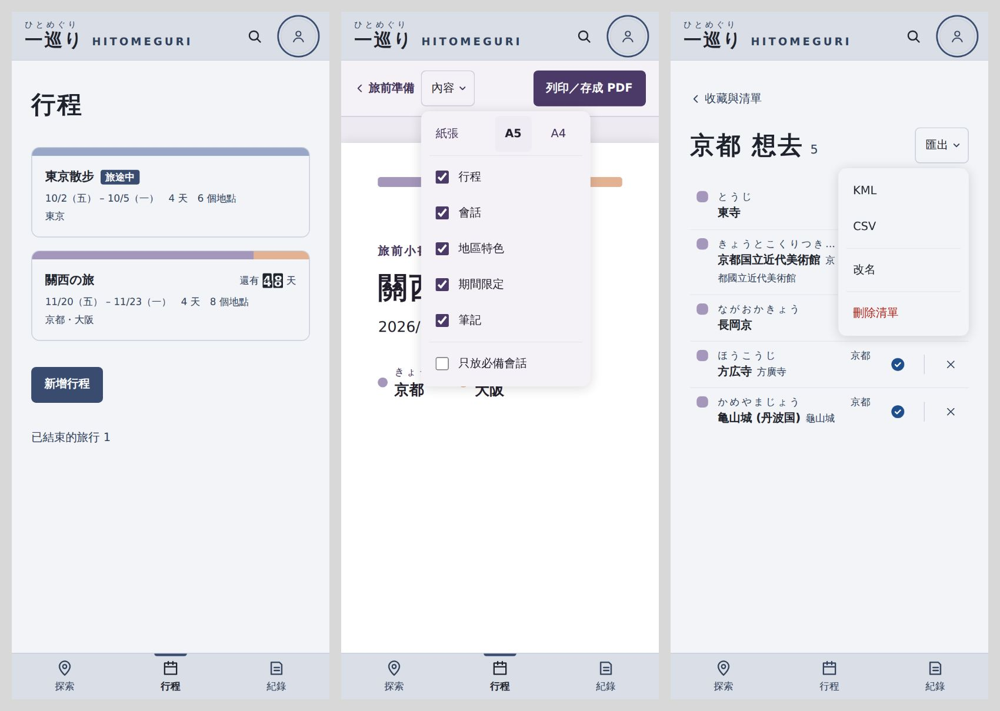

# 手機版面第三階段 驗收說明（2026-10-03）

計畫見 `docs/手機版計畫.md` §4（1–11 項）。使用者同意的決定：O1（位置小框在清單或景點卡片的左緣）、P2（一顆「匯出 ▾」，能分享檔案時走系統分享）、Q2（主畫面圖示在建置時產生）、R3（小字級收成三階）。

在分支 `feat/mobile-3`，還沒合併。桌機（1024 以上、滑鼠）除了下面標「桌機也有」的地方，看起來和用起來都和原本一樣。

## 做了什麼
- **探索**：
  - 縣地圖的位置小框改到左邊、變窄：清單開著時在清單下面，景點卡片或祭典小卡打開時在卡片上面，不再被清單蓋住，也不會碰到上方的膠囊列和右邊的縮放鈕。上下放不下時不顯示；打橫照舊不顯示。縣名加倍率放不下一行時，倍率換到第二行。
  - 縣地圖剛打開、整縣都在畫面裡時看不到小框，放大之後才出現（和原本一樣）。
- **深度探索**：季節曆的櫻花開花和滿開太近時畫成一條，不再疊成「(●」；月份只標單數月，格線與本月的底色不變。上方的觀測站，北海道 8 站在 360 寬也排成一行。
- **行程**：
  - /trips 先列已有的行程，下面一顆「新增行程」，按了才展開表單，名稱欄直接可以打字。已結束的旅行排在最後。
  - 旅前小書的工具列收成一列：「‹ 旅前準備」「內容 ▾」「列印／存成 PDF」。紙張 A5／A4 與五個段落的勾選放在「內容 ▾」裡，勾選時不會收起，點外面或按 Esc 收起。
  - 行程頁「更多 ▾」裡的 KML、CSV 也改成能分享就分享。
- **匯出**：
  - 收藏與清單、單一清單、紀錄頁的「去過」，KML 和 CSV 收成一顆「匯出 ▾」。清單頁的改名、刪除清單也在同一個選單裡，用線隔開，刪除排在最後。
  - 手機能分享檔案時（例如 CSV）叫出系統分享選單，可以直接傳給其他 App；不能分享的照舊下載（例如 Chrome 不分享 KML）。取消分享就結束，不會跳錯誤。
  - 沒有可匯出的項目時「匯出 ▾」是灰的；空的清單仍可以打開選單改名或刪除。
- **紀錄**：
  - 成就頁標頭右上放最近達成的一枚章；還沒有成就時不放。
  - 補登旅行的表單：名稱整行，日期與「新增」排在下一行。月曆開在上個月（桌機也有）。日期面板和下拉選單不會蓋到分頁列。
- **主畫面圖示**：加到主畫面時的圖示改成和開場畫面一樣的 47 縣圓點圓環，顏色從各縣的地區色來；iPhone 與 Android（含裁成圓形的圖示）各有一張。原本只有網頁小圖示。
- **換頁**：手機換分頁（探索、行程、紀錄）時直接換，不再淡入淡出；換縣的墨暈、同一個分頁裡的換頁、桌機的換頁照舊。開場動畫沒有動。
- **字級**（桌機也有）：小字從四種收成三種，原本 13 的按鈕、膠囊、段落列、小標、返回連結都變成 14，看起來略大一點。窄的地方用 12：景點卡片底部的「收藏・去過・清單・加入行程」、成就格的名稱。量過 360、390 與桌機，現代與昭和，沒有新的截字或斷行。

（沙箱連不到地圖與照片，所以地圖是空白、照片是灰框。）

## 扭蛋獎品左上的黑色小方塊
查過來源，是沙箱瀏覽器用軟體畫圖時才出現的，程式本身沒有問題，所以沒有改。請在手機上抽一次扭蛋看獎品左上角；真的手機也有的話再修。

## 要用真的手機確認
- 「匯出 ▾」的 CSV：iPhone 與 Android 會不會叫出系統分享選單，傳到 LINE、存到檔案後打開是不是正常的中文（不是亂碼）；KML 是不是照舊下載。分享檔案的官方說明頁在沙箱打不開，是用搜尋到的原文摘錄確認的。
- 加到主畫面：iPhone（Safari「加入主畫面」）與 Android（Chrome「安裝應用程式」）的圖示是不是 47 縣圓環，Android 裁成圓形時圓點有沒有被切掉。已經加過的要先刪掉再加一次才會換新圖示。
- 換分頁時直接換、沒有閃一下；換縣時的墨暈還在。
- 扭蛋獎品左上角有沒有黑色小方塊。
- 字級變大之後，常用的頁面有沒有哪裡擠或斷行怪。

## 下一步
- 這一階段沒有改 Firestore 規則。
- 開場動畫對回訪者要不要縮短，等使用者決定（`docs/手機版計畫.md` §4 第 10 項）。
- 驗收後合併進 main，推上去就會部署。
