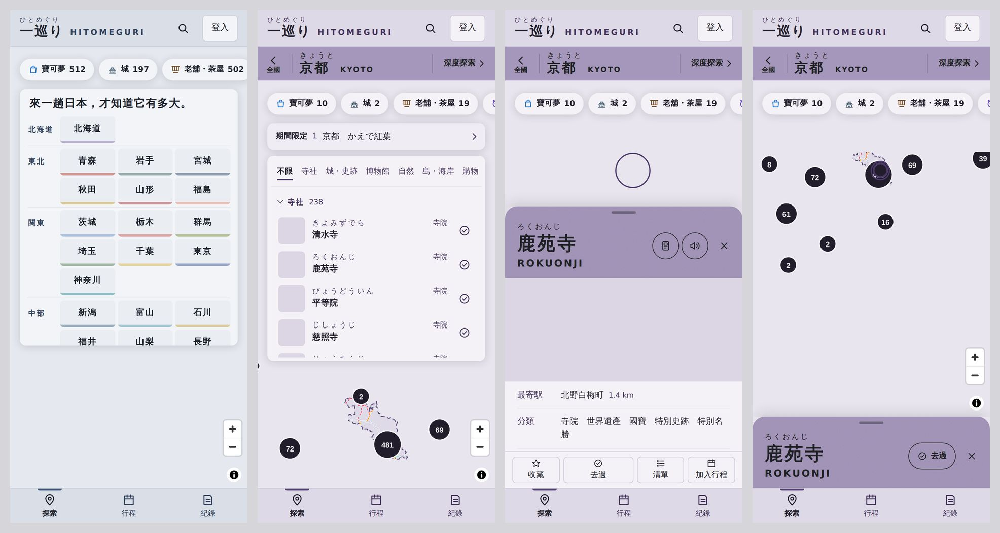
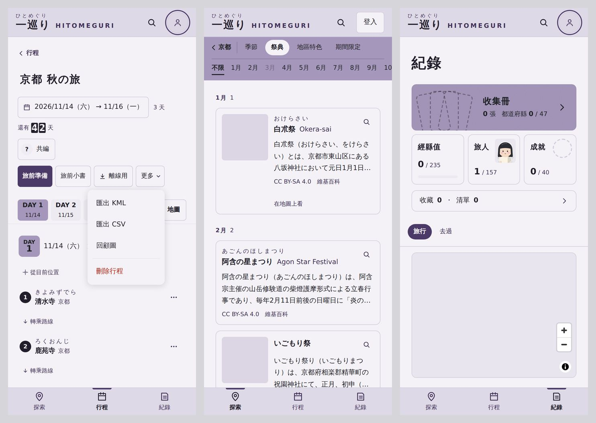

# 手機版面第二階段 驗收說明（2026-10-03）

計畫見 `docs/手機版計畫.md` §3（1–31 項）。使用者同意的決定：B2（觸控點擊區）、C3＋chip 軌道（景點卡片三段高度）、D2（行程工具鈕）、E2（分頁記住位置）、F3（行程天數條）、H2（首頁站名板）、I2（深度探索段落列）、J3（LINE 邀請）、K2（紀錄頁第一屏）、L3（復原與站內確認框）、M2（旅人小窗）、N2（打橫精簡 header）、T1（按下去仍是往下 1px）。

已合併進 main。桌機（1024 以上、滑鼠）除了下面標「桌機也有」的地方，看起來和用起來都和原本一樣。

## 做了什麼
- **全站**：
  - 觸控時按鈕、文字連結、底線索引都撐到一指好點的大小；看起來的大小不變，地圖的縮放鈕不動。
  - 底部分頁記住各分頁上次停在哪一頁；點目前的分頁先捲回頂端，再點一次回到分頁的第一頁。
  - 取消收藏、取消去過、從清單移除、從行程移除後，下方出現一行「已取消收藏　復原」，約 6 秒收起；復原連去過的日期、停留點原本的位置一起放回去。（桌機也有）
  - 刪除行程、清單、截圖，移出成員、離開共編、重新產生連結，改用站內的確認框，預設停在「取消」。（桌機也有）
  - 類型篩選切回「不限」、收集冊切回「全部」、關掉景點卡片都比原本快；關卡片後清單停在原本捲到的地方。深度探索的地區特色改成只載入這一縣。
- **探索**：
  - 景點卡片上方有把手，可以拖成三段：只露出名稱與「去過」、半開、全開。只有把手和名稱那一帶能拖，甩一下換一段，從最低再往下拉就關掉。地圖會跟著卡片的高度，選到的點不會被蓋住。
  - 海報條下面一行膠囊：收藏、各擴充包（各自的顏色）、設定。開著的是實心，再點一下關掉。期間限定有資料時，下面多一行連到深度探索。
  - 縣地圖的清單拿掉「景點」標題，類型排成一行左右滑，清單多露出一列多。
  - 首頁改成依地方分組的站名板：一格一縣，下緣是縣色，一屏約 20 縣；標語一行。
- **深度探索**：
  - 海報捲走後，段落列換成地區色，左邊「‹ 京都」回縣地圖。在祭典時第二列是月份，在地區特色時是組別。
  - 祭典「在地圖上看」之後返回，回到原本那張卡，月份篩選與展開的月份也還在。
  - 地區特色卡在手機改成縮圖在左的橫排，一張大約只剩一半高；平板的祭典排兩欄。
  - 截圖檢視可以左右滑換張、點背景關閉，框跟著圖片的高度。
- **行程**：
  - 整頁一起捲。天數條（DAY 1…、待排、地圖）貼在上緣，一次看一天；地圖預設收起，打開只顯示選中的那天。第一個停留點從第二屏移到第一屏。
  - 旅途中進來就停在今天，地圖打開；天數條與 DAY 標記下有「今日」。
  - 工具鈕只留「旅前準備」「旅前小書」「離線用」「更多」，KML、CSV、回顧圖、刪除行程收在「更多」裡，刪除排在最後、用紅字。
  - 觸控時停留點不顯示拖曳把手和「移到」下拉；改用「⋯」選單：移到最前、往前、往後、移到最後、移到哪一天或待排、從行程移除。
  - 每天第一站上面有「從目前位置」；停留點下面有「Google Maps 路線」，站太多時拆成「1–5」「5–8」幾段。（桌機也有）
  - 共編從下方出現；手機有系統分享時「複製」換成「傳送」。邀請連結從 LINE 打開會改用外部瀏覽器；在 App 內建的瀏覽器裡，加入頁的「登入」換成「用瀏覽器開啟」與「複製連結」。
- **紀錄**：
  - 第一屏：收集冊縮成一條，經縣值、旅人、成就三格一列，下面一行「收藏・清單」，再來是貼在上緣的「旅行・去過」。
  - 經縣值：點縣後在分頁列上方出現一條「縣名＋6 段等級」；點到海上會選最近的縣；沖繩的框放大約 3 倍（收集冊地圖、位置小框、分享圖也一樣，桌機也有）；47 縣清單上方有地方的段落列。
  - 批次補日期的工具列貼在分頁列上方，一行「已選・日期・套用・完成」。
  - 清單名稱太長時顯示兩行。清單列的「去過」和「×」中間隔開。（桌機也有）
- **收集**：
  - 收集冊的海報縮成一條，券列一行，篩選一行左右滑；第一列卡片從畫面下緣移到大約中間。
  - 收集冊多一條貼在上緣的縣名小牌（縣名＋張數），跟著捲到的縣，點了跳過去、篩選不變。
  - 旅人選衣服時，展示窗往上捲會縮成上緣的小窗，娃娃一直看得到；衣櫃的分頁平分寬度，不再左右捲。
  - 十連抽在手機排成 3 欄；卡片檢視的「關閉」在右上角，觸控時點卡片翻面，按鈕排得下一行。
- **打橫**：
  - header 變矮，探索・行程・紀錄放進 header，下方不顯示分頁列。
  - 地圖頁的清單和景點卡片改成左邊一欄，地圖用右邊；景點卡片在這裡不能拖。
  - 經縣值地圖、紀錄頁小地圖、練習卡都放得進一屏；練習卡在左、按鈕在右。

（沙箱連不到地圖與照片，所以地圖是空白、照片是灰框。）

## 要用真的手機確認
- 景點卡片拖起來順不順、甩一下換段的力道是否自然；iPhone 網址列收放時，半開的高度會不會跳。
- 從 LINE 點邀請連結：會不會跳到外部瀏覽器；在 LINE 裡打開加入頁時，「用瀏覽器開啟」有沒有作用。
- 「傳送」叫出的系統分享選單；取消分享時不會跳錯誤。
- 「Google Maps 路線」在手機打開 Google Maps App 時，停留點有沒有照順序帶進去；「從目前位置」是否從所在地出發。Google Maps 與 LINE 的官方說明頁在沙箱打不開，是用搜尋到的原文摘錄確認的。
- 經縣值點到海上時選到的縣是否是手指想點的那個。
- 打橫時 header 與瀏海、Home 指示條的位置。
- 沙箱的資料庫模擬器在最後一輪停擺，紀錄頁的「補日期」與行程頁最後的修正是用頁面裡放的資料測的，請在手機上實際補一次日期、開一次旅途中的行程。

## 下一步
- 這一階段沒有改 Firestore 規則。
- 第三階段（可以晚點）：位置小框的位置、成就頁最新印章、季節曆、補登旅行表單、匯出選單、/trips 排序、旅前小書工具列、扭蛋黑色小方塊、主畫面圖示、換分頁的淡入淡出、小字級收成三階，見 `docs/手機版計畫.md` §4。
- 類型篩選時地圖仍是整份重畫（分群的數字要跟著篩選），要再快得把每個類型拆開，留到之後再看。
