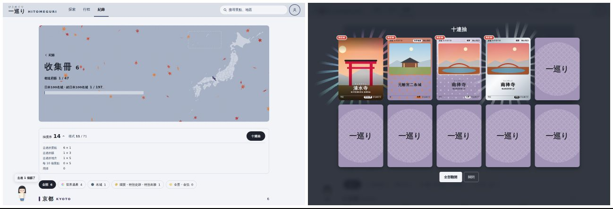
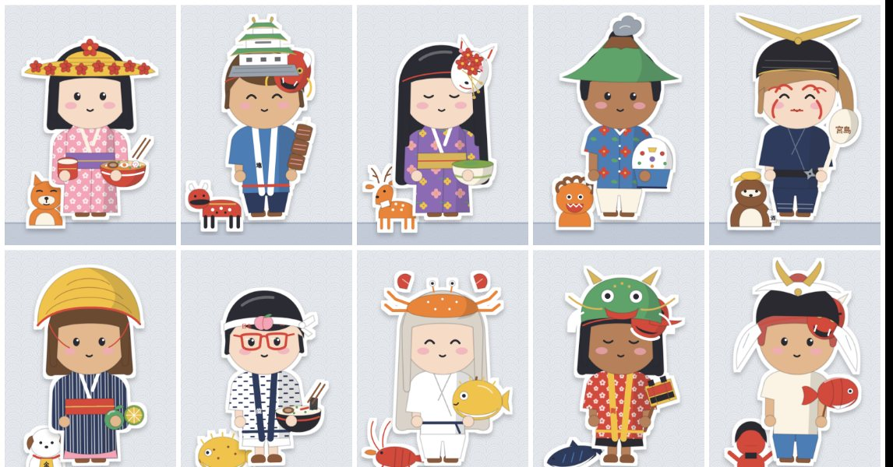
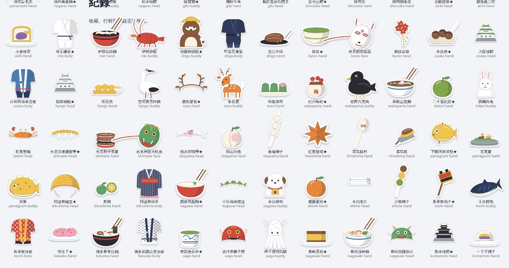
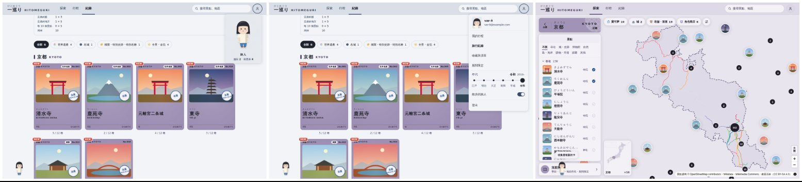
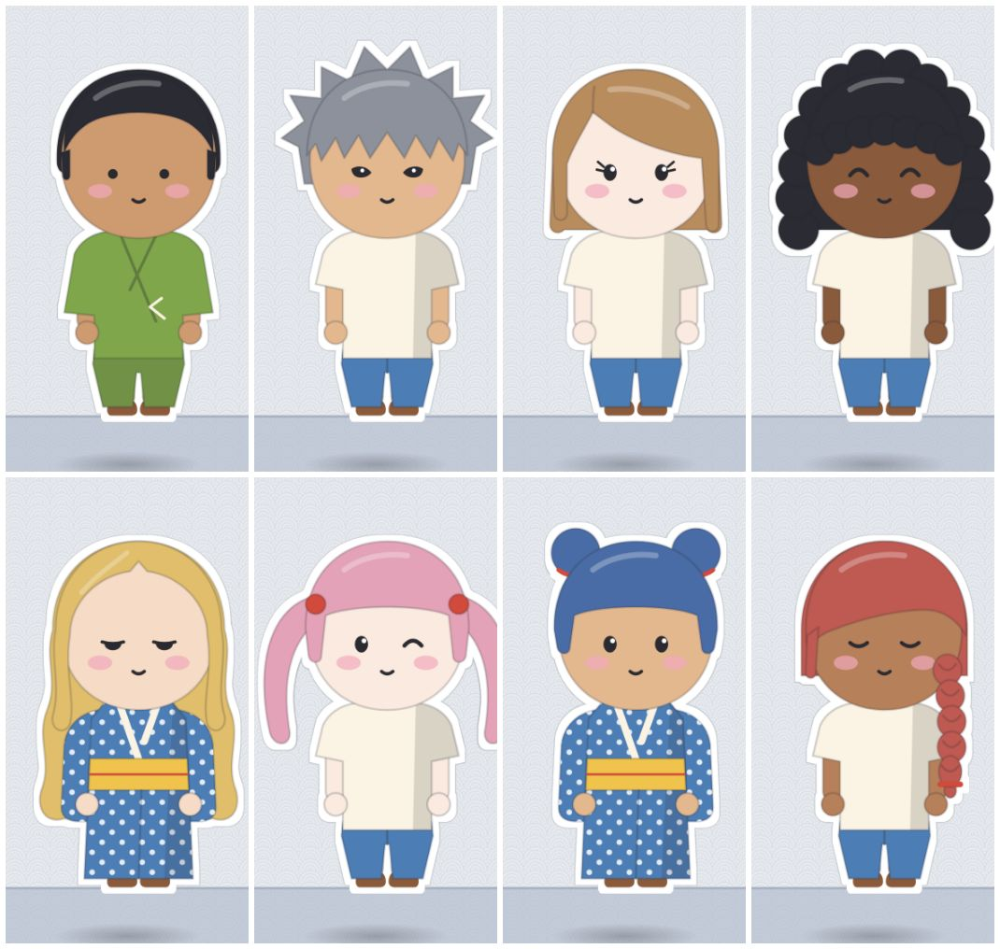
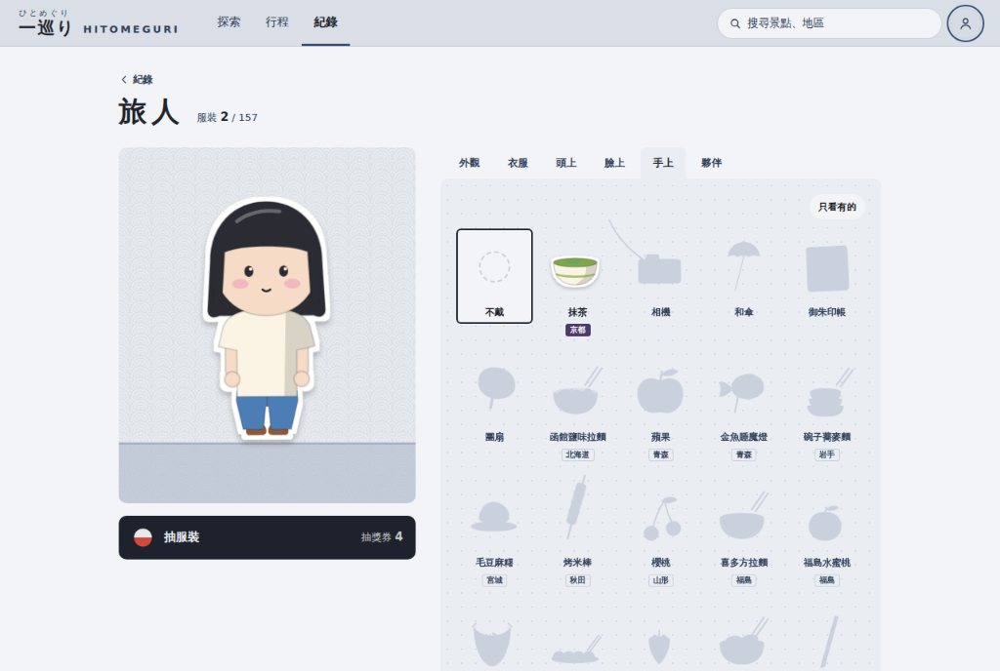

# 旅人（紙娃娃）與抽獎 驗收說明（第三版，2026-10-02）

規格見 DESIGN.md §7.19b（抽獎券與抽獎）、§7.24（旅人）。入口在「紀錄」頁的第三張卡、帳號選單最上面的旅人小窗，或直接開 `/log/avatar`。

## 這次改了什麼
回饋：風格、比例 OK；舞台不需要；扭蛋機不錯；服裝太少，每個縣至少 2–3 件；扭蛋不要重複；旅人在網站上多一點存在感；抽獎（旅人、景點卡）都不重複、收齊就不給抽、新的標 NEW；想清楚抽獎的辦法：不可能一直去同一個景點，也不該靠新增刪除行程刷卡包。

### 抽獎的辦法
- 一種抽獎券，旅人扭蛋與景點卡共用。全部由「現在去過的地方」算出來：
  - 每個去過的景點 1 張、每個去過的縣 3 張、每個去過的地方（北海道、東北…8 個）5 張、景點每累積 10 個再 5 張。
  - 取消去過再勾回去、新增刪除行程，張數都不會變多；上限就是去過的地方。
- 景點卡：去過就有基本卡，加上去的那天的季節卡；每個景點第一次去過時送一次免費抽（在景點按「去過」或打開行程卡包，只送一次）。其他樣式用券抽，一定是那個景點還沒有的。
  - 放大檢視「抽一張」：1 張券，抽這個景點。
  - 收集冊上方「十連抽」：10 張券，從所有還沒收齊的景點裡抽 10 種還沒有的。不用一直去同一個景點，去過的地方越多，能抽的越多。
  - 收齊了按鈕變「已收齊」；剩不到 10 種時寫「抽 n 張」。
- 旅人扭蛋：1 張券，只抽還沒有的服裝；範圍是不限縣的＋去過的縣的，抽完寫「去過的縣都抽齊了」，去新的縣會加進新的。
- NEW：新拿到、還沒看過的卡片樣式與服裝標「NEW」（照 UI 文案規則不加驚嘆號），看過、點過就拿掉。
- 收集冊上方點「抽獎券 n」會展開來源明細（景點、縣、地方、每 10 個景點、用掉）。
- 測試期照樣不限次數（券不夠也能抽），張數照算照扣，方便看機制。

### 旅人的服裝：163 件
（2026-10-09 加成就服裝 6 件，見 docs/成就驗收.md「成就服裝」。）
- 每個縣 3 件，共 141 件，取自那個縣實際的特產、工藝、祭典：例如秋田的生剝鬼面・秋田犬・烤米棒，山形的花笠・櫻桃・天童將棋駒，福島的赤牛・喜多方拉麵・水蜜桃，京都的抹茶・伏見稻荷狐面・舞妓花簪，德島的阿波舞編笠・酢橘・阿波舞浴衣，鹿兒島的白熊刨冰・櫻島大根・櫻島火山帽。
- 第一件是代表單品，第一次去那個縣就送；另外兩件去過那個縣之後加進扭蛋。
- 不限縣的 16 件照舊用抽的。
- 衣櫃有「只看有的」，有的排前面。

### 旅人在網站上
- 滑鼠移到右上的帳號頭像：跳出旅人的小卡片（全身、服裝數、抽獎券），點了到旅人頁。
- 帳號選單最上面是旅人的半身小窗；選單裡多了「散步的旅人」開關。
- 散步的旅人：登入後在畫面下緣走來走去（手機在分頁列上方），偶爾跳一下、轉一圈、鞠躬，或說一句話。說的話都來自自己的資料：下一趟出發倒數、目前地圖的縣（去過了、想去、去那裡可以拿到什麼）、剩幾張抽獎券、有沒穿的新衣服、收集冊有新的卡。點它會說一句。

### 規則
- 旅人頁標題旁「規則」：服裝怎麼拿、抽獎券怎麼算（附自己目前的張數明細）、衣櫃的記號、展示窗怎麼轉。自己點才打開。
- 收集冊的抽獎券那一條也有「規則」：卡片怎麼拿、各樣式、抽卡、抽獎券明細、收集冊的記號。
- 夜景卡只給找得到真的夜景照片的景點（目前 236 個）；不再拿白天照片調暗。其他景點每個 10 種樣式。

### 外觀與清晰度（第四輪回饋）
- 髮型 5 → 13：加平頭、刺刺頭、旁分、捲髮、波浪長髮、雙丸子、雙馬尾、麻花辮。
- 眼睛 3 → 8：加豆豆眼、睫毛、鳳眼、睡眼、眨眼。膚色 3 → 6、髮色 5 → 9（金、灰、粉紅、藍）。
- 展示窗放大後配件粗糙：原因是待機時一直輕輕擺動，瀏覽器就用低解析度畫 3D 的層。拿掉待機擺動，停下來就用全解析度畫；轉動中仍會稍微模糊，放開就清楚。

### 拿掉的
- 舞台的換縣與站名標。

## 需要你處理
- `firestore.rules` 加了抽獎券（`users/{uid}/meta/wallet`），請再貼一次到 Firebase Console。沒貼之前抽獎券的用量只存在這台裝置。

## 請確認
- 抽獎券的張數（景點 1、縣 3、地方 5、每 10 個景點 5）夠不夠、會不會太多。
- 散步的旅人會不會太吵（可以在帳號選單關掉）、說的話要不要再多幾種。
- 各縣 3 件的選擇有沒有想換的。

## 之後可以做
- 在景點附近（GPS）按去過多給券（現地打卡），讓真的去過的比只是標記的多一點。
- 旅人放進分享圖、收集冊海報；服裝跟著年代主題換樣子。
- 正式上線前：`UNLIMITED_DRAWS` 改成 false，清空 `users/*/cards`、`users/*/meta/wallet`。
