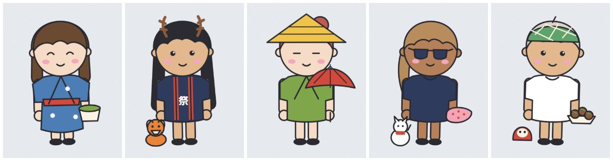
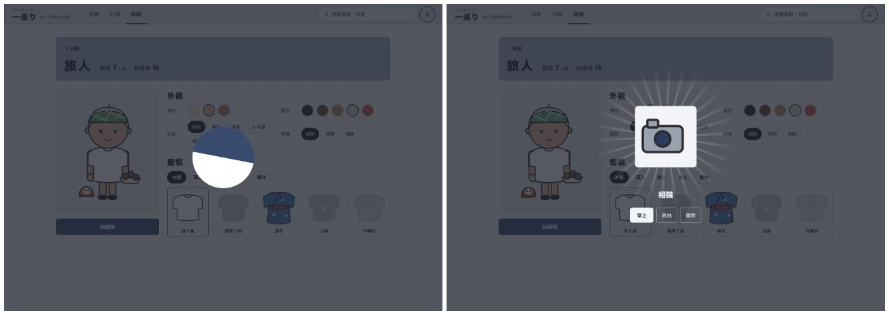

# 旅人（紙娃娃）第一版 驗收說明（2026-10-02）

規格見 DESIGN.md §7.24。入口在「紀錄」頁的第三張卡，或直接開 `/log/avatar`。

## 有什麼
- 外觀：膚色 3、髮型 5、髮色 5、眼睛 3，改了就存。
- 服裝 32 件，分衣服、頭上、臉上、手上、夥伴五個位置。
  - 16 件是各縣的特色單品，去過那個縣就有：北海道哈密瓜帽、宮城毛豆麻糬、東京提燈、山梨葡萄、長野信州蕎麥麵、靜岡富士山帽、愛知金鯱帽、京都抹茶、大阪章魚燒、奈良鹿角髮箍、廣島紅葉饅頭、香川讚岐烏龍麵、福岡明太子、沖繩風獅爺、青森蘋果、石川金箔霜淇淋。
  - 其他 16 件用抽的（T 恤、浴衣、法被、作務衣、斗笠、和傘、招財貓…）。
- 抽獎券：去過一個景點 1 張、結束一趟旅行 3 張。測試期不限（跟收集卡一樣）。抽到的範圍是不限縣的＋去過的縣的，還沒有的優先。
- 存在帳號裡（`users/{uid}/meta/avatar`）。規則請貼到 Firebase Console；沒貼之前存在這台裝置。

## 請確認
- 角色的風格、比例。
- 各縣單品想先補哪些縣（現在 16 縣）。
- 抽獎券的數量（景點 1、旅行 3）。

## 還沒做
- 旅人放進分享圖、收集冊海報。
- 服裝跟著年代主題換樣子。
- 其他 31 縣的單品。
