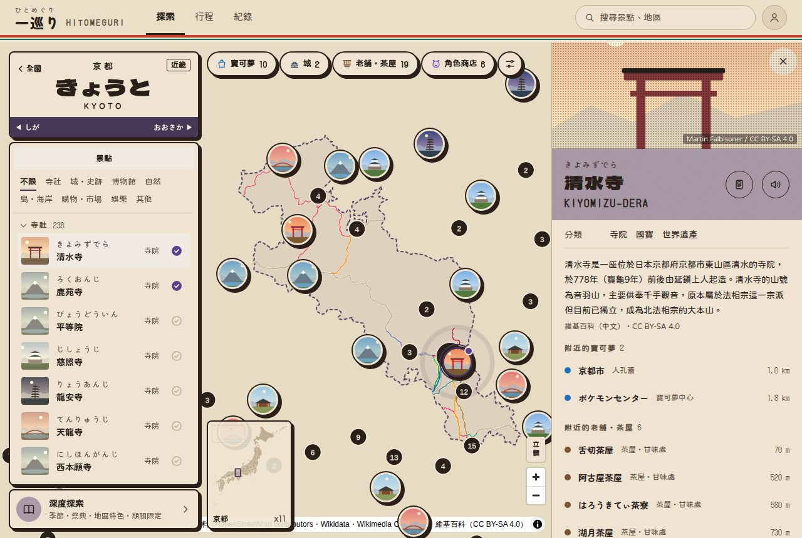
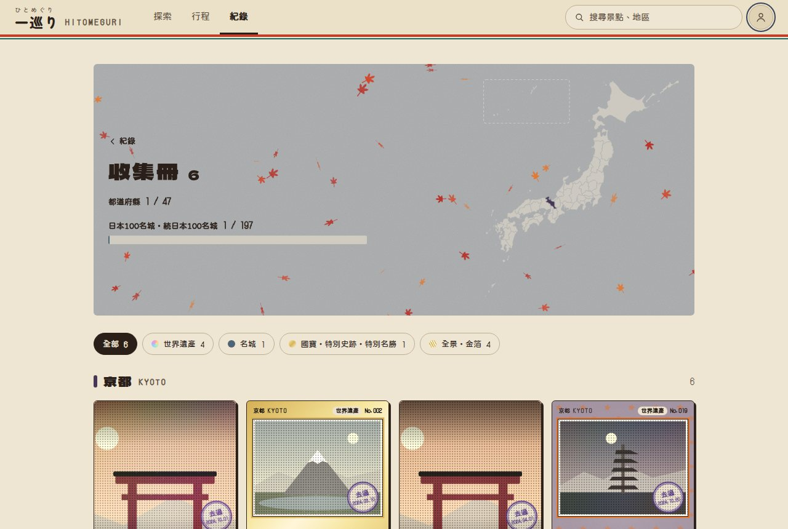
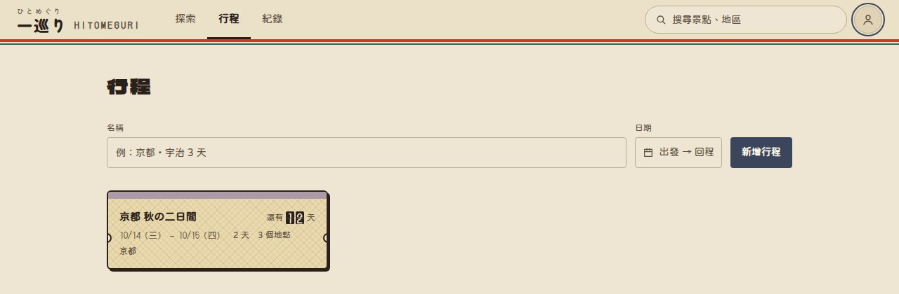
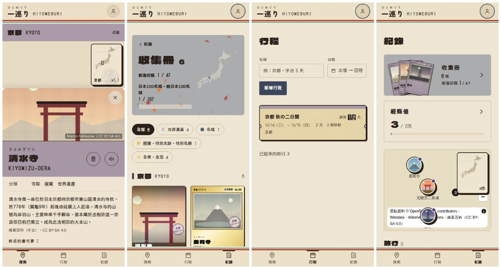

# 昭和主題 驗收說明（2026-10-02）

規格見 DESIGN.md §13；mockup：https://claude.ai/artifact/ML2F8FTvJa9LDsKY263tXw

## 怎麼切換
- 登入後點右上頭像 →「主題」選「昭和」。存在這台裝置，下次打開還是昭和。
- 沒登入也可以預覽：網址後面加 `?theme=showa`（例：https://hitomeguri-7d87a.web.app/?theme=showa ）。這個只有那次有效，不會存。

## 換了什麼
- 顏色：生成り紙、焦茶墨；47 縣的地區色都降了彩度、往古紙色靠；去過印章改成駅スタンプ的紫色。
- 字型：內文粉圓、大標 Dela Gothic One、數字 DotGothic16。只有選了昭和才下載。
- 頂部下緣朱、青竹兩條線；浮動面板改成墨色框＋錯位陰影。
- 地圖左上的地區標籤變成站名標，下面色帶兩端可以直接換到前後一個縣。
- 照片褐色調，大照片與收集卡加印刷網點；收集卡是舊照片卡。
- 行程卡變成硬券（斜格底紋、剪票缺口）。

## 請確認
- 整體感覺、字型（特別是內文粉圓、數字點陣字）是否喜歡。
- 站名標的「前後一個縣」要不要留。
- 地圖上的照片圓點也有錯位陰影，會不會太重。

## 還沒做
- 分享圖（旅行回顧圖）仍是現代主題的顏色。
- 開場動畫仍是現代主題（JS 載入前就顯示）。
- 其他年代（大正浪漫、江戶…）可以用同一個切換再加。
