# 特效說明

景點收集卡、收集冊、開場動畫、操作過渡、新卡入手、季節飄落、收集冊地圖、路線繪製。原本在分支 `claude/visual-effects` 試做，2026-10-02 你決定合併進 `main`，之後的特效直接在 `main` 做。規格在 DESIGN.md §7.0、§7.19、§8、§9。

截圖裡的照片是測試用的假圖（開發環境連不到 Wikimedia），實際會是景點的照片。

## 1. 景點收集卡

景點卡片名稱帶右側多一顆卡片鈕，打開是一張像寶可夢卡的景點卡：照片、假名／名稱／羅馬拼音、縣名與卡號，框是地區色＋紙紋。滑鼠移動時卡片 3D 傾斜、反光跟著移動；手機可以按「用手機傾斜」用陀螺儀。點卡片翻面，背面是維基簡介與出處。

稀有度只看景點既有的資料（不自己編）：

| 稀有度 | 條件 | 箔片 |
|---|---|---|
| 虹 | 世界遺產 | 虹色，越斜越亮 |
| 名城 | 日本100名城・続日本100名城 | 只照地方紋樣的形狀（中部是鱗紋、近畿是七寶…），平放時就看得到淡淡的紋樣 |
| 金 | 國寶、特別史跡、特別名勝 | 金色 |
| 一般 | 其他 | 沒有箔片，只有傾斜與反光 |

- 卡片右上寫實際的指定名稱（世界遺產、100名城、續100名城、國寶、特別史跡、特別名勝）；卡號是縣內依分數排第幾，名城卡用名城番號。
- 箔片只在照片窗裡（像實體閃卡的圖框），平放時幾乎看不到，字都清楚。
- 研究時原本以為資料沒有「國寶」，其實有（全國 161 處），所以金卡加上國寶。

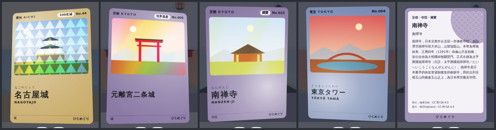

## 2. 收集冊（`/log/cards`）

去過的景點（自己標的＋已結束行程裡的停留點）全部做成卡片，依縣排列。

- 上方：張數、去過的都道府縣（右側日本地圖，第二輪）、名城進度（去過幾座 / 197）。
- 篩選：全部／世界遺產／名城／國寶・特別史跡・特別名勝。
- 卡片依序從下方翻上來（像發牌）；滑鼠移到卡片上會傾斜。
- 點卡片放大：← → 或左右滑換上一張、下一張，「地圖」回到那個景點，Esc 關閉。
- 入口：紀錄頁最上方，最近去過的三張卡疊成扇形，滑過時展開。

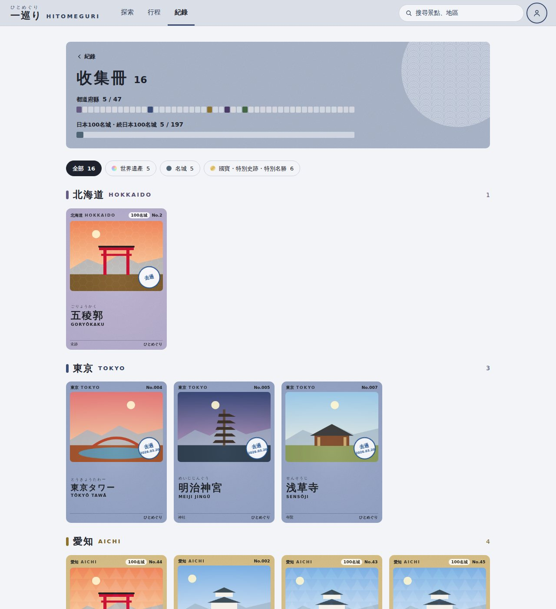

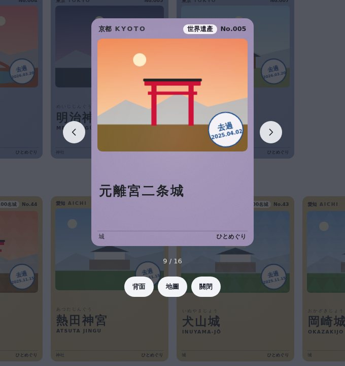 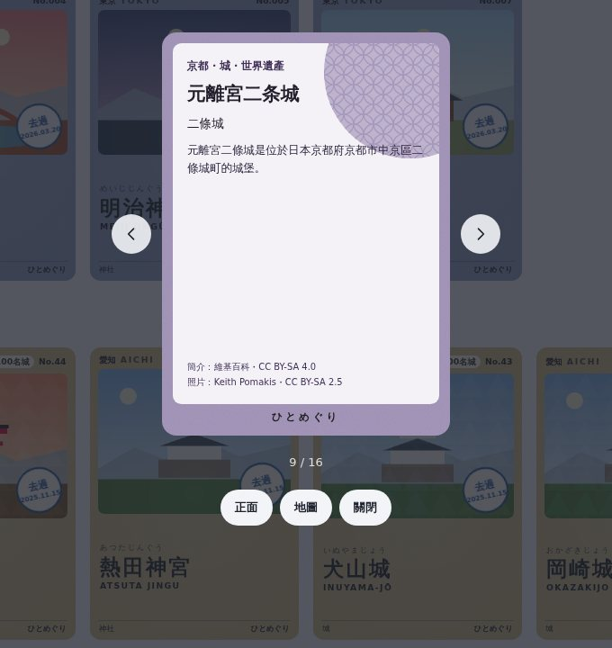

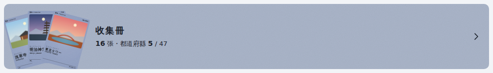

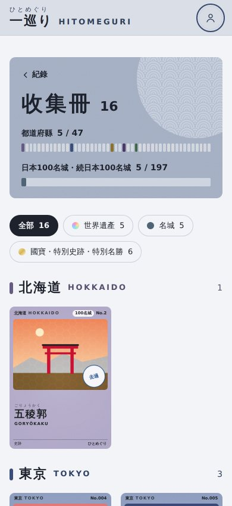

效能：收集冊只用各縣的地圖 bundle（每縣約 30 KB）就畫得出卡面與稀有度；為此 map bundle 多一個欄位 `d`（最高的文化指定：世界遺產 213、國寶 121、特別史跡 41、特別名勝 18，共 393 處）。放大檢視時才載入該縣的詳細資料換上簡介。

## 3. 開場動畫

原本的「圓弧繞圈＋進度條」改成 47 都道府縣的圓點圍成一圈：北海道在最上面，順時針到沖繩。載入進度走到哪一縣，那一縣的圓點就亮成該縣的地區色，一次亮一顆。全部亮完後圓點往外擴散，從中間開一個洞露出網站。

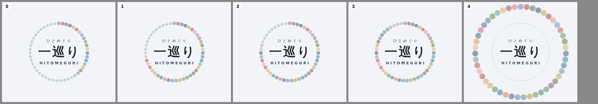

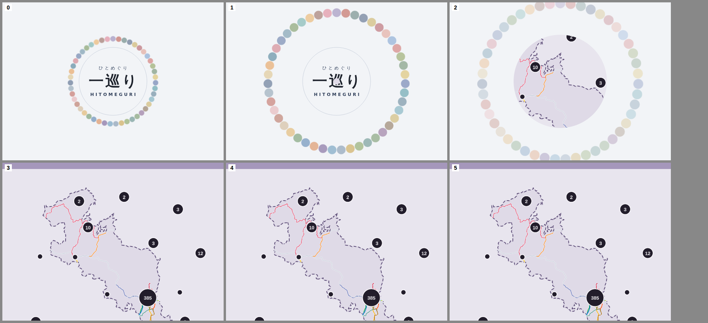

## 4. 操作過渡

- **換頁過場**：地圖頁左上的地區標籤點「深度探索」後，會長成深度探索頁的標頭（色塊、縣名、紋樣圓一起移動放大），按「地圖」返回時縮回去。其他換頁是整頁淡入淡出；同一頁裡選景點、換縣不做。

  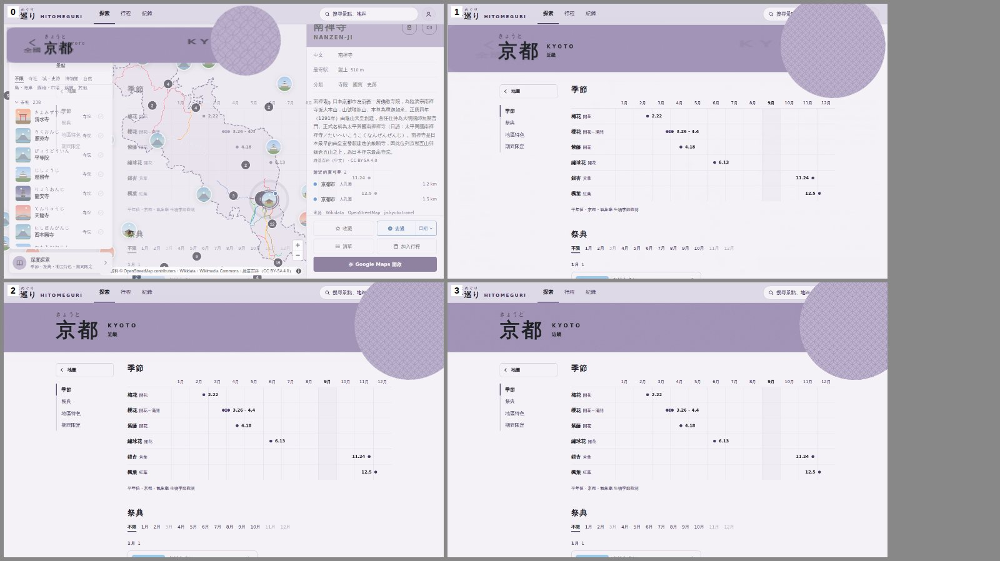

- **去過的蓋章**：按「去過」時勾勾像印章壓下去、擴出一圈墨暈（景點卡片、清單列的快捷鈕）。只有自己按下時播放。

  

- **滑動的選中標示**：頂部分頁（探索／行程／紀錄）的底線、手機底部分頁、深度探索與旅前準備的段落目錄，選中的標示會滑到新的位置，不再用跳的。
- **景點卡片**：換景點時內容淡入；手機的卡片從下方升上來；載入中改成照片、名稱、按鈕的灰色佔位。

  

- **收藏的星星**：按「收藏」時星星轉一下彈出來（只有自己按下時）。
- **選單淡入**：帳號選單、擴充包設定、日期選擇、搜尋結果、加入清單／行程的選單打開時淡入，不再突然出現。
- **行程排序**：行程編輯頁用「往前／往後」、拖曳或換天時，停留點滑到新的位置。
- **數字滾動**：擴充包件數、收藏數、收集冊的張數，改變時每一位數像里程表滾到新的數字。
- **載入中**：其他頁面的「載入中」文字都換成灰色佔位列（搜尋、擴充包清單、收藏、旅前準備、練習、旅前小書、行程、共編邀請）。

系統設定「減少動態」時，以上全部關掉（只保留淡出）。

## 5. 第二輪（2026-10-01）

你決定拿掉 DESIGN.md「動畫 ≤ 250ms、不做彈跳縮放、不用漸層」的限制，改成「有理由才動、不擋操作、尊重減少動態」（DESIGN.md §1 第 7 條、§9、§12）。這一輪加了：

### 新卡入手

在景點卡片按「去過」：畫面暗下，收集卡從下方轉兩圈飛到中央，落定時背後放光（虹卡虹色、金卡金色、名城是縣色、一般白光，慢慢旋轉）、一圈光往外擴、蓋上去過的印章、一道光掃過卡面，手機輕震一下。停兩秒左右（越稀有越久）後縮小飛進「紀錄」分頁，分頁跳一下。點任何地方或 Esc 直接收進去。清單列的快捷鈕不播（一次標很多個時會太吵）。

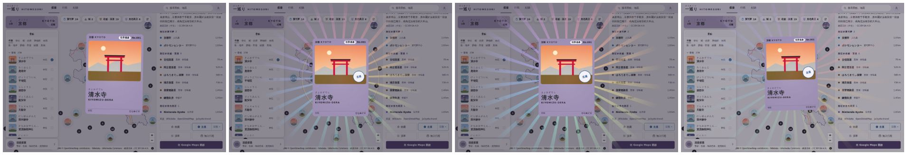

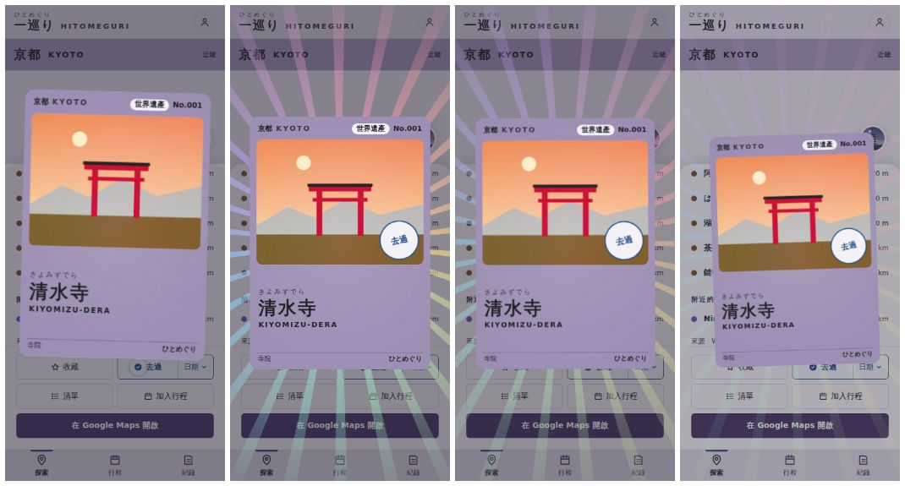

### 季節飄落

深度探索頁與收集冊的海報區飄櫻花瓣、紅葉、銀杏、雪或螢火蟲。季節先看氣象廳本季觀測（這個縣正在開花或轉紅、轉黃），沒有時依月份：3–4 月櫻花、6–7 月螢火蟲、10–11 月紅葉、12–2 月雪（北海道、沖繩另外算）。葉片會翻面、左右飄；滑鼠經過時被風吹開。網址後面加 `?season=sakura`（`momiji`、`ichou`、`snow`、`hotaru`）可以預覽其他季節，例：`/region/kyoto?season=snow`。

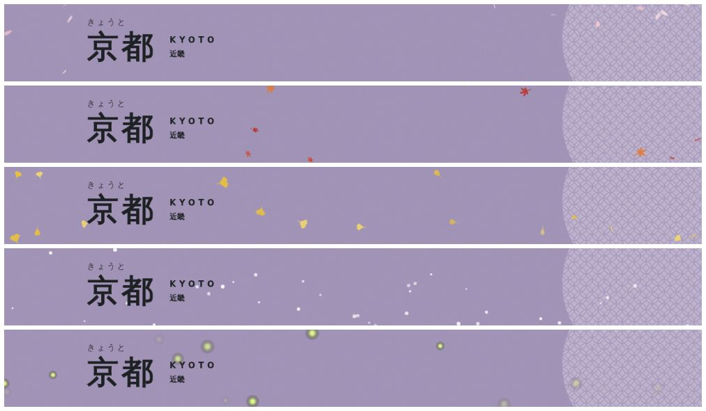

### 收集冊的日本地圖

收集冊海報區右側換成日本地圖（取代原本的 47 格）：去過的縣塗該縣的顏色，進頁面時依北到南一縣一縣蓋上去（放大壓下、回彈）。滑過顯示縣名與張數，點去過的縣捲到那一縣的卡片。沖繩依日本地圖的慣例放在左上的虛線框裡。

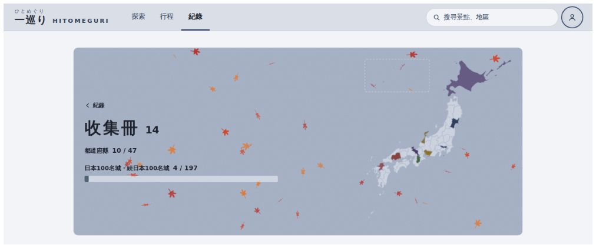 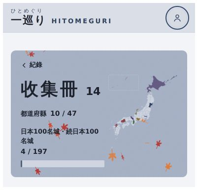

### 行程路線像用筆畫出來

行程頁的路線在開頁、換天、排序時從起點畫到終點（前後慢、中間快），筆尖是一個圓點。

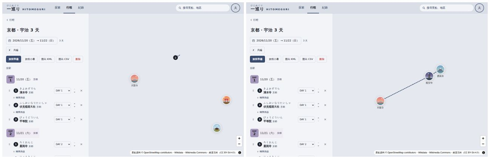

## 6. 待確認

- ~~§9 動態、§12 漸層~~：你決定拿掉限制（2026-10-01），DESIGN.md 已改。
- ~~合併方式~~：整個合併進 `main`（2026-10-02）。
- **新卡入手的長度**：現在停 1.9～2.6 秒，要更短或只在稀有卡播，跟我說。
- **新的顏色 token**：箔片（虹、金）與季節飄落（櫻、紅葉、銀杏、雪、螢火蟲）是固定色，不跟地區色走。

## 7. 已知限制

- 換頁過場用 View Transitions API：Chrome、Edge、Safari 18 以上有；不支援的瀏覽器照常換頁，沒有過場。
- iPhone 的「用手機傾斜」第一次要允許動作與方向的權限。
- 收集冊的格子裡照片沒有標作者（卡片背面、頁尾有註明）；地圖上的小照片原本也是這樣。
- 擴充包的點（人孔蓋、老舖、角色商店）不做成卡片；名城進度算得到。

## 改了哪些檔案

- 卡片：`web/src/components/SpotCard.vue`、`CardViewer.vue`、`web/src/composables/tilt.ts`、`web/src/services/card.ts`
- 收集冊：`web/src/views/CardsView.vue`、`web/src/composables/collection.ts`、`visited.ts`，`LogView.vue` 的入口
- 開場：`web/index.html`、`web/src/services/splash.ts`、`web/vite.config.ts`（產生 47 個圓點）
- 過渡：`web/src/services/viewTransition.ts`、`web/src/composables/indicator.ts`、`stampPress.ts`、`RollingNumber.vue`、`SkeletonRows.vue`、`TripStopList.vue`（TransitionGroup），`theme.css` 的動畫與 `skeleton`、`stamp-ring`
- 第二輪：`web/src/components/CardReveal.vue`、`web/src/services/cardReveal.ts`（新卡入手）；`SeasonDrift.vue`、`web/src/services/season.ts`（季節飄落）；`JapanMap.vue`、`web/src/services/geo.ts` 的 `japanOutline`（收集冊地圖）；`MapView.vue` 的 `drawRoute`（路線繪製）
- 資料：`pipeline/build_bundles.py`（map bundle 的 `d`）
- 文件：DESIGN.md §1、§7.0、§7.19、§8、§9、§12，UX-FLOW.md E7 與路由表

## 8. 第四輪（2026-10-02）

- **位置小框**改到左側面板右邊（和「深度探索」底部對齊），不能點，只顯示：日本全圖、目前範圍的框、下方縣名與放大倍率（「長野 ×8.2」，以日本全圖為 ×1）。

  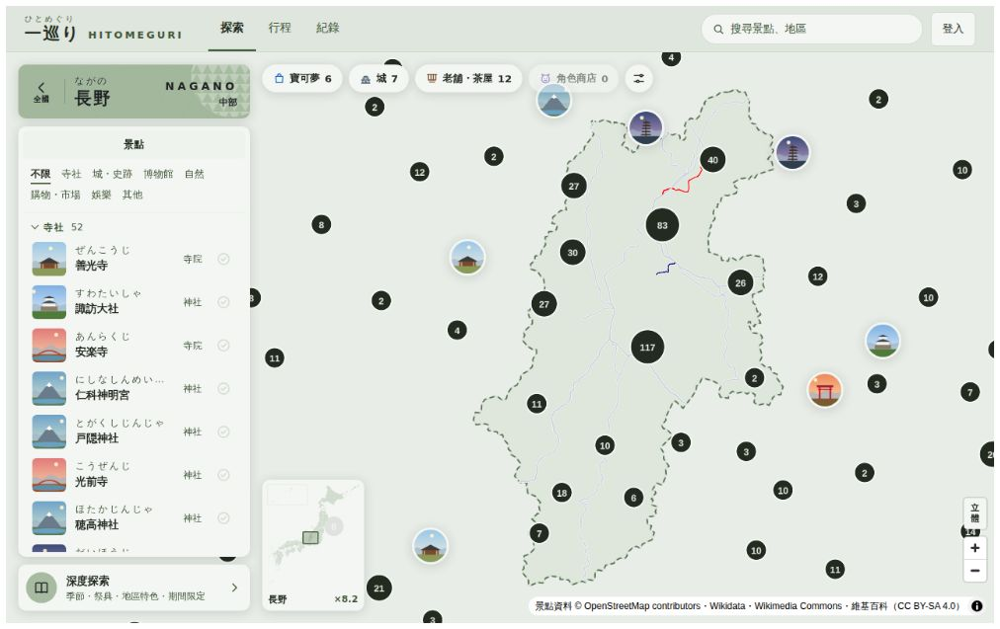

- **立體**只開關地形與陰影，不再自動傾斜（傾斜照舊用右鍵拖曳、手機兩指上下拖）。陰影加深，正上方看也看得出山的起伏。地形資料涵蓋全日本（国土地理院 DEM10B，已確認瀏覽器可以直接讀取），山區放大、傾斜後最明顯，例如長野、富山的北阿爾卑斯、富士山。
- **出發倒數翻牌**：行程卡片與行程頁的「還有 N 天」，數字像車站發車標一格一格翻過去。

  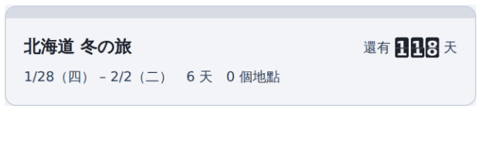

- **縣的紀念章**：在一個縣第一次按「去過」，新卡入手時卡片左下蓋上這個縣的紀念章（像車站的スタンプ：縣名、羅馬拼音、初訪、日期）。

  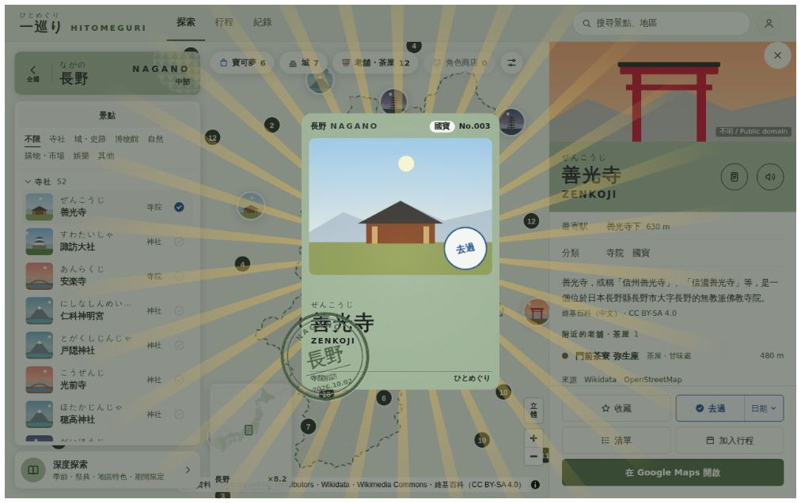

- **8 月的煙火**：深度探索頁與收集冊的海報區在 8 月放煙火（季節飄落的一種；`?season=hanabi` 可以預覽）。

  

- **景點照片慢慢拉近**：景點卡片上方的照片 14 秒緩緩拉近、平移。
