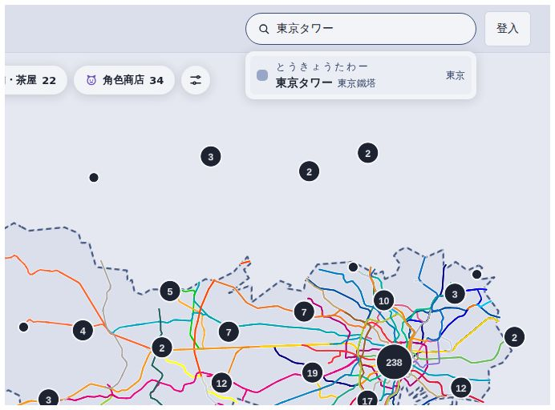
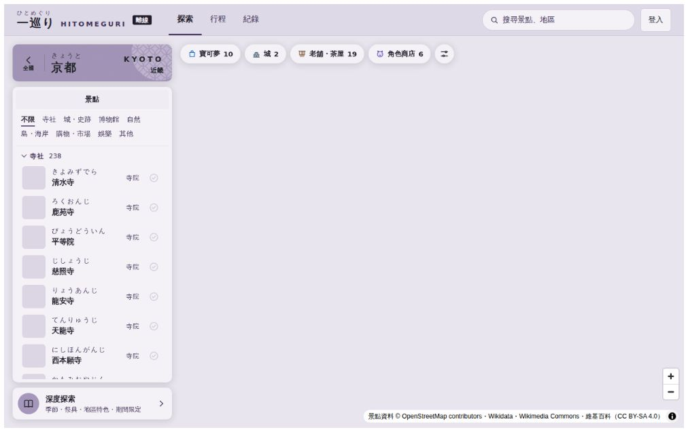
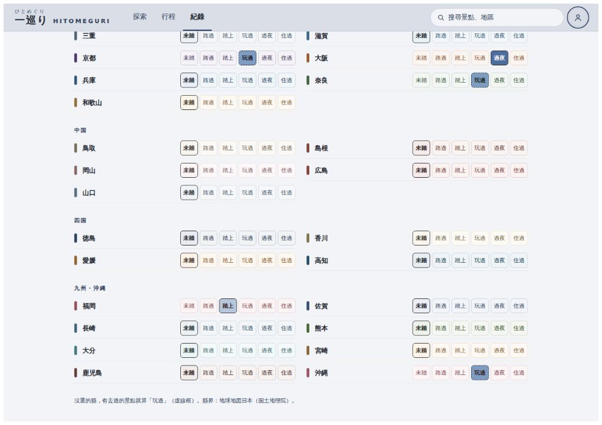
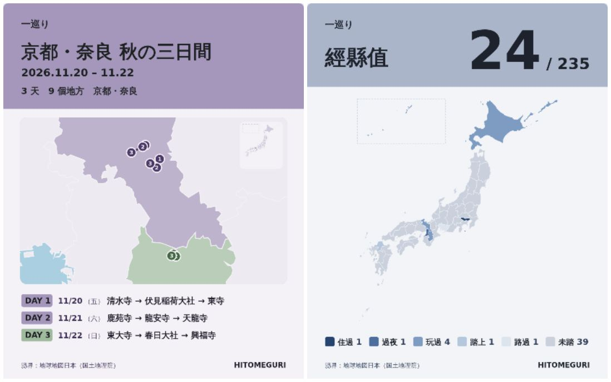
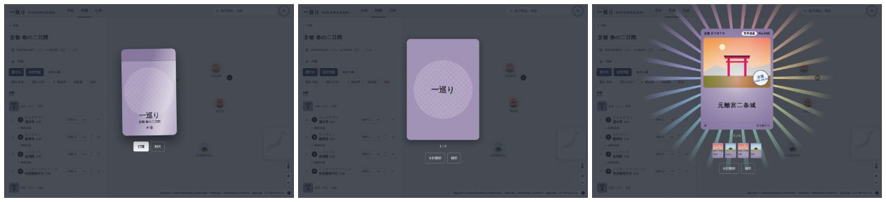
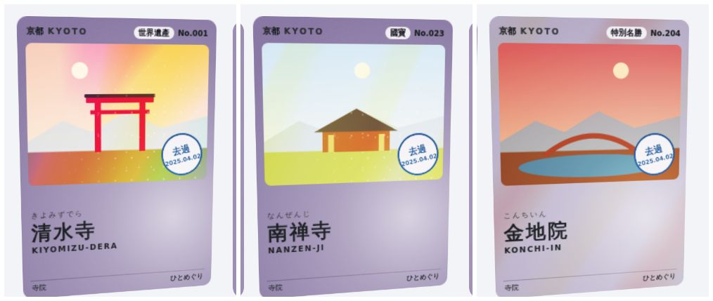
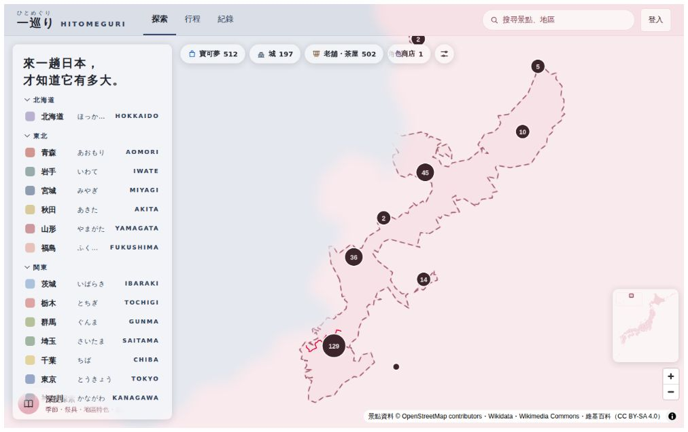

# 第三輪驗收：離線、經縣值、分享圖、位置小框、特效、景點整理

完成日期：2026-10-02
網站：https://hitomeguri-7d87a.web.app/

你睡前交代的：離線、旅行回顧圖、經縣值地圖、四個特效（開卡包、3D 地形、更多箔片、換縣轉場）、特效分支合併回 main、修搜尋結果被地圖蓋住、查東京華納影城、篩掉地區型景點、地圖位置小框。全部都上線了，下面依序說明。

## 要你做的事

1. **Firestore 規則**：經縣值要存在 `users/{uid}/meta/keiken`，規則加了一段（`firestore.rules` 的「經縣值」）。請把整份 `firestore.rules` 貼到 Firebase Console → Firestore → 規則 → 發布。發布前經縣值會先存在這台裝置，發布後下一次修改時同步上去。
2. **景點資料**：已合併。排除清單如果有不該排的，告訴我名稱。

## 1. 特效分支合併、搜尋結果

- 特效分支已經整個合併進 `main`，之後的特效直接在 `main` 做；分支與預覽網址的 workflow 刪掉了（預覽網址到期前還看得到舊版）。說明文件改名為 `docs/特效說明.md`。
- **搜尋結果被地圖蓋住**：特效分支的換頁過場讓頂部列自成一層（`view-transition-name`），裡面的搜尋結果、帳號選單就疊不過地圖。頂部列加了層級，修好了。

## 2. 東京的華納影城（ワーナー ブラザース スタジオツアー東京）

為什麼沒有：
- 東京的景點清單來自官方觀光網站 GO TOKYO。GO TOKYO 有列這一筆，但這一頁沒有地圖座標，只能靠「名稱完全相同」對到 Wikidata 或 OSM 的候選。
- GO TOKYO 的名稱是「ワーナー ブラザース スタジオツアー東京 – メイキング・オブ・ハリー・ポッター」，後面多了副標題。
- Wikidata 上這個項目（Q117148543）沒有日文標籤，只有別名「スタジオツアー東京」，所以兩邊都對不上。
- 它的位置原本是としまえん（2020 年關閉）；資料裡還留著としまえん。

怎麼修：
- 官方名稱比對時拆開「–」後面的副標題。
- 種子清單（`data/seed/seed_from_guides.json`）可以直接指定 Wikidata 項目。加了這一筆（標成你要求的 `user-request-2026-10`），日文名用種子寫的。
- Wikidata 有關閉日的設施排除（としまえん），規則見下一節。
- 東京重新採集（seed-region run 32），結果見「景點整理」。

## 3. 景點整理：地區、事件、已關閉

你說淺草、新宿、中目黑這類是地區不是景點。查了 Wikidata 的類型（P31），新增規則：

| 規則 | 例子 |
|---|---|
| 類型「全部」都是地區類（町丁、都市の地区、広域地名、繁華街、歓楽街、電気街、都心等拠点地区、歴史的地域、大字…）就排除；另有景點類型的保留 | 排除：浅草、新宿、銀座、秋葉原、渋谷、六本木、歌舞伎町、道頓堀、心斎橋、みなとみらい、嵯峨野。保留：嵐山（山）、アメ横（商店街） |
| 地區類但名稱以跡、通り、横丁、小路、町並み結尾，或有文化指定（重要伝統的建造物群保存地区等）的保留 | 長町武家屋敷跡、上通・下通（商店街） |
| 東京 23 區本身（「日本の特別区」，原本的規則漏了這個寫法） | 新宿区、渋谷区等 16 區 |
| 事件（大量殺人、暗殺…） | 秋葉原通り魔事件、桜田門外の変 |
| 已關閉：Wikidata 有廢止日或關閉日、而且在 1950 年以後、沒有文化指定、類型不是遺構、遺跡、城、廢礦、橋 | としまえん、築地市場、スペースワールド、梅小路蒸気機関車館、合併掉的町村。保留：熊本城、岐阜城（江戶明治的「廢止」）、富岡製糸場、タウシュベツ橋梁、別子銅山 |
| 拆除的建築（不是城跡的） | 凌雲閣 |

規則調了三次才對：第一次把江戶時代廢城的城（熊本城）、文化遺產（富岡製糸場）、商店街（上通）、廢橋（タウシュベツ橋梁）都排掉了，看了報告後逐一修正。每次的排除清單在 `pipeline/prune-spots-*` 分支的 commit 訊息。

**合併狀態（已合併進 main）**：全國排除 274 筆（地區、23 區、事件、已關閉、拆除）。東京改用重新採集的結果（seed-region run 32）：401 個景點，去掉 41 筆（浅草、新宿、銀座、秋葉原、渋谷、六本木、歌舞伎町、23 區、としまえん、築地市場、秋葉原通り魔事件…），補進 47 筆（含ワーナー ブラザース スタジオツアー東京、チームラボプラネッツ、渋谷ヒカリエ、柴又帝釈天、皇居東御苑）。各縣排除清單在 `pipeline/prune-spots-48` 的 commit 訊息。補進來的有幾筆不太像景點（東京湾岸警察署、電通本社ビル、工學院大學），看到可以告訴我加進排除清單。

## 4. 地圖位置小框

放大到看不出在哪裡時（縮放 6.5 以上），出現日本全圖（後來改到桌機左側面板右邊、手機清單或景點卡片的左緣，見 DESIGN.md §8）：目前的縣塗地區色，看的範圍畫成框（太小時是一個點）。沖繩照日本地圖的慣例放在左上的框。小框只顯示，不能點（設計如此）。

## 5. 離線

- 網站變成 PWA：看過的頁面、資料、地圖、照片會存在手機裡，沒網路也打得開。手機瀏覽器可以「加到主畫面」當 App 用。
- 收藏、去過、行程存在本機，離線也看得到；離線時的修改連上網後自動送出。
- 行程頁新增「離線用」：一次把這趟的資料、照片、停留點附近的地圖（縮放 10–15）與縣全圖下載好。出發前按一下。
- 沒網路時頂部顯示「離線」。有新版本時底部提示「有新版本　重新整理」，按了才換。

已知限制：地圖文字（字型）只有看過的區域才有存；第一次就離線打開沒看過的地方，地圖會是空白的。

## 6. 經縣值（`/log/keiken`）

日本的「経県値」玩法：每個縣選住過 5、過夜 4、玩過 3、踏上 2、路過 1、未踏 0，總分最高 235。

- 上方總分、各級數的縣數、「存成圖片」；中間日本地圖依級數塗色，點縣直接選；下方 47 縣列表，一排 6 個按鈕。
- 沒選的縣，有去過的景點就自動算「玩過」（虛線框），可以改。
- 入口：紀錄頁收集冊旁邊。

## 7. 分享圖（旅行回顧、經縣值）

- 行程頁「回顧圖」：行程名、日期、天數；停留點範圍的地圖（縣界）、每天的路線與順序、右上日本全圖；每天的停留點。
- 經縣值「存成圖片」。
- 1080×1350（IG 直式），電腦下載 PNG，手機可以直接分享。只畫自己的地圖與文字，不放照片（Commons 照片要逐張標作者與授權，分享出去容易漏）。

## 8. 特效

- **開卡包**：結束的行程在行程頁有「開卡包」（還沒開過的有紅點）。這趟去過的地方包成一包，點了撕開，卡片一張一張翻（一般的先、最稀有的最後；稀有卡背後放光），翻完一覽。

  

- **更多箔片**：世界遺產＝虹＋亮片、國寶＝金＋亮片、特別史跡・特別名勝＝反向閃卡（卡框發亮，照片不加）。

  

- **換縣墨暈**：點縣名、地區標籤、「全國」換縣時，新的地區色從點的地方像墨水暈開。拖地圖跨縣不會觸發。

  

- ~~**立體地形**~~：已移除（2026-10-10，使用者決定）。

## 請你驗收

- [ ] 貼上 Firestore 規則後，經縣值選幾個縣，換一台裝置看是否同步
- [ ] 手機：加到主畫面、開飛航模式打開看過的縣
- [ ] 行程「離線用」、「回顧圖」、結束的行程「開卡包」
- [ ] 換縣的墨暈、位置小框
- [ ] 東京沒有淺草、新宿這類地區；有華納影城
- [ ] 景點排除清單（各縣）有沒有不該排除的
